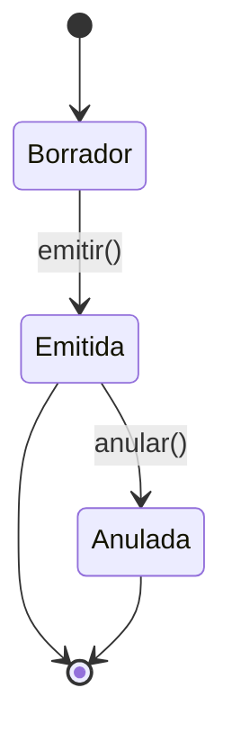
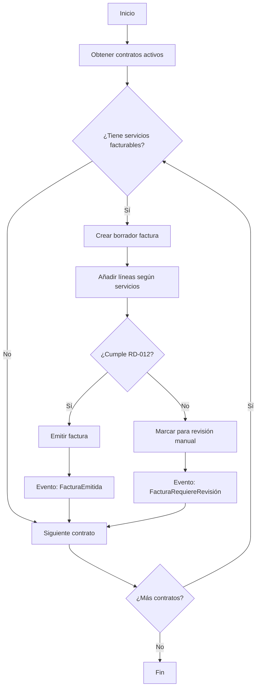
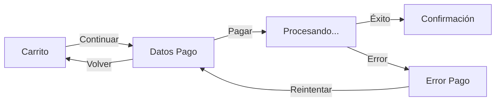
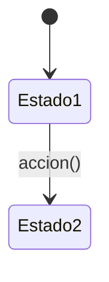

# KDD: Knowledge-Driven Development

## Prefacio: El Problema que Resolvemos

Existe una paradoja en el desarrollo de software: invertimos enormes esfuerzos en escribir código, pero el conocimiento que lo justifica—el *porqué*, el *qué* y el *cómo*—vive fragmentado en la cabeza de las personas, en tickets de Jira abandonados, en conversaciones de Slack perdidas, en wikis que nadie actualiza.

Cuando un desarrollador nuevo se incorpora al equipo, no le entregamos conocimiento: le entregamos código y le deseamos suerte. Cuando un analista de negocio necesita entender una regla, no consulta una fuente de verdad: pregunta al desarrollador que "estuvo ahí". Cuando queremos verificar que el sistema hace lo que debe, no tenemos especificaciones ejecutables: tenemos esperanzas y pruebas manuales.

**KDD propone invertir esta realidad**: el conocimiento documentado es el artefacto primario; el código es una consecuencia derivada, una caché que puede regenerarse.

---

## Parte I: Fundamentos

### 1.1 ¿Qué es KDD?

**Knowledge-Driven Development** es una metodología que trata la documentación como código: artefactos pequeños y atómicos (Markdown, YAML), versionados en Git, con linters, revisiones de código y pipelines de CI/CD.

Pero KDD es más que una práctica técnica. Es una declaración de intenciones:

> *"El conocimiento del dominio es más valioso y duradero que cualquier implementación concreta. Las tecnologías cambian, los frameworks mueren, las arquitecturas evolucionan. Pero las reglas de negocio, las entidades del dominio, los procesos fundamentales—esos perduran."*

### 1.2 El Manifiesto KDD

1. **Conocimiento explícito** sobre conocimiento tácito
2. **Documentación** sobre código (el código es derivado, regenerable)
3. **Documentos pequeños y conectados** sobre documentos monolíticos
4. **Ejemplos concretos** sobre descripciones abstractas
5. **Automatización** sobre procesos manuales

### 1.3 Los Tres Principios Fundamentales

KDD se sostiene sobre tres principios que, juntos, transforman la documentación de un artefacto secundario a la pieza central del desarrollo de software.

```
┌─────────────────────────────────────────────────────────────────┐
│                                                                 │
│                    LOS TRES PRINCIPIOS                          │
│                                                                 │
│   ┌─────────────────┐                                           │
│   │  DOCUMENTACIÓN  │                                           │
│   │  COMO VERDAD    │  ← El código deriva de aquí               │
│   └────────┬────────┘                                           │
│            │                                                    │
│            ▼                                                    │
│   ┌─────────────────┐                                           │
│   │  DOCUMENTACIÓN  │  ← Humanos y máquinas la consultan        │
│   │  COMO           │                                           │
│   │  CONOCIMIENTO   │                                           │
│   └────────┬────────┘                                           │
│            │                                                    │
│            ▼                                                    │
│   ┌─────────────────┐                                           │
│   │  DOCUMENTACIÓN  │  ← Se versiona, testea, despliega         │
│   │  COMO CÓDIGO    │                                           │
│   └─────────────────┘                                           │
│                                                                 │
└─────────────────────────────────────────────────────────────────┘
```

---

#### Principio 1: Documentación como Fuente de Verdad

> *"El código es una caché de la especificación. La especificación es la verdad."*

En el desarrollo tradicional, el código es el artefacto primario y la documentación es un subproducto que intenta (y fracasa) mantenerse al día. KDD invierte esta relación:

| Enfoque Tradicional | Enfoque KDD |
|---------------------|-------------|
| El código define qué hace el sistema | La documentación define qué debe hacer el sistema |
| La documentación describe el código | El código implementa la documentación |
| Si divergen, el código tiene razón | Si divergen, hay un bug (en código o en docs) |
| Cambiar comportamiento = cambiar código | Cambiar comportamiento = cambiar spec → regenerar código |

**Implicaciones prácticas:**

1. **Single Source of Truth (SSoT)**: Cada concepto, cada regla, cada decisión tiene un único lugar donde vive. No hay duplicación.

```
/Dominio/Reglas/RD-012-LimiteCredito.md  ← Definición canónica
    ↑
    └── El código, los tests, la UI... todo deriva de aquí
```

2. **El código es derivable**: En el límite, si tienes la especificación completa, podrías regenerar el código. Hoy esto es parcialmente posible (generación de schemas, contratos, scaffolding). Mañana, con IA generativa, será cada vez más real.

3. **La documentación se revisa primero**: Antes de un code review, revisamos si la especificación es correcta. El código es "solo" una implementación de esa especificación.

```
┌──────────────────────────────────────────────────────────┐
│                                                          │
│   FLUJO DE CAMBIO EN KDD                                 │
│                                                          │
│   Requisito nuevo                                        │
│        │                                                 │
│        ▼                                                 │
│   ┌─────────────┐    PR #1                               │
│   │ Actualizar  │ ──────────► Review de especificación   │
│   │ docs KDD    │             (¿Es correcto el cambio?)  │
│   └─────────────┘                                        │
│        │                                                 │
│        ▼                                                 │
│   ┌─────────────┐    PR #2                               │
│   │ Implementar │ ──────────► Review de código           │
│   │ en código   │             (¿Implementa la spec?)     │
│   └─────────────┘                                        │
│        │                                                 │
│        ▼                                                 │
│   Tests verifican que código = especificación            │
│                                                          │
└──────────────────────────────────────────────────────────┘
```

**¿Por qué es importante?**

Porque el código miente. El código te dice *cómo* funciona algo, pero no te dice:
- *Por qué* funciona así
- *Qué problema* resuelve
- *Qué alternativas* se descartaron
- *Qué restricciones* de negocio aplican

La documentación KDD captura todo esto. Es la memoria institucional que sobrevive a la rotación de personal, a los refactors, a los cambios de tecnología.

---

#### Principio 2: Documentación como Conocimiento

> *"La documentación no es texto muerto. Es conocimiento vivo, consultable por humanos y máquinas."*

La documentación tradicional tiene un problema: se escribe para humanos, pero los humanos no la leen. Se pudre en wikis abandonadas, en Confluence olvidado, en README.md que nadie actualiza.

KDD resuelve esto diseñando la documentación para ser **consumida activamente**, no solo almacenada:

**Para humanos:**
- **Navegable**: enlaces bidireccionales forman un grafo explorable
- **Descubrible**: búsqueda, índices, visualización de conexiones
- **Contextual**: cada documento enlaza a sus dependencias y dependientes

```markdown
# RD-001: Descuento Cliente VIP

## Declaración
Cuando un [[Cliente]] tiene categoría "VIP", 
se aplica un descuento del 15% sobre el [[Pedido]].

## Entidades involucradas
- [[Cliente]]
- [[Pedido]]
- [[Descuento]]

## Casos de uso relacionados
- [[CU-003-RealizarCompra]]

## Verificado por
- [[descuentos.feature#Escenario: Descuento VIP aplicado]]
```

**Para máquinas (agentes, asistentes, herramientas):**

En la era de la IA, la documentación tiene nuevos consumidores. Un sistema bien documentado en KDD puede ser indexado y consultado por asistentes que responden preguntas sobre el dominio:

```
Desarrollador: "¿Cómo se calcula el descuento VIP?"

Asistente: [Consulta base de conocimiento KDD]
           [Recupera RD-001-DescuentoClienteVIP.md]
           [Recupera ejemplos de verificación]
           
           "Según la regla de dominio RD-001, los clientes VIP 
            reciben un 15% de descuento. Aquí tienes un ejemplo..."
```

```
QA: "¿Qué reglas de negocio afectan a la facturación?"

Asistente: [Consulta grafo de conocimiento]
           [Encuentra reglas enlazadas a [[Factura]]]
           
           "Hay 7 reglas que afectan a facturación:
            - RD-012: Límite de crédito
            - RD-015: Numeración de facturas
            ..."
```

**Implicaciones prácticas:**

1. **Estructura semántica**: Los documentos tienen front-matter YAML con metadatos queryables
2. **Enlaces tipados**: No solo `[[Entidad]]`, sino relaciones con significado
3. **Granularidad atómica**: Un concepto = un archivo = una unidad consultable
4. **Formato procesable**: Markdown + YAML, no PDFs ni Word

```yaml
---
id: RD-012
title: Límite de Crédito
type: regla-dominio
status: approved
affects:
  - entity: Cliente
  - entity: Factura
  - command: CMD-004-EmitirFactura
verified_by:
  - facturacion.feature#limite-credito
---
```

**¿Por qué es importante?**

Porque el conocimiento atrapado en la cabeza de las personas no escala. Cada vez que alguien pregunta "¿cómo funciona X?", alguien tiene que dejar lo que está haciendo para explicarlo. Con KDD:

- El onboarding es autoservicio: "Lee el dominio de Facturación"
- Las respuestas son consistentes: todos consultan la misma fuente
- Los asistentes multiplican el acceso: preguntas 24/7 sin interrumpir humanos

---

#### Principio 3: Documentación como Código

> *"Si la documentación es la fuente de verdad, debe tratarse con el mismo rigor que el código."*

Este principio cierra el círculo: si la documentación es tan importante, debe tener el mismo ciclo de vida que el código. No es un documento de Word en SharePoint. Es un artefacto versionado, testeado, y desplegado.

**El pipeline de documentación:**

```
┌─────────────────────────────────────────────────────────────────┐
│                                                                 │
│   PIPELINE KDD (Documentación como Código)                      │
│                                                                 │
│   ┌─────────┐   ┌─────────┐   ┌─────────┐   ┌─────────┐        │
│   │         │   │         │   │         │   │         │        │
│   │  EDIT   │──►│  LINT   │──►│  TEST   │──►│ DEPLOY  │        │
│   │         │   │         │   │         │   │         │        │
│   └─────────┘   └─────────┘   └─────────┘   └─────────┘        │
│       │             │             │             │               │
│       ▼             ▼             ▼             ▼               │
│   - Git         - Front-matter  - Enlaces     - Publicar       │
│   - Branch        válido         válidos       índice          │
│   - PR          - Formato       - Ejemplos    - Actualizar     │
│   - Review        correcto       ejecutables   embeddings      │
│                 - Plantilla     - Cobertura   - Notificar      │
│                   completa       de reglas     cambios         │
│                                                                 │
└─────────────────────────────────────────────────────────────────┘
```

**Componentes del pipeline:**

1. **Versionado (Git)**
   - Cada cambio tiene historia
   - Podemos ver quién cambió qué y cuándo
   - Podemos revertir errores
   - Branches para cambios grandes

2. **Linting (Validación estática)**
   ```yaml
   # .github/workflows/kdd-lint.yml
   - name: Validar front-matter
     run: ./scripts/validate-frontmatter.sh
   
   - name: Verificar plantillas completas
     run: ./scripts/check-templates.sh
   
   - name: Buscar enlaces rotos
     run: ./scripts/check-broken-links.sh
   ```

3. **Testing (Verificación)**
   - Los `.feature` (BDD) se ejecutan contra el código
   - Se verifica que cada regla tenga ejemplos
   - Se detecta cuando documentación y código divergen

   ```bash
   # Si este test falla, o el código está mal o la spec está desactualizada
   npm run test:bdd
   ```

4. **Deploy (Publicación)**
   - Generar sitio de documentación (MkDocs, Docusaurus)
   - Actualizar índices de búsqueda
   - Regenerar embeddings para asistentes IA
   - Notificar a equipos afectados

**Automatización del ciclo de vida:**

El verdadero poder de "Documentación como Código" es que podemos **automatizar** la generación de artefactos derivados:

```
┌─────────────────────────────────────────────────────────────────┐
│                                                                 │
│   DOCUMENTACIÓN KDD                                             │
│        │                                                        │
│        ├──► Generar schemas de base de datos                    │
│        │    (desde Entidades + Value Objects)                   │
│        │                                                        │
│        ├──► Generar contratos OpenAPI                           │
│        │    (desde Comandos + Consultas)                        │
│        │                                                        │
│        ├──► Generar esqueletos de código                        │
│        │    (clases, interfaces, tests)                         │
│        │                                                        │
│        ├──► Generar tests BDD ejecutables                       │
│        │    (desde ejemplos en /5-Verificacion)                 │
│        │                                                        │
│        ├──► Generar diagramas                                   │
│        │    (desde relaciones entre entidades)                  │
│        │                                                        │
│        └──► Alimentar asistentes IA                             │
│             (embeddings actualizados automáticamente)           │
│                                                                 │
└─────────────────────────────────────────────────────────────────┘
```

**Ejemplo concreto:**

```yaml
# Entidad documentada en KDD
---
id: ENT-003
title: Factura
type: entidad
---

## Atributos
| Atributo | Tipo | Requerido |
|----------|------|-----------|
| facturaId | UUID | Sí |
| numero | String | Sí |
| fecha | Date | Sí |
| total | Money | Sí |
| estado | Enum(borrador,emitida,anulada) | Sí |
```

```typescript
// Generado automáticamente desde la especificación
// ⚠️ NO EDITAR MANUALMENTE - Regenerar con `npm run kdd:generate`

interface Factura {
  facturaId: string;  // UUID
  numero: string;
  fecha: Date;
  total: Money;
  estado: 'borrador' | 'emitida' | 'anulada';
}
```

**Estados y gobernanza:**

Como el código, los documentos tienen estados que controlan su ciclo de vida:

```yaml
---
status: draft    # Trabajo en progreso, no usar como referencia
status: review   # En revisión, pendiente de aprobación
status: approved # Fuente de verdad oficial
status: deprecated # Obsoleto, existe documentación nueva
---
```

```
draft ──────► review ──────► approved ──────► deprecated
  │              │                               │
  │              │                               │
  └── Cualquiera └── Requiere                    └── Enlaza a
      puede          aprobación                      reemplazo
      crear          de owner
```

**¿Por qué es importante?**

Porque la documentación sin rigor se degrada. Sin versionado, no sabes qué cambió. Sin linting, los errores se acumulan. Sin testing, la documentación y el código divergen silenciosamente. Sin deploy automatizado, nadie ve las actualizaciones.

"Documentación como Código" no es una metáfora. Es una práctica concreta que hace que la documentación sea tan confiable como el código que describe.

---

## Parte II: La Estructura Conceptual

### 2.1 El Flujo Cognitivo Top-Down

KDD organiza la documentación siguiendo el proceso mental natural de diseño de software. No es una taxonomía arbitraria: es el camino que recorre la mente al entender y construir un sistema.

```
┌─────────────────────────────────────────────────────────────────┐
│                                                                 │
│   PROBLEMA  →  DOMINIO  →  CAPACIDADES  →  INTERACCIÓN  →  VERIFICACIÓN
│                                                                 │
│   "¿Por qué?"  "¿Qué      "¿Qué se      "¿Cómo lo     "¿Cómo lo   │
│                existe?"    puede         usan?"        probamos?"  │
│                            hacer?"                                 │
│                                                                 │
└─────────────────────────────────────────────────────────────────┘
```

Cada nivel **añade compromiso** con la implementación:

| Nivel | Compromiso | Pregunta | Artefactos |
|-------|-----------|----------|------------|
| Problema | Nulo | ¿Por qué construimos esto? | PRD, contexto, objetivos |
| Dominio | Conceptual | ¿Qué conceptos existen? | Entidades, eventos, reglas |
| Capacidades | Funcional | ¿Qué puede hacer el sistema? | Comandos, procesos |
| Interacción | Experiencial | ¿Cómo lo usa alguien? | Casos de uso, flujos, UI |
| Verificación | Concreto | ¿Cómo sabemos que funciona? | Ejemplos, tests, criterios |

### 2.2 Los Cinco Niveles en Detalle

#### Nivel 1: Problema

Este nivel responde a la pregunta fundamental: **¿Por qué existe este sistema?**

Aquí no hablamos de software. Hablamos de problemas humanos, de contexto de negocio, de objetivos medibles. Un sistema que no tiene claro su "por qué" es un sistema condenado a la deriva.

**Artefactos típicos:**
- **PRD (Product Requirements Document)**: visión del producto, problema a resolver, usuarios objetivo, métricas de éxito
- **Contexto de Negocio**: restricciones, stakeholders, sistemas relacionados

> **Nota sobre Lenguaje Ubicuo**: Las definiciones de términos del dominio viven en `/02-domain/entities/`. No se mantiene un glosario separado para evitar duplicación (principio SSoT).

**Ejemplo de PRD ligero:**

```markdown
# Sistema de Facturación Electrónica

## El Problema
Actualmente, el proceso de facturación es manual, propenso a errores, 
y no cumple con la normativa de facturación electrónica que entra 
en vigor en enero 2025.

## Usuarios
- Contables (emiten facturas)
- Clientes (reciben facturas)
- Hacienda (valida cumplimiento)

## Éxito significa
- 100% de facturas emitidas electrónicamente
- Tiempo de emisión < 2 minutos
- 0 errores de formato normativo

## Lo que NO es este sistema
- No es un ERP completo
- No gestiona cobros (eso es otro sistema)
```

#### Nivel 2: Dominio

Este nivel responde: **¿Qué conceptos existen en nuestro universo de problema?**

Aquí aplicamos Domain-Driven Design (DDD) para modelar el dominio de forma pura, sin contaminación de UI ni de tecnología. Es el nivel más estable: las entidades del dominio cambian menos que cualquier otra cosa.

**Artefactos típicos:**
- **Entidades**: objetos con identidad propia (Cliente, Factura, Producto)
- **Value Objects**: objetos definidos por sus atributos (Dinero, DirecciónPostal)
- **Agregados**: clusters de entidades con una raíz
- **Eventos de Dominio**: hechos significativos que han ocurrido (FacturaEmitida, PedidoCancelado)
- **Reglas de Dominio**: invariantes y restricciones que siempre deben cumplirse

**Ejemplo de Entidad:**

```markdown
# Factura

## Identidad
- `facturaId`: UUID, inmutable una vez creada

## Atributos
| Atributo | Tipo | Descripción |
|----------|------|-------------|
| número | String | Número secuencial según serie |
| fecha | Date | Fecha de emisión |
| cliente | [[Cliente]] | Receptor de la factura |
| líneas | List<[[LíneaFactura]]> | Conceptos facturados |
| estado | Enum | borrador, emitida, anulada |

## Invariantes
- Una factura emitida no puede modificarse (solo anularse)
- El importe total = suma de líneas + impuestos
- El número es único dentro de su serie

## Ciclo de Vida


## Eventos que genera
- [[FacturaEmitida]] al emitir()
- [[FacturaAnulada]] al anular()
```

**Ejemplo de Regla de Dominio:**

```markdown
# RD-012: Límite de Crédito

## Declaración
Cuando un [[Cliente]] tiene deuda pendiente superior a su límite 
de crédito, no se pueden emitir nuevas [[Factura]]s para ese cliente.

## Justificación de negocio
Protege a la empresa de acumular deuda incobrable. El límite de 
crédito se negocia individualmente con cada cliente según su 
historial y solvencia.

## Fórmula
```
deuda_pendiente = suma(facturas_no_pagadas)
puede_facturar = (deuda_pendiente + nuevo_importe) <= limite_credito
```

## Excepciones
- Facturas de regularización (abonos) siempre se permiten
- El director financiero puede autorizar excepciones

## Entidades involucradas
- [[Cliente]]
- [[Factura]]

## Ver también
- [[RD-013-CalculoDeudaPendiente]]
```

**Ejemplo de Evento de Dominio:**

```markdown
# FacturaEmitida

## Descripción
Se ha emitido una factura, quedando registrada oficialmente 
y siendo enviada al cliente.

## Productor
[[Factura]].emitir()

## Payload
```yaml
facturaEmitidaId: UUID
timestamp: DateTime
datos:
  facturaId: UUID
  número: String
  clienteId: UUID
  importeTotal: Money
  fechaEmisión: Date
```

## Consumidores
| Consumidor | Reacción |
|------------|----------|
| [[ProcesoEnvíoEmail]] | Envía PDF al cliente |
| [[ProcesoContabilidad]] | Genera asiento contable |
| [[ProcesoHacienda]] | Reporta a sistema tributario |

## Reglas que aplican
- [[RD-012-LímiteCrédito]] (verificada antes de emitir)
```

#### Nivel 3: Capacidades

Este nivel responde: **¿Qué puede hacer el sistema?**

Aquí definimos las operaciones posibles sobre el dominio, todavía de forma abstracta. No decimos *cómo* un usuario ejecuta estas operaciones (eso es Interacción), solo *qué* operaciones existen.

**Artefactos típicos:**
- **Comandos**: acciones que modifican el estado (EmitirFactura, AnularPedido)
- **Consultas**: peticiones de información (ObtenerFacturasPendientes)
- **Procesos de Negocio**: flujos que orquestan múltiples comandos y eventos

**Ejemplo de Comando:**

```markdown
# CMD-004: EmitirFactura

## Propósito
Transforma una factura en borrador a estado emitido, 
haciéndola oficial e inmutable.

## Entrada
| Parámetro | Tipo | Requerido |
|-----------|------|-----------|
| facturaId | UUID | Sí |
| fechaEmisión | Date | No (default: hoy) |

## Precondiciones
- La factura existe y está en estado `borrador`
- [[RD-012-LímiteCrédito]] se cumple para el cliente
- La factura tiene al menos una línea

## Postcondiciones
- Factura pasa a estado `emitida`
- Se asigna número definitivo según [[RD-015-NumeraciónFacturas]]
- Se genera evento [[FacturaEmitida]]

## Errores posibles
| Código | Condición |
|--------|-----------|
| FACT-001 | Factura no encontrada |
| FACT-002 | Factura no está en borrador |
| FACT-003 | Límite de crédito excedido |
| FACT-004 | Factura sin líneas |
```

**Ejemplo de Proceso de Negocio:**

```markdown
# PROC-002: Proceso de Facturación Mensual

## Descripción
Proceso que se ejecuta el primer día de cada mes para generar 
automáticamente las facturas de servicios recurrentes.

## Disparador
Evento temporal: primer día del mes a las 02:00

## Flujo


## Reglas aplicables
- [[RD-012-LímiteCrédito]]
- [[RD-020-FacturaciónRecurrente]]
- [[RD-015-NumeraciónFacturas]]

## Eventos generados
- [[FacturaEmitida]] (por cada factura exitosa)
- [[FacturaRequiereRevisión]] (cuando hay bloqueos)
- [[ProcesoFacturaciónCompletado]] (al finalizar)
```

#### Nivel 4: Interacción

Este nivel responde: **¿Cómo usa alguien el sistema?**

Ahora sí introducimos al usuario. Aquí describimos cómo un actor (humano o sistema externo) interactúa con las capacidades del nivel anterior para lograr sus objetivos.

**Artefactos típicos:**
- **Casos de Uso**: interacciones actor-sistema con flujos completos
- **Flujos de Usuario**: secuencias de pasos desde la perspectiva del usuario
- **Wireframes / Pantallas**: representaciones de la interfaz
- **Mapas de Navegación**: cómo se conectan las pantallas

**Ejemplo de Caso de Uso:**

```markdown
# CU-007: Emitir Factura

## Contexto
| Elemento | Descripción |
|----------|-------------|
| Actor | Contable |
| Objetivo | Convertir un borrador de factura en factura oficial |
| Precondición | Existe una factura en estado borrador |
| Postcondición | La factura está emitida y el cliente notificado |

## Flujo Principal
1. El contable accede al listado de facturas en borrador
2. El sistema muestra las facturas pendientes de emisión
3. El contable selecciona una factura
4. El sistema muestra el detalle de la factura con preview
5. El contable verifica los datos y pulsa "Emitir"
6. El sistema valida las reglas de negocio
7. El sistema emite la factura y muestra confirmación
8. El sistema envía email al cliente con el PDF

## Flujos Alternativos

### A1: Límite de crédito excedido
En el paso 6, si [[RD-012-LímiteCrédito]] no se cumple:
1. El sistema muestra mensaje de error con deuda actual y límite
2. El sistema ofrece opciones:
   - Solicitar autorización excepcional
   - Cancelar emisión
3. Si solicita autorización, se crea tarea para director financiero

### A2: Error en datos de factura
En el paso 5, si el contable detecta errores:
1. El contable pulsa "Editar"
2. Vuelve al caso de uso [[CU-005-EditarBorradorFactura]]

## Reglas de Negocio Aplicables
- [[RD-012-LímiteCrédito]]
- [[RD-015-NumeraciónFacturas]]
- [[RD-018-FormatoFacturaElectrónica]]

## Comandos invocados
- [[CMD-004-EmitirFactura]]

## Pantallas relacionadas
- [[UI-ListadoBorradores]]
- [[UI-DetalleFactura]]

## Eventos generados
- [[FacturaEmitida]]
```

**Ejemplo de Flujo de UI:**

```markdown
# Flujo: Checkout de Compra

## Pantallas involucradas
1. [[UI-Carrito]]
2. [[UI-DatosPago]]
3. [[UI-Confirmación]]
4. [[UI-ResultadoPago]]

## Mapa de navegación


## Estados del flujo
| Estado | Descripción | Acciones posibles |
|--------|-------------|-------------------|
| carrito | Usuario revisando productos | Modificar, Vaciar, Continuar |
| datos_pago | Introduciendo tarjeta | Pagar, Volver |
| procesando | Esperando respuesta pasarela | - |
| completado | Pago exitoso | Ver pedido |
| error | Pago fallido | Reintentar, Cancelar |
```

#### Nivel 5: Verificación

Este nivel responde: **¿Cómo sabemos que funciona?**

Aquí cerramos el círculo: convertimos todo el conocimiento anterior en **evidencia ejecutable**. Los ejemplos concretos (BDD), los criterios de aceptación, los casos de prueba—todo lo que demuestra que el sistema cumple con su especificación.

**Artefactos típicos:**
- **Especificaciones por Ejemplos (BDD)**: escenarios Given/When/Then
- **Criterios de Aceptación**: condiciones de "done" para historias
- **Casos de Prueba**: escenarios de testing documentados
- **Contratos**: especificaciones de APIs, schemas

**Ejemplo de Especificación BDD:**

```gherkin
# facturacion.feature

Feature: Emisión de facturas
  Como contable
  Quiero emitir facturas a clientes
  Para formalizar las ventas realizadas

  Background:
    Given existe un cliente "Acme Corp" con límite de crédito 10000€
    And el cliente tiene una deuda pendiente de 3000€

  @regla:RD-012
  Scenario: Emisión exitosa dentro del límite
    Given existe una factura en borrador por 5000€
    When el contable emite la factura
    Then la factura pasa a estado "emitida"
    And se genera el número de factura según la serie
    And se envía email al cliente con el PDF

  @regla:RD-012
  Scenario: Bloqueo por límite de crédito excedido
    Given existe una factura en borrador por 8000€
    When el contable intenta emitir la factura
    Then el sistema muestra error "Límite de crédito excedido"
    And la factura permanece en estado "borrador"
    And se muestra la deuda actual (3000€) y el límite (10000€)

  @regla:RD-012
  Scenario Outline: Diferentes escenarios de límite
    Given existe una factura en borrador por <importe>€
    When el contable intenta emitir la factura
    Then el resultado es "<resultado>"

    Examples:
      | importe | resultado |
      | 6000    | bloqueado |  # 3000 + 6000 = 9000, excede límite de 10000 en... espera, no excede
      | 7000    | bloqueado |  # 3000 + 7000 = 10000, en el límite exacto
      | 7001    | bloqueado |  # 3000 + 7001 = 10001, excede
      | 5000    | emitida   |  # 3000 + 5000 = 8000, dentro del límite
```

**Ejemplo de Contrato de API:**

```markdown
# API: Facturación

## POST /api/v1/facturas/{id}/emitir

### Descripción
Emite una factura existente en estado borrador.

### Implementa
- Comando: [[CMD-004-EmitirFactura]]
- Reglas: [[RD-012-LímiteCrédito]], [[RD-015-NumeraciónFacturas]]

### Request
```http
POST /api/v1/facturas/123e4567-e89b-12d3-a456-426614174000/emitir
Authorization: Bearer {token}
Content-Type: application/json

{
  "fechaEmision": "2024-01-15"  // opcional
}
```

### Responses

#### 200 OK
```json
{
  "facturaId": "123e4567-e89b-12d3-a456-426614174000",
  "numero": "2024/A/00042",
  "estado": "emitida",
  "fechaEmision": "2024-01-15",
  "importeTotal": {
    "cantidad": 5000.00,
    "moneda": "EUR"
  }
}
```

#### 400 Bad Request - Límite excedido
```json
{
  "error": "FACT-003",
  "message": "Límite de crédito excedido",
  "details": {
    "limiteCredito": 10000.00,
    "deudaActual": 3000.00,
    "importeFactura": 8000.00,
    "exceso": 1000.00
  }
}
```

#### 404 Not Found
```json
{
  "error": "FACT-001",
  "message": "Factura no encontrada"
}
```
```

---

## Parte III: Estructura de Carpetas en Obsidian

### 3.1 La Estructura Recomendada

```
/KDD-{ProjectName}
│
├── /01-problem
│   ├── PRD.md
│   ├── context.md
│   └── /decisions
│       ├── ADR-001-BackendTechnology.md
│       └── ADR-002-Database.md
│
├── /02-domain
│   ├── /entities            # type: entity | value-object | aggregate
│   │   ├── Customer.md
│   │   ├── Invoice.md
│   │   ├── Product.md
│   │   ├── Money.md         # type: value-object
│   │   ├── PostalAddress.md # type: value-object
│   │   └── Order.md         # type: aggregate
│   ├── /events
│   │   ├── InvoiceIssued.md
│   │   └── OrderCancelled.md
│   └── /rules
│       ├── BR-001-VIPDiscount.md
│       ├── BR-012-CreditLimit.md
│       └── _rules-index.md
│
├── /03-capabilities
│   ├── /commands
│   │   ├── CMD-001-CreateCustomer.md
│   │   └── CMD-004-IssueInvoice.md
│   ├── /queries
│   │   └── QRY-001-PendingInvoices.md
│   └── /processes
│       ├── PROC-001-CustomerOnboarding.md
│       └── PROC-002-MonthlyBilling.md
│
├── /04-interaction
│   ├── /use-cases
│   │   ├── UC-001-RegisterCustomer.md
│   │   └── UC-007-IssueInvoice.md
│   ├── /flows
│   │   ├── Flow-Checkout.md
│   │   └── Flow-Return.md
│   └── /screens
│       ├── UI-Dashboard.md
│       ├── UI-InvoiceList.md
│       └── /wireframes
│           └── dashboard-v1.png
│
├── /05-verification
│   ├── /examples
│   │   ├── billing.feature
│   │   ├── customers.feature
│   │   └── discounts.feature
│   ├── /contracts
│   │   ├── API-Billing.md
│   │   └── API-Customers.md
│   └── /criteria
│       └── Sprint-2024-Q1.md
│
├── /kdd/templates
│   ├── entity.template.md
│   ├── rule.template.md
│   ├── event.template.md
│   ├── use-case.template.md
│   ├── requirement.template.md
│   ├── process.template.md
│   ├── prd.template.md
│   ├── adr.template.md
│   ├── ui-component.template.md
│   ├── ui-view.template.md
│   └── ui-flow.template.md
│
└── README.md
```

### 3.2 Convenciones de Nombrado

| Tipo | Prefijo | Ejemplo |
|------|---------|---------|
| Business Rule | BR-NNN | BR-012-CreditLimit.md |
| Command | CMD-NNN | CMD-004-IssueInvoice.md |
| Query | QRY-NNN | QRY-001-PendingInvoices.md |
| Process | PROC-NNN | PROC-002-MonthlyBilling.md |
| Use Case | UC-NNN | UC-007-IssueInvoice.md |
| Event | {EventName} | InvoiceIssued.md |
| Entity | {EntityName} | Invoice.md *(type: entity)* |
| Value Object | {VOName} | Money.md *(type: value-object)* |
| Aggregate | {AggregateName} | Order.md *(type: aggregate)* |
| ADR | ADR-NNN | ADR-001-BackendTechnology.md |

> **Nota**: Entity, Value Object y Aggregate comparten la carpeta `/entities` y se distinguen mediante el campo `type` en el front-matter.

### 3.3 Front-Matter Estándar

Cada archivo debe incluir metadatos en YAML:

```yaml
---
id: BR-012
title: Credit Limit
type: business-rule  # entity | value-object | aggregate | event | business-rule | command | query | process | use-case
status: approved     # draft | review | approved | deprecated
owner: "@ana.garcia"
created: 2024-01-10
last_modified: 2024-01-15
version: 1.2
tags:
  - billing
  - credit
  - customer
related:
  - "[[Cliente]]"
  - "[[Factura]]"
  - "[[CU-007-EmitirFactura]]"
---
```

---

## Parte IV: El Grafo de Conocimiento

### 4.1 La Red de Enlaces

El poder de KDD en Obsidian está en los **enlaces bidireccionales**. No son decoración: son la estructura del conocimiento.

```
                    ┌─────────────────┐
                    │   PRD           │
                    │   (Problema)    │
                    └────────┬────────┘
                             │ define objetivos para
                             ▼
                    ┌─────────────────┐    ┌──────────────┐
                    │   Entidades     │───►│   Eventos    │
                    │   (Dominio)     │    │              │
                    └────────┬────────┘    └──────┬───────┘
                             │ restringidas por   │
                             ▼                    │
                    ┌─────────────────┐           │
                    │   Reglas de     │◄──────────┘
                    │   Dominio       │    disparan
                    └────────┬────────┘
                             │ implementadas en
                             ▼
                    ┌─────────────────┐
                    │   Comandos /    │
                    │   Capacidades   │
                    └────────┬────────┘
                             │ usados en
                             ▼
                    ┌─────────────────┐
                    │   Casos de Uso  │
                    │   (Interacción) │
                    └────────┬────────┘
                             │ verificados por
                             ▼
                    ┌─────────────────┐
                    │   Ejemplos BDD  │
                    │   (Verificación)│
                    └─────────────────┘
```

### 4.2 Consultas Útiles en Obsidian (Dataview)

Si usas el plugin Dataview, puedes crear vistas dinámicas:

**Índice de Reglas de Dominio:**

```dataview
TABLE status, owner, last_modified
FROM "2-Dominio/Reglas"
WHERE type = "regla-dominio"
SORT id ASC
```

**Reglas sin ejemplos de verificación:**

```dataview
LIST
FROM "2-Dominio/Reglas"
WHERE !contains(file.outlinks, "5-Verificacion")
```

**Casos de uso por estado:**

```dataview
TABLE status, owner
FROM "4-Interaccion/CasosDeUso"
GROUP BY status
```

---

## Parte V: Integración con el Desarrollo

### 5.1 KDD en el Flujo de Trabajo

```
┌─────────────────────────────────────────────────────────────────┐
│                        CICLO KDD                                │
├─────────────────────────────────────────────────────────────────┤
│                                                                 │
│  1. DESCUBRIMIENTO                                              │
│     ├── Event Storming / Domain Storytelling                    │
│     ├── Identificar entidades, eventos, reglas                  │
│     └── Documentar en /2-Dominio                                │
│                                                                 │
│  2. ESPECIFICACIÓN                                              │
│     ├── Definir comandos y procesos (/3-Capacidades)            │
│     ├── Escribir casos de uso (/4-Interaccion)                  │
│     └── Crear ejemplos BDD (/5-Verificacion)                    │
│                                                                 │
│  3. IMPLEMENTACIÓN                                              │
│     ├── Los .feature se copian al repo de código                │
│     ├── El código implementa los comandos                       │
│     └── Los tests verifican los ejemplos                        │
│                                                                 │
│  4. VALIDACIÓN                                                  │
│     ├── CI ejecuta los tests BDD                                │
│     ├── Si falla: ¿bug en código o spec desactualizada?         │
│     └── Actualizar lo que corresponda                           │
│                                                                 │
│  5. EVOLUCIÓN                                                   │
│     ├── Nuevos requisitos → volver a paso 1                     │
│     ├── Documentación viaja con el cambio                       │
│     └── El grafo de conocimiento crece                          │
│                                                                 │
└─────────────────────────────────────────────────────────────────┘
```

### 5.2 Sincronización Docs ↔ Código

**Opción A: Docs en repo separado**
- Vault de Obsidian en su propio repositorio
- Los `.feature` se copian/sincronizan al repo de código
- Ventaja: separación clara
- Desventaja: riesgo de desincronización

**Opción B: Docs en el mismo repo**
```
/mi-proyecto
├── /docs
│   └── /kdd
│       ├── /01-Problema
│       ├── /02-Dominio
│       └── ...
├── /src
├── /tests
│   └── /features  ← symlink o copia de /docs/kdd/5-Verificacion/Ejemplos
└── package.json
```
- Ventaja: todo viaja junto, PRs incluyen docs
- Desventaja: mezcla concerns

**Opción C: Docs como fuente, código como derivado (el ideal KDD)**
- Pipeline de CI lee la documentación
- Genera esqueletos de código, contratos, tests
- El desarrollador completa la implementación
- Esta es la visión "especificación > código"

### 5.3 Linting y Validación

Implementa checks automáticos en CI:

```yaml
# .github/workflows/kdd-lint.yml
name: KDD Lint

on: [push, pull_request]

jobs:
  validate:
    runs-on: ubuntu-latest
    steps:
      - uses: actions/checkout@v3
      
      - name: Validar front-matter
        run: |
          # Verificar que todos los .md tienen front-matter válido
          ./scripts/validate-frontmatter.sh docs/kdd
      
      - name: Verificar enlaces rotos
        run: |
          # Buscar enlaces [[xxx]] que no existen
          ./scripts/check-broken-links.sh docs/kdd
      
      - name: Verificar cobertura de reglas
        run: |
          # Cada regla en /2-Dominio/Reglas debe tener 
          # al menos un ejemplo en /5-Verificacion
          ./scripts/check-rule-coverage.sh docs/kdd
      
      - name: Generar informe
        run: |
          ./scripts/generate-coverage-report.sh docs/kdd
```

---

## Parte VI: Templates

### 6.1 Template: Entidad

```markdown
---
id: ENT-{número}
title: {NombreEntidad}
type: entidad
status: draft
owner: "@{usuario}"
created: {fecha}
aggregate: {AggregateRoot si aplica}
tags: []
---

# {NombreEntidad}

## Descripción
{Qué representa esta entidad en el dominio}

## Identidad
- `{nombreId}`: {tipo}, {restricciones}

## Atributos
| Atributo | Tipo | Requerido | Descripción |
|----------|------|-----------|-------------|
| | | | |

## Invariantes
- {Condición que siempre debe cumplirse}

## Ciclo de Vida


## Relaciones
- [[OtraEntidad]]: {tipo de relación}

## Eventos que genera
- [[EventoX]] cuando {condición}

## Reglas que aplican
- [[RD-XXX]]
```

### 6.2 Template: Regla de Dominio

```markdown
---
id: RD-{número}
title: {NombreRegla}
type: regla-dominio
status: draft
owner: "@{usuario}"
created: {fecha}
priority: {alta|media|baja}
tags: []
---

# RD-{número}: {NombreRegla}

## Declaración
Cuando {condición}, entonces {consecuencia}.

## Justificación de negocio
{Por qué existe esta regla, qué problema resuelve}

## Fórmula / Lógica
```
{pseudocódigo o fórmula si aplica}
```

## Entidades involucradas
- [[Entidad1]]
- [[Entidad2]]

## Excepciones
- {Casos donde la regla no aplica}

## Ejemplos
| Escenario | Entrada | Resultado |
|-----------|---------|-----------|
| | | |

## Verificación
- [[ejemplos/{archivo}.feature]] - Escenario: {nombre}

## Historial
| Fecha | Cambio | Autor |
|-------|--------|-------|
| {fecha} | Creación | @{usuario} |
```

### 6.3 Template: Evento de Dominio

```markdown
---
id: EVT-{número}
title: {NombreEvento}
type: evento-dominio
status: draft
owner: "@{usuario}"
created: {fecha}
tags: []
---

# {NombreEvento}

## Descripción
{Qué ha ocurrido en el dominio - siempre en pasado}

## Productor
[[{Entidad o Proceso que emite el evento}]]

## Trigger
{Qué acción o condición genera este evento}

## Payload
```yaml
{nombreEvento}Id: UUID
timestamp: DateTime
datos:
  campo1: tipo
  campo2: tipo
```

## Consumidores
| Consumidor | Reacción |
|------------|----------|
| [[Proceso1]] | {qué hace} |

## Reglas que aplican
- [[RD-XXX]]

## Eventos relacionados
- Precedido por: [[EventoAnterior]]
- Puede generar: [[EventoSiguiente]]
```

### 6.4 Template: Comando

```markdown
---
id: CMD-{número}
title: {NombreComando}
type: comando
status: draft
owner: "@{usuario}"
created: {fecha}
tags: []
---

# CMD-{número}: {NombreComando}

## Propósito
{Qué hace este comando, qué estado modifica}

## Entrada
| Parámetro | Tipo | Requerido | Validación |
|-----------|------|-----------|------------|
| | | | |

## Precondiciones
- {Estado requerido antes de ejecutar}

## Postcondiciones
- {Estado garantizado después de ejecutar}

## Reglas que valida
- [[RD-XXX]]

## Eventos que genera
- [[EventoX]] si {condición}

## Errores posibles
| Código | Condición | Mensaje |
|--------|-----------|---------|
| | | |

## Casos de uso que lo invocan
- [[CU-XXX]]
```

### 6.5 Template: Caso de Uso

```markdown
---
id: CU-{número}
title: {NombreCasoUso}
type: caso-uso
status: draft
owner: "@{usuario}"
created: {fecha}
actor: {ActorPrincipal}
tags: []
---

# CU-{número}: {NombreCasoUso}

## Contexto
| Elemento | Descripción |
|----------|-------------|
| Actor | {quién inicia} |
| Objetivo | {qué quiere lograr} |
| Precondición | {estado inicial requerido} |
| Postcondición | {estado final garantizado} |
| Trigger | {qué dispara el caso de uso} |

## Flujo Principal
1. {Actor} {acción}
2. El sistema {respuesta}
3. ...

## Flujos Alternativos

### A1: {NombreAlternativo}
En el paso {n}, si {condición}:
1. ...

## Flujos de Excepción

### E1: {NombreExcepción}
En el paso {n}, si {error}:
1. ...

## Reglas de Negocio
- [[RD-XXX]]

## Comandos invocados
- [[CMD-XXX]]

## Pantallas
- [[UI-XXX]]

## Verificación
- [[{archivo}.feature]] - Feature: {nombre}
```

---

## Parte VII: Métricas y Gobernanza

### 7.1 Métricas de Salud del Conocimiento

| Métrica | Descripción | Objetivo |
|---------|-------------|----------|
| **Cobertura de reglas** | % de reglas con ejemplos BDD | > 90% |
| **Frescura** | Días desde última actualización por área | < 30 días |
| **Completitud** | % de templates con todos los campos | > 80% |
| **Conectividad** | Promedio de enlaces por documento | > 3 |
| **Orfandad** | Documentos sin enlaces entrantes | 0 |
| **Estados** | Distribución draft/review/approved | < 20% en draft |

### 7.2 Proceso de Revisión

```
┌─────────────────────────────────────────────────────────────────┐
│                    FLUJO DE REVISIÓN                            │
├─────────────────────────────────────────────────────────────────┤
│                                                                 │
│   draft ──────► review ──────► approved                         │
│     │              │              │                             │
│     │              │              └──► deprecated               │
│     │              │                                            │
│     │              └── Requiere:                                │
│     │                  - Revisión por owner del área            │
│     │                  - Validación de enlaces                  │
│     │                  - Al menos 1 ejemplo si es regla         │
│     │                                                           │
│     └── Cualquiera puede crear                                  │
│                                                                 │
└─────────────────────────────────────────────────────────────────┘
```

### 7.3 Roles Sugeridos

| Rol | Responsabilidad |
|-----|-----------------|
| **Domain Owner** | Mantiene /2-Dominio, valida corrección conceptual |
| **Product Owner** | Mantiene /1-Problema, prioriza qué documentar |
| **Tech Lead** | Mantiene /3-Capacidades y /5-Verificacion/Contratos |
| **QA Lead** | Mantiene /5-Verificacion/Ejemplos, asegura cobertura |
| **UX Lead** | Mantiene /4-Interaccion, valida flujos |

---

## Parte VIII: Preguntas Frecuentes

### ¿KDD reemplaza a Scrum/Kanban?

No. KDD es ortogonal a la metodología de gestión. Puedes usar KDD con Scrum, Kanban, o waterfall. KDD define *qué documentar y cómo*; tu metodología define *cuándo y quién*.

### ¿No es demasiada documentación?

La documentación excesiva es la que nadie lee ni mantiene. KDD produce documentación *útil* porque:
- Es granular (cambias solo lo que cambia)
- Es verificable (los tests fallan si miente)
- Es navegable (encuentras lo que buscas)
- Es consumible por humanos Y máquinas

### ¿Qué pasa con las historias de usuario y épicas?

Son artefactos de *planificación*, no de *conocimiento*. Una historia de usuario es útil para priorizar y estimar trabajo. Una vez implementada, el conocimiento debe migrar a los artefactos KDD (entidades, reglas, casos de uso). Las historias pueden archivarse o eliminarse.

### ¿Cómo empiezo si ya tengo un sistema existente?

1. Empieza por el glosario (lenguaje ubicuo)
2. Documenta las reglas de negocio más críticas
3. Añade ejemplos BDD para esas reglas
4. Expande incrementalmente

No intentes documentar todo de golpe. Documenta lo que tocas.

### ¿Obsidian es obligatorio?

No. Puedes usar cualquier sistema que soporte:
- Archivos Markdown con front-matter YAML
- Enlaces entre archivos
- Versionado en Git

Alternativas: Notion (menos ideal por vendor lock-in), VS Code + extensiones, Foam, Logseq.

---

## Parte IX: Glosario de KDD

| Término | Definición |
|---------|------------|
| **Agregado** | Cluster de entidades tratado como unidad para cambios de datos |
| **Comando** | Operación que modifica el estado del sistema |
| **Consulta** | Operación que lee estado sin modificarlo |
| **Entidad** | Objeto del dominio con identidad única |
| **Evento de Dominio** | Hecho significativo que ha ocurrido en el dominio |
| **Lenguaje Ubicuo** | Vocabulario compartido entre negocio y desarrollo |
| **Regla de Dominio** | Invariante o restricción que el sistema debe cumplir |
| **SSoT** | Single Source of Truth - cada concepto tiene un único lugar canónico |
| **Value Object** | Objeto sin identidad, definido por sus atributos |
| **Verificación** | Comprobación de que el sistema cumple su especificación |

---

## Conclusión: El Conocimiento como Activo

El código envejece. Los frameworks mueren. Las arquitecturas se reescriben. 

Pero el conocimiento del dominio—las reglas de negocio, las entidades, los procesos—ese conocimiento es el verdadero activo de tu organización. Es lo que distingue a tu sistema de un CRUD genérico.

KDD es una apuesta: **si invertimos en documentar bien ese conocimiento, el desarrollo se vuelve más predecible, el onboarding más rápido, la comunicación más clara, y la automatización posible**.

No es una metodología perfecta. Es un punto de partida. Adáptala, extiéndela, hazla tuya.

Pero empieza hoy. Documenta esa regla de negocio que solo vive en la cabeza de María. Escribe ese ejemplo BDD que demuestra cómo funciona el descuento VIP. Conecta los conceptos con enlaces.

El grafo de conocimiento crece un nodo a la vez.

---

*KDD: Knowledge-Driven Development*  
*Versión 1.0 - {fecha}*  
*Licencia: CC BY-SA 4.0*