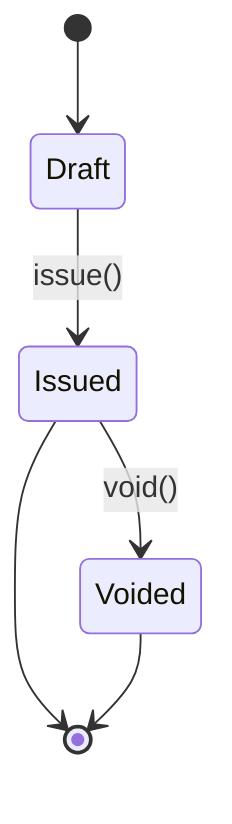
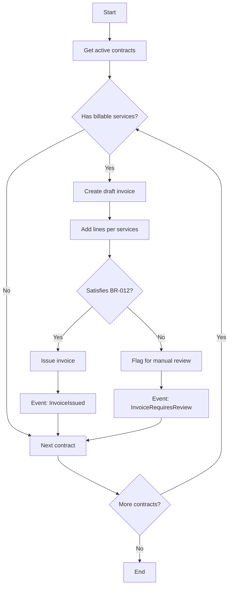
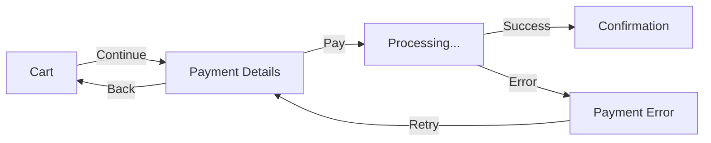
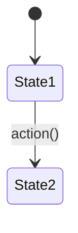

# KDD: Knowledge-Driven Development

## Preface: The Problem We Solve

There is a paradox in software development: we invest enormous effort in writing code, but the knowledge that justifies it—the *why*, the *what*, and the *how*—lives fragmented in people's heads, in abandoned Jira tickets, in lost Slack conversations, in wikis that nobody updates.

When a new developer joins the team, we don't hand them knowledge: we hand them code and wish them luck. When a business analyst needs to understand a rule, they don't consult a source of truth: they ask the developer who "was there." When we want to verify that the system does what it should, we don't have executable specifications: we have hopes and manual tests.

**KDD proposes to invert this reality**: documented knowledge is the primary artifact; code is a derived consequence, a cache that can be regenerated.

---

## Part I: Fundamentals

### 1.1 What is KDD?

**Knowledge-Driven Development** is a methodology that treats documentation as code: small, atomic artifacts (Markdown, YAML), versioned in Git, with linters, code reviews, and CI/CD pipelines.

But KDD is more than a technical practice. It is a statement of intent:

> *"Domain knowledge is more valuable and enduring than any concrete implementation. Technologies change, frameworks die, architectures evolve. But business rules, domain entities, fundamental processes—those endure."*

### 1.2 The KDD Manifesto

1. **Explicit knowledge** over tacit knowledge
2. **Documentation** over code (code is derived, regenerable)
3. **Small, connected documents** over monolithic documents
4. **Concrete examples** over abstract descriptions
5. **Automation** over manual processes

### 1.3 The Three Fundamental Principles

KDD rests on three principles that, together, transform documentation from a secondary artifact into the centerpiece of software development.

```
┌─────────────────────────────────────────────────────────────────┐
│                                                                 │
│                    THE THREE PRINCIPLES                          │
│                                                                 │
│   ┌─────────────────┐                                           │
│   │  DOCUMENTATION  │                                           │
│   │  AS TRUTH    │  ← Code derives from here               │
│   └────────┬────────┘                                           │
│            │                                                    │
│            ▼                                                    │
│   ┌─────────────────┐                                           │
│   │  DOCUMENTATION  │  ← Humans and machines query it        │
│   │  AS             │                                           │
│   │  KNOWLEDGE   │                                           │
│   └────────┬────────┘                                           │
│            │                                                    │
│            ▼                                                    │
│   ┌─────────────────┐                                           │
│   │  DOCUMENTATION  │  ← Versioned, tested, deployed         │
│   │  AS CODE    │                                           │
│   └─────────────────┘                                           │
│                                                                 │
└─────────────────────────────────────────────────────────────────┘
```

---

#### Principle 1: Documentation as Source of Truth

> *"Code is a cache of the specification. The specification is the truth."*

In traditional development, code is the primary artifact and documentation is a byproduct that tries (and fails) to stay up to date. KDD inverts this relationship:

| Traditional Approach | KDD Approach |
|---------------------|-------------|
| Code defines what the system does | Documentation defines what the system should do |
| Documentation describes the code | Code implements the documentation |
| If they diverge, code is right | If they diverge, there is a bug (in code or in docs) |
| Change behavior = change code | Change behavior = change spec → regenerate code |

**Practical implications:**

1. **Single Source of Truth (SSoT)**: Every concept, every rule, every decision has a single place where it lives. No duplication.

```
/Domain/Rules/BR-012-CreditLimit.md  ← Canonical definition
    ↑
    └── Code, tests, UI... everything derives from here
```

2. **Code is derivable**: In the limit, if you have the complete specification, you could regenerate the code. Today this is partially possible (schema generation, contracts, scaffolding). Tomorrow, with generative AI, it will become increasingly real.

3. **Documentation is reviewed first**: Before a code review, we review whether the specification is correct. The code is "just" an implementation of that specification.

```
┌──────────────────────────────────────────────────────────┐
│                                                          │
│   CHANGE FLOW IN KDD                                 │
│                                                          │
│   New requirement                                        │
│        │                                                 │
│        ▼                                                 │
│   ┌─────────────┐    PR #1                               │
│   │ Update      │ ──────────► Specification review   │
│   │ KDD docs    │             (Is the change correct?)  │
│   └─────────────┘                                        │
│        │                                                 │
│        ▼                                                 │
│   ┌─────────────┐    PR #2                               │
│   │ Implement   │ ──────────► Code review           │
│   │ in code     │             (Does it implement spec?)     │
│   └─────────────┘                                        │
│        │                                                 │
│        ▼                                                 │
│   Tests verify that code = specification            │
│                                                          │
└──────────────────────────────────────────────────────────┘
```

**Why is this important?**

Because code lies. Code tells you *how* something works, but it doesn't tell you:
- *Why* it works that way
- *What problem* it solves
- *What alternatives* were discarded
- *What business constraints* apply

KDD documentation captures all of this. It is the institutional memory that survives staff turnover, refactors, and technology changes.

---

#### Principle 2: Documentation as Knowledge

> *"Documentation is not dead text. It is living knowledge, queryable by humans and machines."*

Traditional documentation has a problem: it is written for humans, but humans don't read it. It rots in abandoned wikis, in forgotten Confluence, in README.md files that nobody updates.

KDD solves this by designing documentation to be **actively consumed**, not just stored:

**For humans:**
- **Navigable**: bidirectional links form an explorable graph
- **Discoverable**: search, indexes, connection visualization
- **Contextual**: each document links to its dependencies and dependents

```markdown
# BR-001: VIP Customer Discount

## Declaration
When a [[Customer]] has "VIP" category,
a 15% discount is applied to the [[Order]].

## Involved entities
- [[Customer]]
- [[Order]]
- [[Discount]]

## Related use cases
- [[UC-003-PlaceOrder]]

## Verified by
- [[discounts.feature#Scenario: VIP Discount applied]]
```

**For machines (agents, assistants, tools):**

In the age of AI, documentation has new consumers. A well-documented KDD system can be indexed and queried by assistants that answer questions about the domain:

```
Developer: "How is the VIP discount calculated?"

Assistant: [Queries KDD knowledge base]
           [Retrieves BR-001-VIPCustomerDiscount.md]
           [Retrieves verification examples]
           
           "According to domain rule BR-001, VIP customers
            receive a 15% discount. Here is an example..."
```

```
QA: "What business rules affect billing?"

Assistant: [Queries knowledge graph]
           [Finds rules linked to [[Invoice]]]
           
           "There are 7 rules that affect billing:
            - BR-012: Credit Limit
            - BR-015: Invoice Numbering
            ..."
```

**Practical implications:**

1. **Semantic structure**: Documents have YAML front-matter with queryable metadata
2. **Typed links**: Not just `[[Entity]]`, but relationships with meaning
3. **Atomic granularity**: One concept = one file = one queryable unit
4. **Machine-readable format**: Markdown + YAML, not PDFs or Word

```yaml
---
id: RD-012
title: Credit Limit
type: business-rule
status: approved
affects:
  - entity: Customer
  - entity: Invoice
  - command: CMD-004-IssueInvoice
verified_by:
  - billing.feature#credit-limit
---
```

**Why is this important?**

Because knowledge trapped in people's heads doesn't scale. Every time someone asks "how does X work?", someone has to stop what they're doing to explain it. With KDD:

- Onboarding is self-service: "Read the Billing domain"
- Answers are consistent: everyone queries the same source
- Assistants multiply access: 24/7 questions without interrupting humans

---

#### Principle 3: Documentation as Code

> *"If documentation is the source of truth, it must be treated with the same rigor as code."*

This principle closes the circle: if documentation is that important, it must have the same lifecycle as code. It is not a Word document on SharePoint. It is a versioned, tested, and deployed artifact.

**The documentation pipeline:**

```
┌─────────────────────────────────────────────────────────────────┐
│                                                                 │
│   KDD PIPELINE (Documentation as Code)                      │
│                                                                 │
│   ┌─────────┐   ┌─────────┐   ┌─────────┐   ┌─────────┐        │
│   │         │   │         │   │         │   │         │        │
│   │  EDIT   │──►│  LINT   │──►│  TEST   │──►│ DEPLOY  │        │
│   │         │   │         │   │         │   │         │        │
│   └─────────┘   └─────────┘   └─────────┘   └─────────┘        │
│       │             │             │             │               │
│       ▼             ▼             ▼             ▼               │
│   - Git         - Valid         - Valid        - Publish        │
│   - Branch        front-matter   links         index           │
│   - PR          - Correct       - Executable  - Update         │
│   - Review        format         examples      embeddings      │
│                 - Complete      - Rule        - Notify          │
│                   template       coverage      changes         │
│                                                                 │
└─────────────────────────────────────────────────────────────────┘
```

**Pipeline components:**

1. **Versioning (Git)**
   - Every change has history
   - We can see who changed what and when
   - We can revert errors
   - Branches for large changes

2. **Linting (Static validation)**
   ```yaml
   # .github/workflows/kdd-lint.yml
   - name: Validate front-matter
     run: ./scripts/validate-frontmatter.sh
   
   - name: Verify complete templates
     run: ./scripts/check-templates.sh
   
   - name: Find broken links
     run: ./scripts/check-broken-links.sh
   ```

3. **Testing (Verification)**
   - The `.feature` files (BDD) are executed against the code
   - Each rule is verified to have examples
   - Divergence between documentation and code is detected

   ```bash
   # If this test fails, either the code is wrong or the spec is outdated
   npm run test:bdd
   ```

4. **Deploy (Publication)**
   - Generate documentation site (MkDocs, Docusaurus)
   - Update search indexes
   - Regenerate embeddings for AI assistants
   - Notify affected teams

**Lifecycle automation:**

The true power of "Documentation as Code" is that we can **automate** the generation of derived artifacts:

```
┌─────────────────────────────────────────────────────────────────┐
│                                                                 │
│   KDD DOCUMENTATION                                             │
│        │                                                        │
│        ├──► Generate database schemas                    │
│        │    (from Entities + Value Objects)                   │
│        │                                                        │
│        ├──► Generate OpenAPI contracts                           │
│        │    (from Commands + Queries)                        │
│        │                                                        │
│        ├──► Generate code skeletons                        │
│        │    (classes, interfaces, tests)                         │
│        │                                                        │
│        ├──► Generate executable BDD tests                       │
│        │    (from examples in /05-verification)                 │
│        │                                                        │
│        ├──► Generate diagrams                                   │
│        │    (from relationships between entities)                  │
│        │                                                        │
│        └──► Feed AI assistants                             │
│             (automatically updated embeddings)           │
│                                                                 │
└─────────────────────────────────────────────────────────────────┘
```

**Concrete example:**

```yaml
# Entity documented in KDD
---
id: ENT-003
title: Invoice
type: entity
---

## Attributes
| Attribute | Type | Required |
|-----------|------|----------|
| invoiceId | UUID | Yes |
| number | String | Yes |
| date | Date | Yes |
| total | Money | Yes |
| status | Enum(draft,issued,voided) | Yes |
```

```typescript
// Auto-generated from the specification
// ⚠️ DO NOT EDIT MANUALLY - Regenerate with `npm run kdd:generate`

interface Invoice {
  invoiceId: string;  // UUID
  number: string;
  date: Date;
  total: Money;
  status: 'draft' | 'issued' | 'voided';
}
```

**States and governance:**

Like code, documents have states that control their lifecycle:

```yaml
---
status: draft    # Work in progress, do not use as reference
status: review   # Under review, pending approval
status: approved # Official source of truth
status: deprecated # Obsolete, newer documentation exists
---
```

```
draft ──────► review ──────► approved ──────► deprecated
  │              │                               │
  │              │                               │
  └── Anyone     └── Requires                    └── Links to
      can create      owner                          replacement
                    approval
```

**Why is this important?**

Because documentation without rigor degrades. Without versioning, you don't know what changed. Without linting, errors accumulate. Without testing, documentation and code silently diverge. Without automated deploy, nobody sees the updates.

"Documentation as Code" is not a metaphor. It is a concrete practice that makes documentation as reliable as the code it describes.

---

## Part II: The Conceptual Structure

### 2.1 The Top-Down Cognitive Flow

KDD organizes documentation following the natural mental process of software design. It is not an arbitrary taxonomy: it is the path the mind travels when understanding and building a system.

```
┌─────────────────────────────────────────────────────────────────┐
│                                                                 │
│   PROBLEM  →  DOMAIN  →  CAPABILITIES  →  INTERACTION  →  VERIFICATION
│                                                                 │
│   "Why?"       "What      "What can     "How do       "How do     │
│                exists?"    it do?"       they use it?" we test it?"│
│                                                                    │
│                                                                 │
└─────────────────────────────────────────────────────────────────┘
```

Each level **adds commitment** to the implementation:

| Level | Commitment | Question | Artifacts |
|-------|-----------|----------|------------|
| Problem | None | Why are we building this? | PRD, context, objectives |
| Domain | Conceptual | What concepts exist? | Entities, events, rules |
| Capabilities | Functional | What can the system do? | Commands, processes |
| Interaction | Experiential | How does someone use it? | Use cases, flows, UI |
| Verification | Concrete | How do we know it works? | Examples, tests, criteria |

### 2.2 The Five Levels in Detail

#### Level 1: Problem

This level answers the fundamental question: **Why does this system exist?**

Here we don't talk about software. We talk about human problems, business context, measurable objectives. A system that doesn't have a clear "why" is a system doomed to drift.

**Typical artifacts:**
- **PRD (Product Requirements Document)**: product vision, problem to solve, target users, success metrics
- **Business Context**: constraints, stakeholders, related systems

> **Note on Ubiquitous Language**: Domain term definitions live in `/02-domain/entities/`. A separate glossary is not maintained to avoid duplication (SSoT principle).

**Lightweight PRD example:**

```markdown
# Electronic Invoicing System

## The Problem
Currently, the invoicing process is manual, error-prone,
and does not comply with the electronic invoicing regulations
coming into effect in January 2025.

## Users
- Accountants (issue invoices)
- Customers (receive invoices)
- Tax Authority (validates compliance)

## Success means
- 100% of invoices issued electronically
- Issuance time < 2 minutes
- 0 regulatory format errors

## What this system is NOT
- It is not a full ERP
- It does not manage collections (that is another system)
```

#### Level 2: Domain

This level answers: **What concepts exist in our problem universe?**

Here we apply Domain-Driven Design (DDD) to model the domain in pure form, without UI or technology contamination. It is the most stable level: domain entities change less than anything else.

**Typical artifacts:**
- **Entities**: objects with their own identity (Customer, Invoice, Product)
- **Value Objects**: objects defined by their attributes (Money, PostalAddress)
- **Aggregates**: clusters of entities with a root
- **Domain Events**: significant facts that have occurred (InvoiceIssued, OrderCancelled)
- **Domain Rules**: invariants and constraints that must always hold

**Entity example:**

```markdown
# Invoice

## Identity
- `invoiceId`: UUID, immutable once created

## Attributes
| Attribute | Type | Description |
|-----------|------|-------------|
| number | String | Sequential number by series |
| date | Date | Issuance date |
| customer | [[Customer]] | Invoice recipient |
| lines | List<[[InvoiceLine]]> | Invoiced items |
| status | Enum | draft, issued, voided |

## Invariants
- An issued invoice cannot be modified (only voided)
- Total amount = sum of lines + taxes
- The number is unique within its series

## Lifecycle


## Events generated
- [[InvoiceIssued]] on issue()
- [[InvoiceVoided]] on void()
```

**Domain Rule example:**

```markdown
# BR-012: Credit Limit

## Declaration
When a [[Customer]] has outstanding debt exceeding their credit
limit, new [[Invoice]]s cannot be issued for that customer.

## Business justification
Protects the company from accumulating bad debt. The credit
limit is individually negotiated with each customer based on their
history and solvency.

## Formula
```
outstanding_debt = sum(unpaid_invoices)
can_invoice = (outstanding_debt + new_amount) <= credit_limit
```

## Exceptions
- Adjustment invoices (credits) are always allowed
- The CFO can authorize exceptions

## Involved entities
- [[Customer]]
- [[Invoice]]

## See also
- [[BR-013-OutstandingDebtCalculation]]
```

**Domain Event example:**

```markdown
# InvoiceIssued

## Description
An invoice has been issued, becoming officially registered
and sent to the customer.

## Producer
[[Invoice]].issue()

## Payload
```yaml
invoiceIssuedId: UUID
timestamp: DateTime
data:
  invoiceId: UUID
  number: String
  customerId: UUID
  totalAmount: Money
  issuanceDate: Date
```

## Consumers
| Consumer | Reaction |
|----------|----------|
| [[EmailDeliveryProcess]] | Sends PDF to customer |
| [[AccountingProcess]] | Generates journal entry |
| [[TaxAuthorityProcess]] | Reports to tax system |

## Applicable rules
- [[BR-012-CreditLimit]] (verified before issuing)
```

#### Level 3: Capabilities

This level answers: **What can the system do?**

Here we define the possible operations on the domain, still in abstract form. We don't say *how* a user executes these operations (that is Interaction), only *what* operations exist.

**Typical artifacts:**
- **Commands**: actions that modify state (IssueInvoice, CancelOrder)
- **Queries**: information requests (GetPendingInvoices)
- **Business Processes**: flows that orchestrate multiple commands and events

**Command example:**

```markdown
# CMD-004: IssueInvoice

## Purpose
Transforms a draft invoice to issued status,
making it official and immutable.

## Input
| Parameter | Type | Required |
|-----------|------|----------|
| invoiceId | UUID | Yes |
| issuanceDate | Date | No (default: today) |

## Preconditions
- The invoice exists and is in `draft` status
- [[BR-012-CreditLimit]] is satisfied for the customer
- The invoice has at least one line

## Postconditions
- Invoice transitions to `issued` status
- A definitive number is assigned per [[BR-015-InvoiceNumbering]]
- Event [[InvoiceIssued]] is generated

## Possible errors
| Code | Condition |
|------|-----------|
| INV-001 | Invoice not found |
| INV-002 | Invoice is not in draft status |
| INV-003 | Credit limit exceeded |
| INV-004 | Invoice has no lines |
```

**Business Process example:**

```markdown
# PROC-002: Monthly Billing Process

## Description
Process that runs on the first day of each month to automatically
generate invoices for recurring services.

## Trigger
Temporal event: first day of the month at 02:00

## Flujo


## Applicable rules
- [[BR-012-CreditLimit]]
- [[BR-020-RecurringBilling]]
- [[BR-015-InvoiceNumbering]]

## Events generated
- [[InvoiceIssued]] (for each successful invoice)
- [[InvoiceRequiresReview]] (when there are blockers)
- [[BillingProcessCompleted]] (upon completion)
```

#### Level 4: Interaction

This level answers: **How does someone use the system?**

Now we introduce the user. Here we describe how an actor (human or external system) interacts with the capabilities from the previous level to achieve their goals.

**Typical artifacts:**
- **Use Cases**: actor-system interactions with complete flows
- **User Flows**: step sequences from the user's perspective
- **Wireframes / Screens**: interface representations
- **Navigation Maps**: how screens connect to each other

**Use Case example:**

```markdown
# UC-007: Issue Invoice

## Context
| Element | Description |
|---------|-------------|
| Actor | Accountant |
| Goal | Convert a draft invoice into an official invoice |
| Precondition | An invoice exists in draft status |
| Postcondition | The invoice is issued and the customer is notified |

## Main Flow
1. The accountant accesses the draft invoices list
2. The system displays invoices pending issuance
3. The accountant selects an invoice
4. The system shows the invoice detail with preview
5. The accountant verifies the data and clicks "Issue"
6. The system validates business rules
7. The system issues the invoice and displays confirmation
8. The system sends an email to the customer with the PDF

## Alternative Flows

### A1: Credit limit exceeded
At step 6, if [[BR-012-CreditLimit]] is not satisfied:
1. The system displays an error message with current debt and limit
2. The system offers options:
   - Request exceptional authorization
   - Cancel issuance
3. If authorization is requested, a task is created for the CFO

### A2: Error in invoice data
At step 5, if the accountant detects errors:
1. The accountant clicks "Edit"
2. Returns to use case [[UC-005-EditDraftInvoice]]

## Applicable Business Rules
- [[BR-012-CreditLimit]]
- [[BR-015-InvoiceNumbering]]
- [[BR-018-ElectronicInvoiceFormat]]

## Commands invoked
- [[CMD-004-IssueInvoice]]

## Related screens
- [[UI-DraftsList]]
- [[UI-InvoiceDetail]]

## Events generated
- [[InvoiceIssued]]
```

**UI Flow example:**

```markdown
# Flow: Purchase Checkout

## Screens involved
1. [[UI-Cart]]
2. [[UI-PaymentDetails]]
3. [[UI-Confirmation]]
4. [[UI-PaymentResult]]

## Navigation map


## Flow states
| State | Description | Possible actions |
|-------|-------------|------------------|
| cart | Customer reviewing products | Modify, Empty, Continue |
| payment_details | Entering card | Pay, Back |
| processing | Awaiting gateway response | - |
| completed | Payment successful | View order |
| error | Payment failed | Retry, Cancel |
```

#### Level 5: Verification

This level answers: **How do we know it works?**

Here we close the circle: we convert all previous knowledge into **executable evidence**. Concrete examples (BDD), acceptance criteria, test cases—everything that demonstrates the system meets its specification.

**Typical artifacts:**
- **Specification by Example (BDD)**: Given/When/Then scenarios
- **Acceptance Criteria**: "done" conditions for stories
- **Test Cases**: documented testing scenarios
- **Contracts**: API specifications, schemas

**BDD Specification example:**

```gherkin
# billing.feature

Feature: Invoice Issuance
  As an accountant
  I want to issue invoices to customers
  In order to formalize completed sales

  Background:
    Given a customer "Acme Corp" exists with a credit limit of 10000€
    And the customer has outstanding debt of 3000€

  @rule:BR-012
  Scenario: Successful issuance within limit
    Given a draft invoice exists for 5000€
    When the accountant issues the invoice
    Then the invoice transitions to "issued" status
    And the invoice number is generated per the series
    And an email is sent to the customer with the PDF

  @rule:BR-012
  Scenario: Blocked due to credit limit exceeded
    Given a draft invoice exists for 8000€
    When the accountant attempts to issue the invoice
    Then the system displays error "Credit limit exceeded"
    And the invoice remains in "draft" status
    And the current debt (3000€) and limit (10000€) are displayed

  @rule:BR-012
  Scenario Outline: Different limit scenarios
    Given a draft invoice exists for <amount>€
    When the accountant attempts to issue the invoice
    Then the result is "<result>"

    Examples:
      | amount | result |
      | 6000    | blocked   |  # 3000 + 6000 = 9000, exceeds limit of 10000 by... wait, it doesn't
      | 7000    | blocked   |  # 3000 + 7000 = 10000, at the exact limit
      | 7001    | blocked   |  # 3000 + 7001 = 10001, exceeds
      | 5000    | issued    |  # 3000 + 5000 = 8000, within the limit
```

**API Contract example:**

```markdown
# API: Billing

## POST /api/v1/invoices/{id}/issue

### Description
Issues an existing invoice in draft status.

### Implements
- Command: [[CMD-004-IssueInvoice]]
- Rules: [[BR-012-CreditLimit]], [[BR-015-InvoiceNumbering]]

### Request
```http
POST /api/v1/invoices/123e4567-e89b-12d3-a456-426614174000/issue
Authorization: Bearer {token}
Content-Type: application/json

{
  "issuanceDate": "2024-01-15"  // optional
}
```

### Responses

#### 200 OK
```json
{
  "invoiceId": "123e4567-e89b-12d3-a456-426614174000",
  "number": "2024/A/00042",
  "status": "issued",
  "issuanceDate": "2024-01-15",
  "totalAmount": {
    "amount": 5000.00,
    "currency": "EUR"
  }
}
```

#### 400 Bad Request - Limit exceeded
```json
{
  "error": "INV-003",
  "message": "Credit limit exceeded",
  "details": {
    "creditLimit": 10000.00,
    "currentDebt": 3000.00,
    "invoiceAmount": 8000.00,
    "excess": 1000.00
  }
}
```

#### 404 Not Found
```json
{
  "error": "INV-001",
  "message": "Invoice not found"
}
```
```

---

## Part III: Folder Structure in Obsidian

### 3.1 The Recommended Structure

```
/KDD-{ProjectName}
│
├── /01-problem
│   ├── PRD.md
│   ├── context.md
│   └── /decisions
│       ├── ADR-001-BackendTechnology.md
│       └── ADR-002-Database.md
│
├── /02-domain
│   ├── /entities            # type: entity | value-object | aggregate
│   │   ├── Customer.md
│   │   ├── Invoice.md
│   │   ├── Product.md
│   │   ├── Money.md         # type: value-object
│   │   ├── PostalAddress.md # type: value-object
│   │   └── Order.md         # type: aggregate
│   ├── /events
│   │   ├── InvoiceIssued.md
│   │   └── OrderCancelled.md
│   └── /rules
│       ├── BR-001-VIPDiscount.md
│       ├── BR-012-CreditLimit.md
│       └── _rules-index.md
│
├── /03-capabilities
│   ├── /commands
│   │   ├── CMD-001-CreateCustomer.md
│   │   └── CMD-004-IssueInvoice.md
│   ├── /queries
│   │   └── QRY-001-PendingInvoices.md
│   └── /processes
│       ├── PROC-001-CustomerOnboarding.md
│       └── PROC-002-MonthlyBilling.md
│
├── /04-interaction
│   ├── /use-cases
│   │   ├── UC-001-RegisterCustomer.md
│   │   └── UC-007-IssueInvoice.md
│   ├── /flows
│   │   ├── Flow-Checkout.md
│   │   └── Flow-Return.md
│   └── /screens
│       ├── UI-Dashboard.md
│       ├── UI-InvoiceList.md
│       └── /wireframes
│           └── dashboard-v1.png
│
├── /05-verification
│   ├── /examples
│   │   ├── billing.feature
│   │   ├── customers.feature
│   │   └── discounts.feature
│   ├── /contracts
│   │   ├── API-Billing.md
│   │   └── API-Customers.md
│   └── /criteria
│       └── Sprint-2024-Q1.md
│
├── /kdd/templates
│   ├── entity.template.md
│   ├── rule.template.md
│   ├── event.template.md
│   ├── use-case.template.md
│   ├── requirement.template.md
│   ├── process.template.md
│   ├── prd.template.md
│   ├── adr.template.md
│   ├── ui-component.template.md
│   ├── ui-view.template.md
│   └── ui-flow.template.md
│
└── README.md
```

### 3.2 Naming Conventions

| Type | Prefix | Example |
|------|---------|---------|
| Business Rule | BR-NNN | BR-012-CreditLimit.md |
| Command | CMD-NNN | CMD-004-IssueInvoice.md |
| Query | QRY-NNN | QRY-001-PendingInvoices.md |
| Process | PROC-NNN | PROC-002-MonthlyBilling.md |
| Use Case | UC-NNN | UC-007-IssueInvoice.md |
| Event | {EventName} | InvoiceIssued.md |
| Entity | {EntityName} | Invoice.md *(type: entity)* |
| Value Object | {VOName} | Money.md *(type: value-object)* |
| Aggregate | {AggregateName} | Order.md *(type: aggregate)* |
| ADR | ADR-NNN | ADR-001-BackendTechnology.md |

> **Note**: Entity, Value Object, and Aggregate share the `/entities` folder and are distinguished by the `type` field in the front-matter.

### 3.3 Standard Front-Matter

Each file must include YAML metadata:

```yaml
---
id: BR-012
title: Credit Limit
type: business-rule  # entity | value-object | aggregate | event | business-rule | command | query | process | use-case
status: approved     # draft | review | approved | deprecated
owner: "@ana.garcia"
created: 2024-01-10
last_modified: 2024-01-15
version: 1.2
tags:
  - billing
  - credit
  - customer
related:
  - "[[Customer]]"
  - "[[Invoice]]"
  - "[[UC-007-IssueInvoice]]"
---
```

---

## Part IV: The Knowledge Graph

### 4.1 The Link Network

The power of KDD in Obsidian lies in **bidirectional links**. They are not decoration: they are the structure of knowledge.

```
                    ┌─────────────────┐
                    │   PRD           │
                    │   (Problem)     │
                    └────────┬────────┘
                             │ defines goals for
                             ▼
                    ┌─────────────────┐    ┌──────────────┐
                    │   Entities      │───►│   Events     │
                    │   (Domain)      │    │              │
                    └────────┬────────┘    └──────┬───────┘
                             │ constrained by   │
                             ▼                    │
                    ┌─────────────────┐           │
                    │   Domain        │◄──────────┘
                    │   Rules         │    trigger
                    └────────┬────────┘
                             │ implemented in
                             ▼
                    ┌─────────────────┐
                    │   Commands /    │
                    │   Capabilities  │
                    └────────┬────────┘
                             │ used in
                             ▼
                    ┌─────────────────┐
                    │   Use Cases     │
                    │   (Interaction)  │
                    └────────┬────────┘
                             │ verified by
                             ▼
                    ┌─────────────────┐
                    │   BDD Examples  │
                    │   (Verification) │
                    └─────────────────┘
```

### 4.2 Useful Queries in Obsidian (Dataview)

If you use the Dataview plugin, you can create dynamic views:

**Domain Rules Index:**

```dataview
TABLE status, owner, last_modified
FROM "2-Dominio/Reglas"
WHERE type = "regla-dominio"
SORT id ASC
```

**Rules without verification examples:**

```dataview
LIST
FROM "2-Dominio/Reglas"
WHERE !contains(file.outlinks, "5-Verificacion")
```

**Use cases by status:**

```dataview
TABLE status, owner
FROM "4-Interaccion/CasosDeUso"
GROUP BY status
```

---

## Part V: Integration with Development

### 5.1 KDD in the Workflow

```
┌─────────────────────────────────────────────────────────────────┐
│                        KDD CYCLE                                │
├─────────────────────────────────────────────────────────────────┤
│                                                                 │
│  1. DISCOVERY                                              │
│     ├── Event Storming / Domain Storytelling                    │
│     ├── Identify entities, events, rules                  │
│     └── Document in /02-domain                                │
│                                                                 │
│  2. SPECIFICATION                                              │
│     ├── Define commands and processes (/03-capabilities)            │
│     ├── Write use cases (/04-interaction)                  │
│     └── Create BDD examples (/05-verification)                    │
│                                                                 │
│  3. IMPLEMENTATION                                              │
│     ├── The .feature files are copied to the code repo                │
│     ├── Code implements the commands                       │
│     └── Tests verify the examples                        │
│                                                                 │
│  4. VALIDATION                                                  │
│     ├── CI runs the BDD tests                                │
│     ├── If it fails: bug in code or outdated spec?         │
│     └── Update as appropriate                           │
│                                                                 │
│  5. EVOLUTION                                                   │
│     ├── New requirements → go back to step 1                     │
│     ├── Documentation travels with the change                       │
│     └── The knowledge graph grows                          │
│                                                                 │
└─────────────────────────────────────────────────────────────────┘
```

### 5.2 Docs ↔ Code Synchronization

**Option A: Docs in a separate repo**
- Obsidian vault in its own repository
- The `.feature` files are copied/synced to the code repo
- Advantage: clear separation
- Disadvantage: desynchronization risk

**Option B: Docs in the same repo**
```
/my-project
├── /docs
│   └── /kdd
│       ├── /01-problem
│       ├── /02-domain
│       └── ...
├── /src
├── /tests
│   └── /features  ← symlink or copy of /docs/kdd/05-verification/examples
└── package.json
```
- Advantage: everything travels together, PRs include docs
- Disadvantage: mixes concerns

**Option C: Docs as source, code as derived (the KDD ideal)**
- CI pipeline reads the documentation
- Generates code skeletons, contracts, tests
- The developer completes the implementation
- This is the "specification > code" vision

### 5.3 Linting and Validation

Implement automated checks in CI:

```yaml
# .github/workflows/kdd-lint.yml
name: KDD Lint

on: [push, pull_request]

jobs:
  validate:
    runs-on: ubuntu-latest
    steps:
      - uses: actions/checkout@v3
      
      - name: Validate front-matter
        run: |
          # Verify that all .md files have valid front-matter
          ./scripts/validate-frontmatter.sh docs/kdd
      
      - name: Check broken links
        run: |
          # Find [[xxx]] links that don't exist
          ./scripts/check-broken-links.sh docs/kdd
      
      - name: Check rule coverage
        run: |
          # Each rule in /02-domain/rules must have
          # at least one example in /05-verification
          ./scripts/check-rule-coverage.sh docs/kdd
      
      - name: Generate report
        run: |
          ./scripts/generate-coverage-report.sh docs/kdd
```

---

## Part VI: Templates

### 6.1 Template: Entity

```markdown
---
id: ENT-{number}
title: {EntityName}
type: entity
status: draft
owner: "@{usuario}"
created: {fecha}
aggregate: {AggregateRoot if applicable}
tags: []
---

# {EntityName}

## Description
{What this entity represents in the domain}

## Identity
- `{nameId}`: {type}, {constraints}

## Attributes
| Attribute | Type | Required | Description |
|-----------|------|----------|-------------|
| | | | |

## Invariants
- {Condition that must always hold}

## Lifecycle


## Relationships
- [[OtherEntity]]: {relationship type}

## Events generated
- [[EventX]] when {condition}

## Applicable rules
- [[BR-XXX]]
```

### 6.2 Template: Domain Rule

```markdown
---
id: BR-{number}
title: {RuleName}
type: business-rule
status: draft
owner: "@{usuario}"
created: {fecha}
priority: {high|medium|low}
tags: []
---

# BR-{number}: {RuleName}

## Declaration
When {condition}, then {consequence}.

## Business justification
{Why this rule exists, what problem it solves}

## Formula / Logic
```
{pseudocode or formula if applicable}
```

## Involved entities
- [[Entity1]]
- [[Entity2]]

## Exceptions
- {Cases where the rule does not apply}

## Examples
| Scenario | Input | Result |
|----------|-------|--------|
| | | |

## Verification
- [[examples/{file}.feature]] - Scenario: {name}

## History
| Date | Change | Author |
|------|--------|--------|
| {date} | Creation | @{user} |
```

### 6.3 Template: Domain Event

```markdown
---
id: EVT-{number}
title: {EventName}
type: domain-event
status: draft
owner: "@{usuario}"
created: {fecha}
tags: []
---

# {EventName}

## Description
{What has occurred in the domain - always in past tense}

## Producer
[[{Entity or Process that emits the event}]]

## Trigger
{What action or condition generates this event}

## Payload
```yaml
{eventName}Id: UUID
timestamp: DateTime
data:
  field1: type
  field2: type
```

## Consumers
| Consumer | Reaction |
|----------|----------|
| [[Process1]] | {what it does} |

## Applicable rules
- [[BR-XXX]]

## Related events
- Preceded by: [[PreviousEvent]]
- May generate: [[NextEvent]]
```

### 6.4 Template: Command

```markdown
---
id: CMD-{number}
title: {CommandName}
type: command
status: draft
owner: "@{usuario}"
created: {fecha}
tags: []
---

# CMD-{number}: {CommandName}

## Purpose
{What this command does, what state it modifies}

## Input
| Parameter | Type | Required | Validation |
|-----------|------|----------|------------|
| | | | |

## Preconditions
- {Required state before execution}

## Postconditions
- {Guaranteed state after execution}

## Rules validated
- [[BR-XXX]]

## Events generated
- [[EventX]] if {condition}

## Possible errors
| Code | Condition | Message |
|------|-----------|---------|
| | | |

## Use cases that invoke it
- [[UC-XXX]]
```

### 6.5 Template: Use Case

```markdown
---
id: UC-{number}
title: {UseCaseName}
type: use-case
status: draft
owner: "@{usuario}"
created: {fecha}
actor: {PrimaryActor}
tags: []
---

# UC-{number}: {UseCaseName}

## Context
| Element | Description |
|---------|-------------|
| Actor | {who initiates} |
| Goal | {what they want to achieve} |
| Precondition | {required initial state} |
| Postcondition | {guaranteed final state} |
| Trigger | {what triggers the use case} |

## Main Flow
1. {Actor} {action}
2. The system {response}
3. ...

## Alternative Flows

### A1: {AlternativeName}
At step {n}, if {condition}:
1. ...

## Exception Flows

### E1: {ExceptionName}
At step {n}, if {error}:
1. ...

## Business Rules
- [[BR-XXX]]

## Commands invoked
- [[CMD-XXX]]

## Screens
- [[UI-XXX]]

## Verification
- [[{file}.feature]] - Feature: {name}
```

---

## Part VII: Metrics and Governance

### 7.1 Knowledge Health Metrics

| Metric | Description | Target |
|---------|-------------|----------|
| **Rule coverage** | % of rules with BDD examples | > 90% |
| **Freshness** | Days since last update per area | < 30 days |
| **Completeness** | % of templates with all fields filled | > 80% |
| **Connectivity** | Average links per document | > 3 |
| **Orphanage** | Documents with no incoming links | 0 |
| **States** | Distribution of draft/review/approved | < 20% in draft |

### 7.2 Review Process

```
┌─────────────────────────────────────────────────────────────────┐
│                    REVIEW FLOW                            │
├─────────────────────────────────────────────────────────────────┤
│                                                                 │
│   draft ──────► review ──────► approved                         │
│     │              │              │                             │
│     │              │              └──► deprecated               │
│     │              │                                            │
│     │              └── Requires:                                │
│     │                  - Review by area owner            │
│     │                  - Link validation                  │
│     │                  - At least 1 example if it is a rule         │
│     │                                                           │
│     └── Anyone can create                                  │
│                                                                 │
└─────────────────────────────────────────────────────────────────┘
```

### 7.3 Suggested Roles

| Role | Responsibility |
|-----|-----------------|
| **Domain Owner** | Maintains /02-domain, validates conceptual correctness |
| **Product Owner** | Maintains /01-problem, prioritizes what to document |
| **Tech Lead** | Maintains /03-capabilities and /05-verification/contracts |
| **QA Lead** | Maintains /05-verification/examples, ensures coverage |
| **UX Lead** | Maintains /04-interaction, validates flows |

---

## Part VIII: Frequently Asked Questions

### Does KDD replace Scrum/Kanban?

No. KDD is orthogonal to management methodology. You can use KDD with Scrum, Kanban, or waterfall. KDD defines *what to document and how*; your methodology defines *when and who*.

### Isn't this too much documentation?

Excessive documentation is documentation that nobody reads or maintains. KDD produces *useful* documentation because:
- It is granular (you change only what changes)
- It is verifiable (tests fail if it lies)
- It is navigable (you find what you're looking for)
- It is consumable by humans AND machines

### What about user stories and epics?

They are *planning* artifacts, not *knowledge* artifacts. A user story is useful for prioritizing and estimating work. Once implemented, the knowledge should migrate to KDD artifacts (entities, rules, use cases). Stories can be archived or deleted.

### How do I start if I already have an existing system?

1. Start with the glossary (ubiquitous language)
2. Document the most critical business rules
3. Add BDD examples for those rules
4. Expand incrementally

Don't try to document everything at once. Document what you touch.

### Is Obsidian mandatory?

No. You can use any system that supports:
- Markdown files with YAML front-matter
- Links between files
- Versioning in Git

Alternatives: Notion (less ideal due to vendor lock-in), VS Code + extensions, Foam, Logseq.

---

## Part IX: KDD Glossary

| Term | Definition |
|---------|------------|
| **Aggregate** | Cluster of entities treated as a unit for data changes |
| **Command** | Operation that modifies the system state |
| **Query** | Operation that reads state without modifying it |
| **Entity** | Domain object with unique identity |
| **Domain Event** | Significant fact that has occurred in the domain |
| **Ubiquitous Language** | Shared vocabulary between business and development |
| **Domain Rule** | Invariant or constraint that the system must satisfy |
| **SSoT** | Single Source of Truth - each concept has a single canonical location |
| **Value Object** | Object without identity, defined by its attributes |
| **Verification** | Confirmation that the system meets its specification |

---

## Conclusion: Knowledge as an Asset

Code ages. Frameworks die. Architectures get rewritten. 

But domain knowledge—business rules, entities, processes—that knowledge is your organization's true asset. It is what distinguishes your system from a generic CRUD.

KDD is a bet: **if we invest in documenting that knowledge well, development becomes more predictable, onboarding faster, communication clearer, and automation possible**.

It is not a perfect methodology. It is a starting point. Adapt it, extend it, make it yours.

But start today. Document that business rule that only lives in Maria's head. Write that BDD example that demonstrates how the VIP discount works. Connect concepts with links.

The knowledge graph grows one node at a time.

---

*KDD: Knowledge-Driven Development*  
*Version 1.0 - {date}*  
*License: CC BY-SA 4.0*