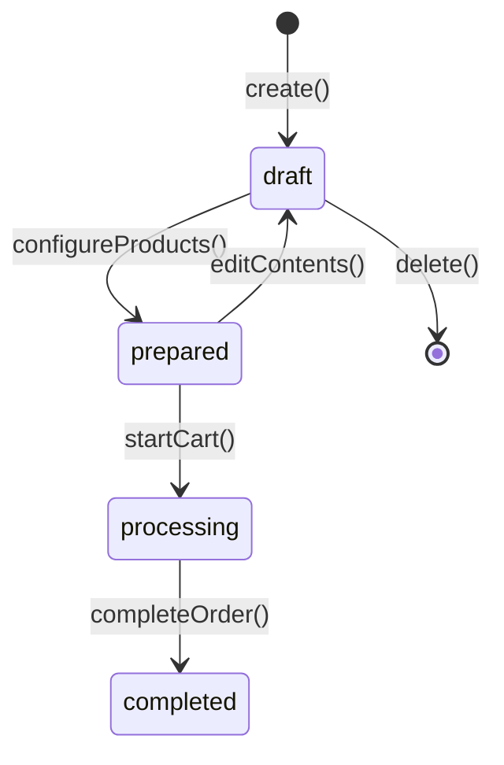

# Layer 01: Domain

## The Heart of the System: What Concepts Exist?

---

## Introduction

The Domain layer answers the question: **What concepts exist in our problem universe?**

Here we apply the principles of **Domain-Driven Design (DDD)** to model the domain in a pure way, without contamination from UI, databases, or specific technology. It is the most **stable** layer of the system: domain entities change less than anything else.

> **Important note**: This layer is the **BASE** of the system. It does not reference other layers, but is referenced by all of them.

```
┌─────────────────────────────────────────────────────────────────────────────┐
│                                                                              │
│   00-Requirements  →  01-Domain   →  02-Behavior  →  03-Experience          │
│                                          ↓                                   │
│   "Why does           "WHAT          04-Verification   05-Architecture      │
│    it exist?"         EXISTS?"                                               │
│                                                                              │
│   ──────────────────────────────────────────────────────────────────────────│
│                                                                              │
│   Motivation          CONCEPTUAL      Functional       Experiential         │
│   Context             ENTITIES        (operations)     (views)              │
│   Objectives          RULES           (use cases)      Validation           │
│                       EVENTS          (processes)      Architecture         │
│                                                                              │
└─────────────────────────────────────────────────────────────────────────────┘
```

---

## The Philosophy: The Domain as Immutable Truth

### Why the Domain Is the Center

Code changes. Frameworks die. Databases get migrated. UIs get redesigned.

But **business rules** and **domain entities** endure:

```
┌─────────────────────────────────────────────────────────────────────────────┐
│                                                                              │
│   2015: "An Invoice must have at least one line item"                       │
│   2020: "An Invoice must have at least one line item"                       │
│   2025: "An Invoice must have at least one line item"                       │
│                                                                              │
│   The framework changed 3 times.                                             │
│   The database migrated 2 times.                                             │
│   The UI was completely redesigned.                                          │
│                                                                              │
│   The business rule remains the same.                                       │
│                                                                              │
└─────────────────────────────────────────────────────────────────────────────┘
```

That is why in KDD, the domain is the most valuable **source of truth**. If you lose the code, you can regenerate it. If you lose the domain knowledge, you lose the system.

### The Ubiquitous Language

A fundamental principle of DDD that KDD adopts: **everyone speaks the same language**.

```
┌─────────────────────────────────────────────────────────────────────────────┐
│                                                                              │
│   UBIQUITOUS LANGUAGE                                                       │
│                                                                              │
│   Business says:  "The customer places an order"                            │
│   Domain says:    "The [[Customer]] creates an [[Order]]"                   │
│   Code says:      customer.placeOrder(data)                                 │
│   Tests say:      "Given a Customer, When they place an Order..."           │
│   UI says:        "Place Order" (button)                                    │
│                                                                              │
│   EVERYONE uses the same terms. No translation needed.                      │
│                                                                              │
└─────────────────────────────────────────────────────────────────────────────┘
```

In KDD, domain terms **always use initial uppercase** in documentation:

```markdown
"The Customer places an Order and configures the Products"
"The customer places an order and configures the products"
```

---

## The Artifacts of the Domain Layer

### 1. Entities

Objects with a **unique identity** that persists over time.

#### Characteristics of an Entity

- Has a unique and immutable **ID**
- Its identity does not change even if its attributes change
- Has a **lifecycle** (created, modified, can be deleted)
- Generates **events** when significant changes occur

#### Structure of an Entity

```markdown
---
kind: entity
aliases:
  - PurchaseOrder
status: approved
---

# Order

## Description
Represents a purchase that the [[Customer]] wants to place
through the [[Store]].

## Identity
- `orderId`: UUID, assigned on creation, immutable

## Attributes
| Attribute | Type | Required | Description |
|-----------|------|----------|-------------|
| title | string(1-100) | Yes | Descriptive name of the order |
| description | text | Yes | Detailed description of the purchase |
| context | text | No | Additional background information |
| status | OrderStatus | Yes | Current lifecycle state |
| customerId | UUID | Yes | [[Customer]] who created the order |
| createdAt | DateTime | Yes | Creation date |
| updatedAt | DateTime | Yes | Last modification |

## States (Lifecycle)


## Invariants
- An Order in `prepared` state must have between 3 and 6 [[Product|Products]]
- An Order in `processing` state cannot be modified
- Only the creator can modify an Order

## Relationships
- Belongs to: [[Customer]] (creator)
- Contains: [[Product]] (3-6)
- Generates: [[Cart]] (0-n)

## Events Generated
- [[EVT-Order-Placed]] on create()
- [[EVT-Order-Prepared]] when reaching `prepared` state
- [[EVT-Order-Started]] when starting the first cart

## Applicable Rules
- [[BR-002-OrderTitleLength]]: Title of 1-100 characters
- [[BR-004-OrderModification]]: Requires 3-6 Products to be prepared
```

---

### 2. Value Objects

Objects **without their own identity**, defined entirely by their attributes.

#### Characteristics of a Value Object

- **Has no ID**: Two Value Objects with the same attributes are equal
- **Immutable**: Once created, it does not change (a new one is created instead)
- **Self-validating**: Guarantees its invariants on construction

#### Common Examples

```markdown
---
kind: value-object
status: approved
---

# Money

## Description
Represents a monetary amount with its currency.

## Attributes
| Attribute | Type | Description |
|-----------|------|-------------|
| amount | decimal | Numeric amount |
| currency | string(3) | ISO 4217 code (EUR, USD) |

## Invariants
- amount >= 0
- currency must be a valid ISO code

## Operations
- `add(other: Money): Money` - Adds two amounts (same currency)
- `multiply(factor: number): Money` - Scales the amount

## Equality
Two Money instances are equal if they have the same amount AND the same currency.
```

```markdown
---
kind: value-object
status: approved
---

# CategoryType

## Description
Represents one of the product categories in the store.

## Possible Values
| Value | Meaning | Description |
|-------|---------|-------------|
| electronics | Electronics | Gadgets, devices, accessories |
| clothing | Clothing | Apparel, shoes, fashion |
| home | Home & Garden | Furniture, decor, tools |
| food | Food & Beverage | Groceries, snacks, drinks |
| books | Books & Media | Books, music, movies |
| sports | Sports & Outdoors | Fitness, camping, recreation |

## Immutability
It is an enum; it cannot have values outside those defined.
```

---

### 3. Aggregates

**Clusters of entities** that are treated as a unit for data changes.

#### Characteristics of an Aggregate

- Has a **root** (Aggregate Root) that controls access
- Internal entities are only accessed through the root
- Operations maintain the **consistency** of the entire cluster
- Changes are persisted **atomically**

#### Example: Cart Aggregate

```markdown
---
kind: aggregate
status: approved
---

# Cart

## Aggregate Root
[[Cart]]

## Contained Entities
- [[CartItem]] (6 per cart, one per category)
- [[Contribution]] (n per cart item, one per product)

## Boundary
```
┌─────────────────────────────────────────────────────────────────┐
│  AGGREGATE: Cart                                                 │
│  ───────────────                                                 │
│                                                                  │
│  ┌─────────────────────────────────────────────────────────┐    │
│  │  Cart (ROOT)                                             │    │
│  │  - cartId                                                │    │
│  │  - orderId                                               │    │
│  │  - status                                                │    │
│  │                                                          │    │
│  │  ┌─────────────┐  ┌─────────────┐  ┌─────────────┐      │    │
│  │  │ CartItem 1  │  │ CartItem 2  │  │ CartItem n  │      │    │
│  │  │ (electronics)│ │ (clothing)  │  │ (...)       │      │    │
│  │  │              │  │             │  │             │      │    │
│  │  │ ┌─────────┐  │  │ ┌─────────┐ │  │             │      │    │
│  │  │ │Contrib 1│  │  │ │Contrib 1│ │  │             │      │    │
│  │  │ │Contrib 2│  │  │ │Contrib 2│ │  │             │      │    │
│  │  │ │...      │  │  │ │...      │ │  │             │      │    │
│  │  │ └─────────┘  │  │ └─────────┘ │  │             │      │    │
│  │  └─────────────┘  └─────────────┘  └─────────────┘      │    │
│  └─────────────────────────────────────────────────────────┘    │
│                                                                  │
│  RULE: CartItem cannot be accessed directly.                     │
│        Always through Cart.                                      │
│                                                                  │
└─────────────────────────────────────────────────────────────────┘
```

## Operations (through the root)
- `cart.processItem(category)` - Generates contributions for a category
- `cart.getContributions(cartItemId)` - Reads contributions
- `cart.complete()` - Finalizes and generates summary

## Aggregate Invariants
- A Cart has exactly 6 CartItems (one per category)
- Each CartItem has as many Contributions as Products in the Order
- The order of CartItems follows the chosen sequence
```

---

### 4. Domain Events

**Significant facts** that have occurred in the domain.

#### Characteristics of an Event

- **Immutable**: Represents something that ALREADY happened
- **In past tense**: `InvoiceIssued`, not `IssueInvoice`
- **Contains data**: Everything needed to understand what happened
- **Triggers reactions**: Other processes listen and react

#### Naming Convention

```
EVT-{Entity}-{Action}
```

Where:
- `{Entity}` = Entity that emits the event (PascalCase)
- `{Action}` = Action in past tense (PascalCase)

Examples: `EVT-Order-Placed`, `EVT-Cart-Completed`, `EVT-CartItem-Started`

#### Structure of an Event

```markdown
---
kind: event
---

# EVT-Order-Placed

## Description
A new [[Order]] has been created in the system.

## Producer
[[Order]].create()

## Payload
```yaml
eventId: UUID          # Unique event ID
timestamp: DateTime    # When it occurred
aggregateId: UUID      # ID of the created Order
data:
  orderId: UUID
  title: string
  customerId: UUID
  status: "draft"
```

## Consumers
| Consumer | Reaction |
|----------|----------|
| [[PROC-Analytics]] | Records order placed metric |
| [[PROC-Onboarding]] | Checks if it is the customer's first order |

## Related Events
- May generate: [[EVT-Customer-FirstOrder]] (if it is the first)
- Preceded by: None (initial event)
```

---

### 5. Domain Rules (Business Rules)

**Invariants and structural constraints** that the system must always satisfy.

#### Types of Rules

| Type | Prefix | Description | Location |
|------|--------|-------------|----------|
| Business Rule | `BR-NNN` | Invariable structural constraint | `01-domain/rules/` |

> **Note**: **Business Policies** (BP-*) and **Cross-Policies** (XP-*) are located in `02-behavior/policies/` because they define conditional behaviors, not structural constraints. See [[02-behavior]].

#### Structure of a Rule

```markdown
---
id: BR-002
kind: business-rule
status: approved
---

# BR-002-OrderTitleLength: Order Title Length

## Declaration
The title of an [[Order]] must be between 1 and 100 characters.

## Why it exists
- Minimum 1: Prevents orders without identification
- Maximum 100: Keeps titles concise and readable in the UI

## When it applies
- When creating an Order
- When modifying the title of an Order

## What happens if violated
"The title must be between 1 and 100 characters"

## Parameters (BP only)
N/A

## Formalization (optional)
```
valid = title.length >= 1 AND title.length <= 100
```

## Examples
| Input | Result | Reason |
|-------|--------|--------|
| "" | Invalid | Empty |
| "My order" | Valid | 8 characters |
| "A"x101 | Invalid | Exceeds 100 |

## Verification
- [[place-order.feature#empty-title]]
- [[place-order.feature#long-title]]
```

---

## Dependencies Between Artifacts

```
┌─────────────────────────────────────────────────────────────────────────────┐
│                                                                              │
│   WITHIN 01-DOMAIN                                                           │
│                                                                              │
│   ┌──────────────┐                                                           │
│   │   Entity     │◄────── Rules constrain entities                          │
│   └──────┬───────┘                                                           │
│          │                                                                   │
│          │ contains                                                          │
│          ▼                                                                   │
│   ┌──────────────┐                                                           │
│   │ Value Object │                                                           │
│   └──────────────┘                                                           │
│                                                                              │
│   ┌──────────────┐         ┌──────────────┐                                 │
│   │   Entity     │────────►│    Event     │  Entities emit events           │
│   └──────────────┘ emits   └──────────────┘                                 │
│          ▲                                                                   │
│          │                                                                   │
│   ┌──────┴───────┐                                                           │
│   │     Rule     │  Rules apply to entities                                 │
│   └──────────────┘                                                           │
│                                                                              │
└─────────────────────────────────────────────────────────────────────────────┘
```

---

## Relationship with Other Layers

The Domain is the **BASE** of the system. It is referenced by the upper layers, but it **knows nothing** about them:

```
┌─────────────────────────────────────────────────────────────────────────────┐
│                                                                              │
│   01-DOMAIN (BASE - does not reference other layers)                         │
│                                                                              │
│   [[Order]]                      │                                          │
│   [[BR-002-OrderTitleLength]]    │  ← The domain is PURE                    │
│   [[EVT-Order-Placed]]           │    It knows nothing of Commands, UI, DB  │
│                                  │                                          │
│        ↑ referenced by                                                      │
│                                                                              │
│   02-CAPABILITIES (ORCHESTRATION)                                            │
│   ───────────────────────────────                                            │
│   [[CMD-001-PlaceOrder]]                                                     │
│     - Creates [[Order]]                                                      │
│     - Validates [[BR-002-OrderTitleLength]]                                             │
│     - Emits [[EVT-Order-Placed]]                                             │
│                                                                              │
│        ↑ referenced by                                                      │
│                                                                              │
│   03-EXPERIENCE (PRESENTATION)                                               │
│   ────────────────────────────                                               │
│   [[UI-OrderEditor]]                                                         │
│     - Displays [[Order]]                                                     │
│     - Invokes CMD-001                                                        │
│                                                                              │
└─────────────────────────────────────────────────────────────────────────────┘
```

**The domain NEVER imports**:
- Frameworks (Elysia, Next.js)
- Database (Drizzle, SQL)
- UI (React, components)
- Infrastructure (external APIs)

---

## Folder Structure

```
/specs/01-domain/
├── /entities/
│   ├── Order.md
│   ├── Cart.md
│   ├── Product.md
│   ├── Customer.md
│   ├── Contribution.md
│   ├── CartItem.md
│   ├── OrderSummary.md
│   └── Money.md              # Value Object (same folder, different kind)
│
├── /events/
│   ├── EVT-Order-Placed.md
│   ├── EVT-Cart-Started.md
│   ├── EVT-CartItem-Completed.md
│   └── EVT-Summary-Generated.md
│
└── /rules/
    ├── _index.md             # Index of all rules
    ├── BR-002-OrderTitleLength.md
    ├── BR-004-OrderModification.md
    ├── BR-005-ProductNameRequired.md
    └── BR-006-CartMaxItems.md
    # Note: BP-* are in 02-behavior/policies/
```

---

## Checklist: Modeling the Domain

When creating or reviewing domain artifacts:

### For Entities
- [ ] Does it have a unique identity (ID)?
- [ ] Are all attributes defined with types?
- [ ] Is the lifecycle documented?
- [ ] Are the invariants clear?
- [ ] What events does it generate?
- [ ] What rules apply to it?

### For Value Objects
- [ ] Is it immutable?
- [ ] Is it defined by its attributes (no ID)?
- [ ] Does it validate on construction?
- [ ] Are two equal instances interchangeable?

### For Events
- [ ] Is the name in `EVT-{Entity}-{Action}` format?
- [ ] Does the payload contain everything needed?
- [ ] Are the consumers identified?
- [ ] What entity produces it?

### For Rules
- [ ] Is the ID in `BR-NNN` or `BP-NNN` format?
- [ ] Is the declaration clear and unambiguous?
- [ ] Is the business justification documented?
- [ ] Are there examples of valid and invalid cases?
- [ ] Is the error message defined?
- [ ] Is it linked to verification tests?

---

## Anti-patterns to Avoid

### 1. Anemic Domain

```typescript
// INCORRECT: Entity without behavior
class Order {
  id: string
  title: string
  status: string
  // Only getters and setters...
}

// Logic is in external "services"
class OrderService {
  changeStatus(order, newStatus) { ... }
}

// CORRECT: Entity with behavior
class Order {
  private status: OrderStatus

  prepare() {
    if (this.products.length < 3) {
      throw new DomainError('Requires at least 3 products')
    }
    this.status = 'prepared'
    this.emit(new OrderPrepared(this.id))
  }
}
```

### 2. Contaminated Domain

```typescript
// INCORRECT: Domain knows about infrastructure
class Order {
  async save() {
    await db.insert(orders).values(this) // Drizzle in the domain!
  }
}

// CORRECT: Pure domain
class Order {
  // Only business logic
}

// Persistence is in a Repository (infrastructure)
class DrizzleOrderRepository implements OrderRepository {
  async save(order: Order) {
    await db.insert(orders).values(order)
  }
}
```

### 3. Implicit Rules

```markdown
# INCORRECT: Rule only in code
// In some .ts file
if (order.title.length > 100) throw new Error('...')
// No documentation

# CORRECT: Documented rule
# BR-002-OrderTitleLength.md
The title must be between 1 and 100 characters.
```

### 4. Events as Commands

```markdown
# INCORRECT: Imperative name
EVT-Place-Order  # This is a command, not an event!

# CORRECT: Past tense name
EVT-Order-Placed  # Something that ALREADY happened
```

---

## Summary

The Domain layer in KDD:

1. **Is the heart**: Contains the most valuable knowledge
2. **Is the BASE**: Does not reference other layers, but all of them reference it
3. **Is stable**: Changes less than any other layer
4. **Is pure**: Knows nothing of frameworks, DB, or UI
5. **Defines the language**: Terms shared by everyone
6. **Is verifiable**: Rules have examples and tests
7. **Outlives the code**: The domain endures, the code gets rewritten

> **"Code is perishable. The domain is eternal. Invest in documenting the domain."**

---

## Related Artifacts

- [[entity.template]] - Template for entities
- [[rule.template]] - Template for rules
- [[event.template]] - Template for events
- [[00-requirements]] - The input layer: Requirements
- [[02-behavior]] - The next layer: Behavior
- [[Introduction to KDD]] - KDD overview

---

*Last updated: 2025-01*
