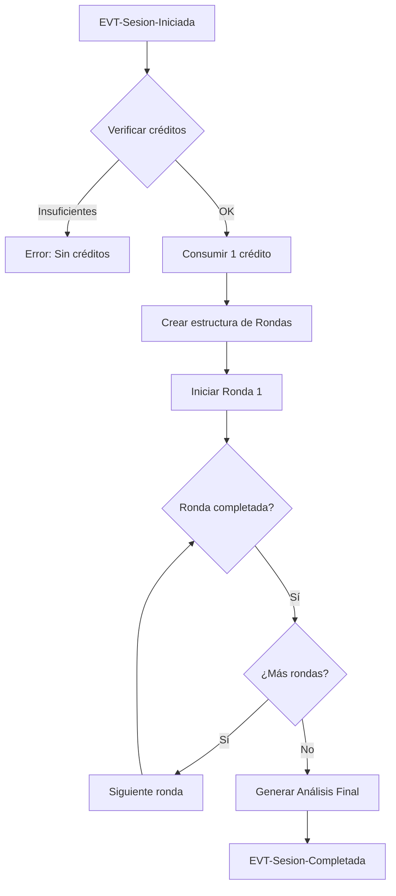

# Capa 02: Behavior (Comportamiento)

## El Comportamiento del Sistema: ¿Cómo se Comporta?

---

## Introducción

La capa de Behavior responde a la pregunta: **¿Cómo se comporta el sistema?**

Aquí definimos las **operaciones posibles** sobre el dominio y los **flujos de interacción** con el usuario. Esta capa es el corazón de la orquestación: define Commands, Queries, Processes, Use Cases y Policies.

> **Nota importante**: Esta capa es la de **ORCHESTRATION**. Referencia a 01-Domain y es referenciada por 03-Experience y 04-Verification.

```
┌─────────────────────────────────────────────────────────────────────────────┐
│                                                                              │
│   00-Requirements  →  01-Domain   →  02-Behavior    →  03-Experience        │
│                                                                              │
│   "¿Por qué           "¿Qué           "¿CÓMO SE           "¿Cómo lo         │
│    existe?"           existe?"         COMPORTA?"          ven?"            │
│                                                                              │
│   ──────────────────────────────────────────────────────────────────────────│
│                                                                              │
│   Motivación          Conceptual      FUNCIONAL           Experiencial       │
│   Contexto            (entidades)     COMMANDS            (vistas)           │
│   Objetivos           (reglas)        QUERIES                                │
│                                       PROCESSES                              │
│                                       USE CASES                              │
│                                       POLICIES                               │
│                                                                              │
└─────────────────────────────────────────────────────────────────────────────┘
```

---

## La Filosofía: CQRS Light + Use Cases

KDD adopta el patrón **CQRS (Command Query Responsibility Segregation)** combinado con **Use Cases** que describen las interacciones actor-sistema:

```
┌─────────────────────────────────────────────────────────────────────────────┐
│                                                                              │
│   CQRS: Separar operaciones de ESCRITURA y LECTURA                          │
│                                                                              │
│   ┌─────────────────────────────────────────────────────────────────────┐   │
│   │                                                                     │   │
│   │   COMMANDS (Escritura)          QUERIES (Lectura)                   │   │
│   │   ────────────────────          ─────────────────                   │   │
│   │                                                                     │   │
│   │   - Modifican estado            - Solo leen estado                  │   │
│   │   - Validan reglas              - No validan (datos ya válidos)     │   │
│   │   - Emiten eventos              - No emiten eventos                 │   │
│   │   - Pueden fallar               - Siempre exitosas (o vacías)       │   │
│   │   - Retornan poco/nada          - Retornan datos estructurados      │   │
│   │                                                                     │   │
│   │   Ejemplo:                      Ejemplo:                            │   │
│   │   CMD-CreateChallenge           QRY-ListChallenges                  │   │
│   │   CMD-InitiateSession           QRY-GetCreditBalance                │   │
│   │                                                                     │   │
│   └─────────────────────────────────────────────────────────────────────┘   │
│                                                                              │
│   USE CASES: Flujos actor-sistema que invocan Commands y Queries            │
│                                                                              │
└─────────────────────────────────────────────────────────────────────────────┘
```

### Por Qué Separar Commands y Queries

1. **Claridad mental**: Sabes exactamente qué operaciones modifican datos
2. **Optimización**: Queries pueden usar réplicas de lectura, caches
3. **Testing**: Commands se testean con rigor, Queries más ligero
4. **Escalabilidad**: Puedes escalar lectura y escritura independientemente

---

## Los Artefactos de la Capa de Behavior

### 1. Commands (Comandos)

Operaciones que **modifican el estado** del sistema.

#### Características de un Command

- **Intención clara**: Nombre en imperativo (CreateChallenge, not ChallengeCreation)
- **Input validado**: Schema de entrada con tipos y restricciones
- **Precondiciones**: Estado requerido antes de ejecutar
- **Postcondiciones**: Estado garantizado después
- **Eventos**: Lo que emite al completarse
- **Errores**: Casos de fallo documentados

#### Estructura de un Command

```markdown
---
id: CMD-001-CreateChallenge
kind: command
title: Create Challenge
status: approved
---

# CMD-001-CreateChallenge

## Propósito
Crea un nuevo [[Reto]] en estado `borrador` para el [[Usuario]] actual.

## Input
| Parámetro | Tipo | Requerido | Validación |
|-----------|------|-----------|------------|
| titulo | string | Sí | 1-100 caracteres |
| descripcion | string | Sí | 1-10000 caracteres |
| contexto | string | No | Máx 5000 caracteres |
| userId | UUID | Sí | Usuario autenticado |

## Precondiciones
- Usuario está autenticado
- Usuario tiene estado `activo`

## Postcondiciones
- Existe un nuevo [[Reto]] con:
  - ID único generado
  - Estado = `borrador`
  - creadorId = userId del input
  - createdAt = timestamp actual
- Evento [[EVT-Reto-Creado]] emitido

## Reglas Validadas
- [[BR-RETO-002]]: Título 1-100 caracteres
- [[BR-RETO-005]]: Descripción requerida

## Eventos Generados
- [[EVT-Reto-Creado]] (siempre, en éxito)

## Errores Posibles
| Código | Condición | Mensaje |
|--------|-----------|---------|
| RETO-001 | Título vacío | "El título es requerido" |
| RETO-002 | Título > 100 chars | "El título no puede exceder 100 caracteres" |
| RETO-003 | Descripción vacía | "La descripción es requerida" |
| AUTH-001 | No autenticado | "Debes iniciar sesión" |

## Output
```typescript
interface CreateChallengeOutput {
  retoId: string      // UUID del reto creado
  estado: 'borrador'  // Estado inicial
  createdAt: string   // ISO 8601
}
```
```

#### Naming Conventions para Commands

```
PATRÓN: CMD-{NNN}-{Verbo}{Sustantivo}

Verbos comunes:
- Create    → Crear algo nuevo
- Update    → Modificar existente
- Delete    → Eliminar
- Initiate  → Comenzar un proceso
- Complete  → Finalizar un proceso
- Cancel    → Abortar un proceso
- Generate  → Crear via IA/algoritmo
- Purchase  → Transacción de compra
- Consume   → Gastar un recurso
- Refund    → Devolver un recurso

Ejemplos:
- CMD-001-CreateChallenge
- CMD-009-InitiateSession
- CMD-013-GenerateAnalysis
```

---

### 2. Queries (Consultas)

Operaciones que **leen estado** sin modificarlo.

#### Características de una Query

- **Solo lectura**: Nunca modifica datos
- **Idempotente**: Llamar N veces da el mismo resultado
- **Sin efectos secundarios**: No emite eventos ni notificaciones
- **Puede retornar vacío**: Resultado vacío es válido, no error

#### Estructura de una Query

```markdown
---
id: QRY-002-ListChallenges
kind: query
title: List Challenges
status: approved
---

# QRY-002-ListChallenges

## Propósito
Obtiene la lista de [[Reto|Retos]] del [[Usuario]] actual,
con filtros y paginación.

## Input
| Parámetro | Tipo | Requerido | Default | Descripción |
|-----------|------|-----------|---------|-------------|
| userId | UUID | Sí | - | Usuario autenticado |
| estado | RetoEstado | No | todos | Filtrar por estado |
| search | string | No | - | Buscar en título/descripción |
| limit | number | No | 20 | Máx resultados (1-100) |
| offset | number | No | 0 | Para paginación |

## Output
```typescript
interface ListChallengesOutput {
  items: RetoSummary[]
  total: number
  limit: number
  offset: number
  hasMore: boolean
}
```

## Casos Especiales
| Caso | Resultado |
|------|-----------|
| Usuario sin retos | `{ items: [], total: 0, hasMore: false }` |
| Filtro sin matches | `{ items: [], total: 0, hasMore: false }` |
```

#### Naming Conventions para Queries

```
PATRÓN: QRY-{NNN}-{Verbo}{Sustantivo}

Verbos comunes:
- Get       → Obtener uno por ID
- List      → Obtener colección con filtros
- Search    → Búsqueda full-text
- Count     → Solo cantidad
- Exists    → Boolean de existencia

Ejemplos:
- QRY-001-GetChallenge
- QRY-002-ListChallenges
- QRY-006-GetCreditBalance
```

---

### 3. Use Cases (Casos de Uso)

**Flujos de interacción** actor-sistema que describen cómo se logra un objetivo.

#### Características de un Use Case

- **Actor claro**: Quién inicia el flujo
- **Objetivo definido**: Qué quiere lograr el actor
- **Flujo principal**: Secuencia de pasos felices
- **Flujos alternativos**: Variaciones válidas
- **Excepciones**: Manejo de errores

#### Estructura de un Use Case

```markdown
---
id: UC-001-CrearReto
kind: use-case
title: Crear Reto
actor: Usuario
status: approved
---

# UC-001: Crear Reto

## Contexto
| Elemento | Descripción |
|----------|-------------|
| Actor | [[Usuario]] autenticado |
| Objetivo | Crear un nuevo Reto para analizar |
| Precondición | Usuario ha iniciado sesión |
| Postcondición | Existe un nuevo Reto en estado `borrador` |
| Trigger | Usuario accede a "Nuevo Reto" |

## Flujo Principal
1. El Usuario accede a la pantalla de creación de Reto
2. El Sistema muestra el formulario de creación
3. El Usuario ingresa título y descripción del Reto
4. El Usuario opcionalmente añade contexto adicional
5. El Usuario hace clic en "Crear Reto"
6. El Sistema valida los datos ([[BR-RETO-002]], [[BR-RETO-005]])
7. El Sistema crea el [[Reto]] con estado `borrador`
8. El Sistema emite [[EVT-Reto-Creado]]
9. El Sistema redirige a la configuración de [[Persona Sintética|Personas]]

## Flujos Alternativos

### A1: Usuario solicita asistencia IA para título
En el paso 3:
1. El Usuario hace clic en "Sugerir título"
2. El Sistema invoca [[CMD-GenerateTitleSuggestions]]
3. El Sistema muestra 3 sugerencias
4. El Usuario selecciona una o escribe su propio título
5. Continúa en paso 4

## Excepciones

### E1: Validación falla
En el paso 6, si la validación falla:
1. El Sistema muestra mensajes de error específicos
2. El Usuario corrige los campos
3. Continúa en paso 5

## Commands Invocados
- [[CMD-001-CreateChallenge]]
- [[CMD-GenerateTitleSuggestions]] (opcional)

## Queries Invocados
- Ninguna

## Vistas Relacionadas
- [[UI-CrearReto]] - Formulario de creación

## Verificación
- [[crear-reto.feature]]
```

#### Naming Conventions para Use Cases

```
PATRÓN: UC-{NNN}-{VerboInfinitivo}{Sustantivo}

Ejemplos:
- UC-001-CrearReto
- UC-002-ConfigurarPersonas
- UC-003-IniciarSesion
- UC-004-VerAnalisis
```

---

### 4. Processes (Procesos de Negocio)

**Flujos que orquestan** múltiples Commands y reaccionan a Eventos.

#### Características de un Proceso

- **Orquestador**: Coordina múltiples operaciones
- **Reactivo**: Se dispara por eventos o triggers temporales
- **Con estado**: Puede tener pasos y checkpoints
- **Compensable**: Define qué hacer si algo falla

#### Estructura de un Proceso

```markdown
---
id: PROC-001-StartSession
kind: process
title: Start Session
trigger: EVT-Sesion-Iniciada
status: approved
---

# PROC-001-StartSession

## Descripción
Proceso que inicia una [[Sesión]] de análisis completa,
creando la estructura de [[Ronda|Rondas]] y ejecutándolas secuencialmente.

## Disparador
- [[CMD-009-InitiateSession]] exitoso → [[EVT-Sesion-Iniciada]]

## Diagrama de Flujo


## Pasos del Proceso

### 1. Verificar Créditos
- Invocar: [[QRY-006-GetCreditBalance]]
- Precondición: balance >= 1
- Si falla: Abortar con error CREDIT-001

### 2. Consumir Crédito
- Invocar: [[CMD-015-ConsumeCredit]]
- Registrar transacción vinculada a sesionId

### 3. Ejecutar Rondas (loop)
- Para cada Ronda en orden:
  - Invocar: [[CMD-011-ExecuteRound]]
  - Emitir: [[EVT-Ronda-Completada]]

### 4. Generar Análisis
- Invocar: [[CMD-013-GenerateAnalysis]]
- Emitir: [[EVT-Sesion-Completada]]

## Compensación (Rollback)
| Paso fallido | Compensación |
|--------------|--------------|
| Ejecutar ronda | [[CMD-016-RefundCredit]], marcar sesión como `fallida` |
| Generar análisis | Reintentar 3 veces, luego refund |

## Timeout
- Proceso completo: 15 minutos
- Al timeout: Compensación + [[EVT-Sesion-Timeout]]
```

---

### 5. Policies (Políticas)

**Comportamientos condicionados** del sistema: qué pasa cuando se ejecutan ciertas acciones.

#### Tipos de Policies

| Tipo | Prefijo | Scope | Descripción |
|------|---------|-------|-------------|
| Business Policy | `BP-{TOPIC}-NNN` | Entidad específica | Política de negocio configurable |
| Cross-Policy | `XP-{TOPIC}-NNN` | Transversal | Aplica a múltiples Commands/Queries |

#### Características

- **Comportamiento condicionado**: "WHEN X happens, THEN do Y"
- **Configurables**: Parámetros que pueden cambiar
- **Interceptoras**: Se evalúan antes o después de operaciones

#### Estructura de una Policy

```markdown
---
id: XP-AUTH-001
kind: cross-policy
title: Autenticación Requerida
scope: [CMD-*, QRY-*]
status: approved
---

# XP-AUTH-001: Autenticación Requerida

## Descripción
Todos los Commands y Queries requieren un usuario autenticado,
excepto los explícitamente marcados como públicos.

## Aplica a
- Todos los `CMD-*` excepto: CMD-RegisterUser, CMD-LoginUser
- Todos los `QRY-*` excepto: QRY-GetPublicChallenge

## Evaluación
```
BEFORE command/query execution:
  IF operation NOT IN [public_operations]
    AND request.user IS NULL:
      THROW AuthenticationRequired
```

## Error
| Código | Mensaje |
|--------|---------|
| AUTH-001 | "Debes iniciar sesión para realizar esta acción" |

## Parámetros
| Parámetro | Valor | Configurable |
|-----------|-------|--------------|
| public_operations | [CMD-Register, CMD-Login, QRY-Public*] | Sí |
```

#### Naming Conventions para Policies

```
PATRÓN BP: BP-{TOPIC}-{NNN}  (Business Policy - scope específico)
PATRÓN XP: XP-{TOPIC}-{NNN}  (Cross-Policy - scope transversal)

Topics comunes BP:
- CREDITO    → Comportamiento de créditos
- TIMEOUT    → Gestión de inactividad
- SUSCRIPCION → Ciclo de suscripciones
- IA         → SLAs de integraciones IA

Topics comunes XP:
- CREDITOS → Verificación transversal de créditos
- AUTH     → Autenticación/Autorización
- RATE     → Rate limiting
- AUDIT    → Auditoría/Logging

Ejemplos:
- BP-CREDITO-001 (Descuento atómico)
- BP-TIMEOUT-001 (Inactividad 30+15 min)
- XP-CREDITOS-001 (Verificación en comandos billable)
- XP-AUTH-001 (Autenticación requerida)
```

---

## El Principio de Dependencia

La capa de Behavior:
- **REFERENCIA**: Entidades, Value Objects, Reglas, Eventos (01-Domain)
- **NO REFERENCIA**: Vistas (03-Experience)

```
┌─────────────────────────────────────────────────────────────────────────────┐
│                                                                              │
│   02-CAPABILITIES                                                            │
│                                                                              │
│   [[CMD-001-CreateChallenge]]                                                │
│     │                                                                        │
│     ├── referencia → [[Reto]]           (entidad)                           │
│     ├── referencia → [[BR-RETO-002]]    (regla)                             │
│     ├── referencia → [[EVT-Reto-Creado]] (evento)                           │
│     │                                                                        │
│     └── NO referencia → [[UI-RetoEditor]]  ❌                               │
│                                                                              │
│   [[UC-001-CrearReto]]                                                       │
│     │                                                                        │
│     ├── referencia → [[CMD-001-CreateChallenge]]  (command)                 │
│     ├── referencia → [[Reto]]                     (entidad)                 │
│     │                                                                        │
│     └── referencia → [[UI-CrearReto]]  ✅ (vista relacionada, no dependencia)│
│                                                                              │
└─────────────────────────────────────────────────────────────────────────────┘
```

> **Nota**: Los Use Cases pueden **mencionar** vistas en "Vistas Relacionadas" para navegación, pero no dependen de ellas funcionalmente.

---

## Estructura de Carpetas

```
/specs/02-behavior/
├── /commands/
│   ├── CMD-001-CreateChallenge.md
│   ├── CMD-002-UpdateChallenge.md
│   ├── CMD-003-DeleteChallenge.md
│   ├── CMD-009-InitiateSession.md
│   ├── CMD-013-GenerateAnalysis.md
│   └── ...
│
├── /queries/
│   ├── QRY-001-GetChallenge.md
│   ├── QRY-002-ListChallenges.md
│   ├── QRY-006-GetCreditBalance.md
│   └── ...
│
├── /processes/
│   ├── PROC-001-StartSession.md
│   └── PROC-002-MonthlyBilling.md
│
├── /use-cases/
│   ├── UC-001-CrearReto.md
│   ├── UC-002-ConfigurarPersonas.md
│   ├── UC-003-IniciarSesion.md
│   ├── UC-004-VerAnalisis.md
│   └── ...
│
└── /policies/
    ├── BP-CREDITO-001.md     # Business Policy (comportamiento específico)
    ├── BP-TIMEOUT-001.md
    ├── XP-CREDITOS-001.md    # Cross-Policy (transversal)
    └── XP-AUTH-001.md
```

---

## Checklist: Especificando Behavior

### Para Commands
- [ ] ID en formato `CMD-{NNN}-{Verbo}{Sustantivo}`
- [ ] Nombre en imperativo (Create, Update, Delete)
- [ ] Input con tipos y validaciones
- [ ] Precondiciones claras
- [ ] Postcondiciones garantizadas
- [ ] Reglas de dominio que valida
- [ ] Eventos que emite
- [ ] Errores posibles con códigos
- [ ] Output estructurado

### Para Queries
- [ ] ID en formato `QRY-{NNN}-{Verbo}{Sustantivo}`
- [ ] Nombre describe qué retorna (Get, List)
- [ ] Input con filtros y paginación
- [ ] Output con tipos exactos
- [ ] Casos especiales (vacío, no encontrado)

### Para Use Cases
- [ ] ID en formato `UC-{NNN}-{Verbo}{Sustantivo}`
- [ ] Actor claramente identificado
- [ ] Objetivo definido
- [ ] Flujo principal paso a paso
- [ ] Flujos alternativos documentados
- [ ] Excepciones con manejo
- [ ] Commands/Queries que invoca
- [ ] Vistas relacionadas (opcional)

### Para Processes
- [ ] ID en formato `PROC-{NNN}-{Nombre}`
- [ ] Trigger que lo inicia
- [ ] Diagrama de flujo
- [ ] Pasos con Commands/Queries involucrados
- [ ] Estrategia de compensación
- [ ] Timeouts definidos

### Para Policies
- [ ] ID en formato `BP-{TOPIC}-NNN` (específica) o `XP-{TOPIC}-NNN` (transversal)
- [ ] Scope de aplicación claro (entidad o comandos afectados)
- [ ] Lógica de evaluación (WHEN/BEFORE/AFTER)
- [ ] Parámetros configurables
- [ ] Errores que genera

---

## Anti-patrones a Evitar

### 1. Command que Conoce la Vista

```yaml
# ❌ INCORRECTO
# CMD-001-CreateChallenge.md
## Usado por:
- UI-RetoEditor  # El command no debe saber esto

# ✅ CORRECTO
# (Sin sección "Usado por" - la vista conoce al command, no al revés)
```

### 2. Query que Modifica Estado

```typescript
// ❌ INCORRECTO
class GetChallengeQuery {
  async execute(id: string) {
    const reto = await this.repo.findById(id)
    reto.viewCount++  // ¡Modificando en una query!
    return reto
  }
}

// ✅ CORRECTO
class GetChallengeQuery {
  async execute(id: string) {
    return await this.repo.findById(id)  // Solo lectura
  }
}
```

### 3. Use Case sin Commands

```yaml
# ❌ INCORRECTO
# UC-001.md
## Commands Invocados
(ninguno)  # ¿Entonces qué hace?

# ✅ CORRECTO
## Commands Invocados
- [[CMD-001-CreateChallenge]]
```

### 4. Process sin Compensación

```yaml
# ❌ INCORRECTO
# PROC-001.md
## Compensación
(no definida)

# ✅ CORRECTO
## Compensación
| Paso fallido | Acción |
|--------------|--------|
| Paso 3 | Refund crédito, notificar usuario |
```

---

## Resumen

La capa de Behavior en KDD:

1. **Define operaciones**: Commands (escritura) y Queries (lectura)
2. **Describe interacciones**: Use Cases con flujos actor-sistema
3. **Orquesta procesos**: Flujos complejos de múltiples pasos
4. **Aplica políticas**: Cross-Policies transversales
5. **Referencia al dominio**: Usa entidades, valida reglas, emite eventos
6. **Es agnóstica de UI**: No depende de las vistas
7. **Es testeable**: Input → Output bien definido

> **"Un sistema bien diseñado tiene Commands claros, Use Cases que los orquestan, y Policies que los gobiernan."**

---

## Artefactos Relacionados

- [[command.template]] - Template para commands
- [[query.template]] - Template para queries
- [[use-case.template]] - Template para use cases
- [[process.template]] - Template para procesos
- [[policy.template]] - Template para policies
- [[01-domain]] - La capa anterior: Domain
- [[03-experience]] - La capa siguiente: Experience
- [[Introducción a KDD]] - Visión general de KDD

---

*Última actualización: 2025-01*
