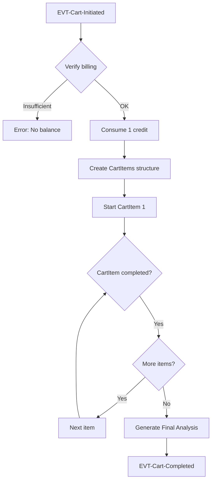

# Layer 02: Behavior

## System Behavior: How Does It Behave?

---

## Introduction

The Behavior layer answers the question: **How does the system behave?**

Here we define the **possible operations** on the domain and the **interaction flows** with the user. This layer is the heart of orchestration: it defines Commands, Queries, Processes, Use Cases, and Policies.

> **Important note**: This layer is the **ORCHESTRATION** layer. It references 01-Domain and is referenced by 03-Experience and 04-Verification.

```
┌─────────────────────────────────────────────────────────────────────────────┐
│                                                                              │
│   00-Requirements  →  01-Domain   →  02-Behavior  →  03-Experience          │
│                                          ↓                                   │
│   "Why does            "What          04-Verification   05-Architecture     │
│    it exist?"          exists?"       "HOW DOES IT BEHAVE?"                 │
│                                                                              │
│   ──────────────────────────────────────────────────────────────────────────│
│                                                                              │
│   Motivation          Conceptual      FUNCTIONAL       Experiential         │
│   Context             (entities)      COMMANDS         (views)              │
│   Objectives          (rules)         QUERIES          Validation           │
│                                       PROCESSES        Architecture         │
│                                       USE CASES                              │
│                                       POLICIES                               │
│                                                                              │
└─────────────────────────────────────────────────────────────────────────────┘
```

---

## The Philosophy: CQRS Light + Use Cases

KDD adopts the **CQRS (Command Query Responsibility Segregation)** pattern combined with **Use Cases** that describe actor-system interactions:

```
┌─────────────────────────────────────────────────────────────────────────────┐
│                                                                              │
│   CQRS: Separate WRITE and READ operations                                  │
│                                                                              │
│   ┌─────────────────────────────────────────────────────────────────────┐   │
│   │                                                                     │   │
│   │   COMMANDS (Write)                QUERIES (Read)                    │   │
│   │   ────────────────────          ─────────────────                   │   │
│   │                                                                     │   │
│   │   - Modify state                  - Only read state                 │   │
│   │   - Validate rules                - No validation (data already     │   │
│   │   - Emit events                     valid)                          │   │
│   │   - Can fail                      - Do not emit events              │   │
│   │   - Return little/nothing         - Always succeed (or empty)       │   │
│   │                                   - Return structured data          │   │
│   │   Example:                        Example:                          │   │
│   │   CMD-PlaceOrder                  QRY-ListOrders                    │   │
│   │   CMD-InitiateCart                QRY-GetBillingBalance             │   │
│   │                                                                     │   │
│   └─────────────────────────────────────────────────────────────────────┘   │
│                                                                              │
│   USE CASES: Actor-system flows that invoke Commands and Queries            │
│                                                                              │
└─────────────────────────────────────────────────────────────────────────────┘
```

### Why Separate Commands and Queries

1. **Mental clarity**: You know exactly which operations modify data
2. **Optimization**: Queries can use read replicas, caches
3. **Testing**: Commands are tested rigorously, Queries more lightly
4. **Scalability**: You can scale reads and writes independently

---

## The Artifacts of the Behavior Layer

### 1. Commands

Operations that **modify the state** of the system.

#### Characteristics of a Command

- **Clear intent**: Name in imperative form (PlaceOrder, not OrderPlacement)
- **Validated input**: Input schema with types and constraints
- **Preconditions**: Required state before execution
- **Postconditions**: Guaranteed state afterwards
- **Events**: What it emits upon completion
- **Errors**: Documented failure cases

#### Structure of a Command

```markdown
---
id: CMD-001
kind: command
status: approved
---

# CMD-001-PlaceOrder

## Purpose
Creates a new [[Order]] in `draft` state for the current [[Customer]].

## Input
| Parameter | Type | Required | Validation |
|-----------|------|----------|------------|
| title | string | Yes | 1-100 characters |
| description | string | Yes | 1-10000 characters |
| context | string | No | Max 5000 characters |
| userId | UUID | Yes | Authenticated user |

## Preconditions
- Customer is authenticated
- Customer has `active` status

## Postconditions
- A new [[Order]] exists with:
  - Unique generated ID
  - Status = `draft`
  - creatorId = userId from input
  - createdAt = current timestamp
- Event [[EVT-Order-Placed]] emitted

## Rules Validated
- [[BR-002-OrderTitleLength]]: Title 1-100 characters
- [[BR-011-DescriptionRequired]]: Description required

## Events
- [[EVT-Order-Placed]] (always, on success)

## Possible Errors
| Code | Condition | Message |
|------|-----------|---------|
| ORDER-001 | Empty title | "Title is required" |
| ORDER-002 | Title > 100 chars | "Title cannot exceed 100 characters" |
| ORDER-003 | Empty description | "Description is required" |
| AUTH-001 | Not authenticated | "You must log in" |
```

#### Naming Conventions for Commands

```
PATTERN: CMD-{NNN}-{Verb}{Noun}

Common verbs:
- Create    → Create something new
- Update    → Modify existing
- Delete    → Remove
- Initiate  → Start a process
- Complete  → Finish a process
- Cancel    → Abort a process
- Generate  → Create via AI/algorithm
- Purchase  → Purchase transaction
- Consume   → Spend a resource
- Refund    → Return a resource

Examples:
- CMD-001-PlaceOrder
- CMD-009-InitiateCart
- CMD-013-GenerateAnalysis
```

---

### 2. Queries

Operations that **read state** without modifying it.

#### Characteristics of a Query

- **Read-only**: Never modifies data
- **Idempotent**: Calling N times yields the same result
- **No side effects**: Does not emit events or notifications
- **Can return empty**: Empty result is valid, not an error

#### Structure of a Query

```markdown
---
id: QRY-002
kind: query
status: approved
---

# QRY-002-ListOrders

## Purpose
Retrieves the list of [[Order|Orders]] for the current [[Customer]],
with filters and pagination.

## Input
| Parameter | Type | Required | Default | Description |
|-----------|------|----------|---------|-------------|
| userId | UUID | Yes | - | Authenticated user |
| status | OrderStatus | No | all | Filter by status |
| search | string | No | - | Search in title/description |
| limit | number | No | 20 | Max results (1-100) |
| offset | number | No | 0 | For pagination |

## Output

| Field | Type | Description |
|-------|------|-------------|
| items | OrderSummary[] | List of order summaries |
| total | number | Total matching results |
| limit | number | Page size |
| offset | number | Current offset |
| hasMore | boolean | Whether more results exist |

## Special Cases
| Case | Result |
|------|--------|
| Customer with no orders | `{ items: [], total: 0, hasMore: false }` |
| Filter with no matches | `{ items: [], total: 0, hasMore: false }` |
```

#### Naming Conventions for Queries

```
PATTERN: QRY-{NNN}-{Verb}{Noun}

Common verbs:
- Get       → Retrieve one by ID
- List      → Retrieve collection with filters
- Search    → Full-text search
- Count     → Only quantity
- Exists    → Boolean existence check

Examples:
- QRY-001-GetOrder
- QRY-002-ListOrders
- QRY-006-GetBillingBalance
```

---

### 3. Use Cases

**Interaction flows** between actor and system that describe how an objective is achieved.

#### Characteristics of a Use Case

- **Clear actor**: Who initiates the flow
- **Defined objective**: What the actor wants to achieve
- **Main flow**: Happy path step sequence
- **Alternative flows**: Valid variations
- **Exceptions**: Error handling

#### Structure of a Use Case

```markdown
---
id: UC-001
kind: use-case
status: approved
---

# UC-001: Place Order

## Context
| Element | Description |
|---------|-------------|
| Actor | Authenticated [[Customer]] |
| Objective | Create a new Order to process |
| Precondition | Customer has logged in |
| Postcondition | A new Order exists in `draft` state |
| Trigger | Customer navigates to "New Order" |

## Main Flow
1. The Customer navigates to the order creation screen
2. The System displays the creation form
3. The Customer enters the title and description of the Order
4. The Customer optionally adds additional context
5. The Customer clicks "Place Order"
6. The System validates the data ([[BR-002-OrderTitleLength]], [[BR-011-DescriptionRequired]])
7. The System creates the [[Order]] with `draft` status
8. The System emits [[EVT-Order-Placed]]
9. The System redirects to the [[Product|Products]] configuration

## Alternative Flows

### A1: Customer requests AI assistance for title
At step 3:
1. The Customer clicks "Suggest title"
2. The System invokes [[CMD-GenerateTitleSuggestions]]
3. The System displays 3 suggestions
4. The Customer selects one or types their own title
5. Continues at step 4

## Exceptions

### E1: Validation fails
At step 6, if validation fails:
1. The System displays specific error messages
2. The Customer corrects the fields
3. Continues at step 5

## Commands Invoked
- [[CMD-001-PlaceOrder]]
- [[CMD-GenerateTitleSuggestions]] (optional)

## Queries Invoked
- None

## Related Views
- [[UI-PlaceOrder]] - Creation form

## Verification
- [[place-order.feature]]
```

#### Naming Conventions for Use Cases

```
PATTERN: UC-{NNN}-{VerbNoun}

Examples:
- UC-001-PlaceOrder
- UC-002-ConfigureProducts
- UC-003-InitiateCart
- UC-004-ViewAnalysis
```

---

### 4. Processes (Business Processes)

**Flows that orchestrate** multiple Commands and react to Events.

#### Characteristics of a Process

- **Orchestrator**: Coordinates multiple operations
- **Reactive**: Triggered by events or temporal triggers
- **Stateful**: Can have steps and checkpoints
- **Compensable**: Defines what to do if something fails

#### Structure of a Process

```markdown
---
id: PROC-001
kind: process
status: approved
---

# PROC-001-StartCart

## Description
Process that initiates a complete analysis [[Cart]],
creating the [[CartItem|CartItems]] structure and executing them sequentially.

## Trigger
- [[CMD-009-InitiateCart]] successful → [[EVT-Cart-Initiated]]

## Flow Diagram


## Process Steps

### 1. Verify Billing
- Invoke: [[QRY-006-GetBillingBalance]]
- Precondition: balance >= 1
- If fails: Abort with error BILLING-001

### 2. Consume Credit
- Invoke: [[CMD-015-ConsumeCredit]]
- Record transaction linked to cartId

### 3. Execute CartItems (loop)
- For each CartItem in order:
  - Invoke: [[CMD-011-ExecuteCartItem]]
  - Emit: [[EVT-CartItem-Completed]]

### 4. Generate Analysis
- Invoke: [[CMD-013-GenerateAnalysis]]
- Emit: [[EVT-Cart-Completed]]

## Compensation (Rollback)
| Failed Step | Compensation |
|-------------|--------------|
| Execute item | [[CMD-016-RefundCredit]], mark cart as `failed` |
| Generate analysis | Retry 3 times, then refund |

## Timeout
- Full process: 15 minutes
- On timeout: Compensation + [[EVT-Cart-Timeout]]
```

---

### 5. Policies

**Conditioned behaviors** of the system: what happens when certain actions are executed.

#### Types of Policies

| Type | Prefix | Scope | Description |
|------|--------|-------|-------------|
| Business Policy | `BP-NNN` | Specific entity | Configurable business policy |
| Cross-Policy | `XP-NNN` | Cross-cutting | Applies to multiple Commands/Queries |

#### Characteristics

- **Conditioned behavior**: "WHEN X happens, THEN do Y"
- **Configurable**: Parameters that can change
- **Intercepting**: Evaluated before or after operations

#### Structure of a Policy

```markdown
---
id: XP-001
kind: cross-policy
status: approved
---

# XP-001-AuthRequired: Authentication Required

## Description
All Commands and Queries require an authenticated user,
except those explicitly marked as public.

## Applies To
- All `CMD-*` except: CMD-RegisterUser, CMD-LoginUser
- All `QRY-*` except: QRY-GetPublicOrder

## Evaluation
```
BEFORE command/query execution:
  IF operation NOT IN [public_operations]
    AND request.user IS NULL:
      THROW AuthenticationRequired
```

## Error
| Code | Message |
|------|---------|
| AUTH-001 | "You must log in to perform this action" |

## Parameters
| Parameter | Value | Configurable |
|-----------|-------|--------------|
| public_operations | [CMD-Register, CMD-Login, QRY-Public*] | Yes |
```

#### Naming Conventions for Policies

```
BP PATTERN: BP-{NNN}-{Name}  (Business Policy - specific scope)
XP PATTERN: XP-{NNN}-{Name}  (Cross-Policy - cross-cutting scope)

Common BP Topics:
- BILLING     → Billing behavior
- TIMEOUT     → Inactivity management
- SUBSCRIPTION → Subscription lifecycle
- AI          → AI integration SLAs

Common XP Topics:
- BILLING  → Cross-cutting billing verification
- AUTH     → Authentication/Authorization
- RATE     → Rate limiting
- AUDIT    → Auditing/Logging

Examples:
- BP-001-BillingCycle (Atomic deduction)
- BP-002-SessionTimeout (Inactivity 30+15 min)
- XP-001-BillingValidation (Verification in billable commands)
- XP-002-AuthRequired (Authentication required)
```

---

## The Dependency Principle

The Behavior layer:
- **REFERENCES**: Entities, Value Objects, Rules, Events (01-Domain)
- **DOES NOT REFERENCE**: Views (03-Experience)

```
┌─────────────────────────────────────────────────────────────────────────────┐
│                                                                              │
│   02-CAPABILITIES                                                            │
│                                                                              │
│   [[CMD-001-PlaceOrder]]                                                     │
│     │                                                                        │
│     ├── references → [[Order]]             (entity)                          │
│     ├── references → [[BR-002-OrderTitleLength]]  (rule)                     │
│     ├── references → [[EVT-Order-Placed]]  (event)                           │
│     │                                                                        │
│     └── DOES NOT reference → [[UI-OrderEditor]]  ❌                          │
│                                                                              │
│   [[UC-001-PlaceOrder]]                                                      │
│     │                                                                        │
│     ├── references → [[CMD-001-PlaceOrder]]      (command)                   │
│     ├── references → [[Order]]                   (entity)                    │
│     │                                                                        │
│     └── references → [[UI-PlaceOrder]]  ✅ (related view, not dependency)    │
│                                                                              │
└─────────────────────────────────────────────────────────────────────────────┘
```

> **Note**: Use Cases can **mention** views in "Related Views" for navigation purposes, but they do not depend on them functionally.

---

## Folder Structure

```
/specs/02-behavior/
├── /commands/
│   ├── CMD-001-PlaceOrder.md
│   ├── CMD-002-UpdateOrder.md
│   ├── CMD-003-DeleteOrder.md
│   ├── CMD-009-InitiateCart.md
│   ├── CMD-013-GenerateAnalysis.md
│   └── ...
│
├── /queries/
│   ├── QRY-001-GetOrder.md
│   ├── QRY-002-ListOrders.md
│   ├── QRY-006-GetBillingBalance.md
│   └── ...
│
├── /processes/
│   ├── PROC-001-StartCart.md
│   └── PROC-002-MonthlyBilling.md
│
├── /use-cases/
│   ├── UC-001-PlaceOrder.md
│   ├── UC-002-ConfigureProducts.md
│   ├── UC-003-InitiateCart.md
│   ├── UC-004-ViewAnalysis.md
│   └── ...
│
└── /policies/
    ├── BP-001-BillingCycle.md     # Business Policy (specific behavior)
    ├── BP-002-SessionTimeout.md
    ├── XP-001-BillingValidation.md  # Cross-Policy (cross-cutting)
    └── XP-002-AuthRequired.md
```

---

## Checklist: Specifying Behavior

### For Commands
- [ ] ID in `CMD-{NNN}-{Verb}{Noun}` format
- [ ] Name in imperative form (Create, Update, Delete)
- [ ] Input with types and validations
- [ ] Clear preconditions
- [ ] Guaranteed postconditions
- [ ] Domain rules it validates
- [ ] Events it emits
- [ ] Possible errors with codes
- [ ] Structured output

### For Queries
- [ ] ID in `QRY-{NNN}-{Verb}{Noun}` format
- [ ] Name describes what it returns (Get, List)
- [ ] Input with filters and pagination
- [ ] Output with exact types
- [ ] Special cases (empty, not found)

### For Use Cases
- [ ] ID in `UC-{NNN}-{Verb}{Noun}` format
- [ ] Clearly identified actor
- [ ] Defined objective
- [ ] Step-by-step main flow
- [ ] Documented alternative flows
- [ ] Exceptions with handling
- [ ] Commands/Queries it invokes
- [ ] Related views (optional)

### For Processes
- [ ] ID in `PROC-{NNN}-{Name}` format
- [ ] Trigger that initiates it
- [ ] Flow diagram
- [ ] Steps with involved Commands/Queries
- [ ] Compensation strategy
- [ ] Defined timeouts

### For Policies
- [ ] ID in `BP-NNN` (specific) or `XP-NNN` (cross-cutting) format
- [ ] Clear application scope (entity or affected commands)
- [ ] Evaluation logic (WHEN/BEFORE/AFTER)
- [ ] Configurable parameters
- [ ] Errors it generates

---

## Anti-patterns to Avoid

### 1. Command that Knows the View

```yaml
# ❌ INCORRECT
# CMD-001-PlaceOrder.md
## Used by:
- UI-OrderEditor  # The command should not know this

# ✅ CORRECT
# (No "Used by" section - the view knows the command, not the other way around)
```

### 2. Query that Modifies State

```typescript
// ❌ INCORRECT
class GetOrderQuery {
  async execute(id: string) {
    const order = await this.repo.findById(id)
    order.viewCount++  // Modifying in a query!
    return order
  }
}

// ✅ CORRECT
class GetOrderQuery {
  async execute(id: string) {
    return await this.repo.findById(id)  // Read-only
  }
}
```

### 3. Use Case without Commands

```yaml
# ❌ INCORRECT
# UC-001.md
## Commands Invoked
(none)  # Then what does it do?

# ✅ CORRECT
## Commands Invoked
- [[CMD-001-PlaceOrder]]
```

### 4. Process without Compensation

```yaml
# ❌ INCORRECT
# PROC-001.md
## Compensation
(not defined)

# ✅ CORRECT
## Compensation
| Failed Step | Action |
|-------------|--------|
| Step 3 | Refund credit, notify user |
```

---

## Summary

The Behavior layer in KDD:

1. **Defines operations**: Commands (write) and Queries (read)
2. **Describes interactions**: Use Cases with actor-system flows
3. **Orchestrates processes**: Complex multi-step flows
4. **Applies policies**: Cross-cutting Cross-Policies
5. **References the domain**: Uses entities, validates rules, emits events
6. **Is UI-agnostic**: Does not depend on views
7. **Is testable**: Well-defined Input → Output

> **"A well-designed system has clear Commands, Use Cases that orchestrate them, and Policies that govern them."**

---

## Related Artifacts

- [[command.template]] - Template for commands
- [[query.template]] - Template for queries
- [[use-case.template]] - Template for use cases
- [[process.template]] - Template for processes
- [[policy.template]] - Template for policies
- [[01-domain]] - The previous layer: Domain
- [[03-experience]] - The next layer: Experience
- [[Introduction to KDD]] - KDD overview

---

*Last updated: 2025-01*
