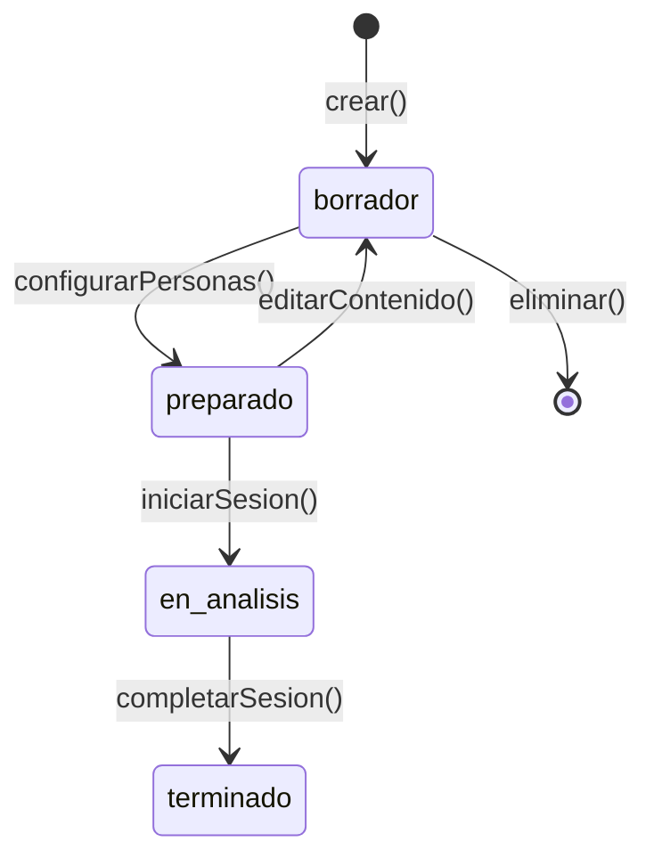

# Capa 02: Dominio

## El Corazón del Sistema: ¿Qué Conceptos Existen?

---

## Introducción

La capa de Dominio responde a la pregunta: **¿Qué conceptos existen en nuestro universo de problema?**

Aquí aplicamos los principios de **Domain-Driven Design (DDD)** para modelar el dominio de forma pura, sin contaminación de UI, bases de datos, ni tecnología específica. Es la capa más **estable** del sistema: las entidades del dominio cambian menos que el resto de la Aplicación.

```
┌─────────────────────────────────────────────────────────────────────────────┐
│                                                                              │
│   01-Problem    →   02-Domain   →   03-Capabilities   →   04-Interaction    │
│                                                                              │
│   "¿Por qué        "¿QUÉ            "¿Qué puede          "¿Cómo lo          │
│    existe?"        EXISTE?"          hacer?"               usan?"            │
│                                                                              │
│   ──────────────────────────────────────────────────────────────────────────│
│                                                                              │
│   Motivación       CONCEPTUAL       Funcional            Experiencial        │
│   Contexto         ENTIDADES        (operaciones)        (personas)          │
│   Objetivos        REGLAS                                                    │
│                    EVENTOS                                                   │
│                                                                              │
└─────────────────────────────────────────────────────────────────────────────┘
```

---

## La Filosofía: El Dominio como Verdad Inmutable

### Por Qué el Dominio es el Centro

El código cambia. Los frameworks mueren. Las bases de datos se migran. Las UIs se rediseñan.

Pero las **reglas de negocio** y las **entidades del dominio** permanecen:

```
┌─────────────────────────────────────────────────────────────────────────────┐
│                                                                              │
│   2015: "Una Factura debe tener al menos una línea"                         │
│   2020: "Una Factura debe tener al menos una línea"                         │
│   2025: "Una Factura debe tener al menos una línea"                         │
│                                                                              │
│   El framework cambió 3 veces.                                               │
│   La base de datos migró 2 veces.                                            │
│   La UI se rediseñó completamente.                                           │
│                                                                              │
│   La regla de negocio sigue siendo la misma.                                │
│                                                                              │
└─────────────────────────────────────────────────────────────────────────────┘
```


### El Lenguaje Ubicuo
A esta capa la llamamos también la capa conceptual, la que explica en qué consiste la Aplicación y establece un mismo idioma para todos los integrantes del equipo. Normalmente es el punto de partida ya que no se puede comprender cómo construir la Aplicación si existe ambigüedad sobre los conceptos principales.

Un principio fundamental de DDD que KDD adopta: **todos hablan el mismo idioma**.

```
┌─────────────────────────────────────────────────────────────────────────────┐
│                                                                              │
│   LENGUAJE UBICUO (Ubiquitous Language)                                     │
│                                                                              │
│   Negocio dice:     "El cliente crea un reto"                               │
│   Dominio dice:     "El [[Usuario]] crea un [[Reto]]"                       │
│   Código dice:      usuario.crearReto(datos)                                │
│   Tests dicen:      "Given un Usuario, When crea un Reto..."                │
│   UI dice:          "Crear Reto" (botón)                                    │
│                                                                              │
│   TODOS usan los mismos términos. No hay traducción.                        │
│                                                                              │
└─────────────────────────────────────────────────────────────────────────────┘
```

En KDD, los términos del dominio **siempre van con mayúscula inicial** en la documentación para enfatizar que estamos referenciando un concepto clave en la aplicación, y no está puesto casualmente:

```markdown
✅ "El Usuario crea un Reto y configura las Personas Sintéticas"
❌ "El usuario crea un reto y configura las personas sintéticas"
```

---

## Los Artefactos de la Capa de Dominio

### 1. Entidades (Entities)

Objetos con **identidad única** que persiste a lo largo del tiempo.

#### Características de una Entidad

- Tiene un **ID** único e inmutable
- Su identidad no cambia aunque sus atributos cambien
- Tiene un **ciclo de vida** (se crea, modifica, puede eliminarse)
- Genera **eventos** cuando ocurren cambios significativos

#### Estructura de una Entidad

```markdown
---
id: ENT-001
title: Reto
type: entity
status: approved
---

# Reto

## Descripción
Representa un problema o situación que el [[Usuario]] desea analizar
mediante el [[Método Seis Sombreros]].

## Identidad
- `retoId`: UUID, asignado al crear, inmutable

## Atributos
| Atributo | Tipo | Requerido | Descripción |
|----------|------|-----------|-------------|
| titulo | string(1-100) | Sí | Nombre descriptivo del reto |
| descripcion | text | Sí | Descripción detallada del problema |
| contexto | text | No | Información de fondo adicional |
| estado | RetoEstado | Sí | Estado actual del ciclo de vida |
| creadorId | UUID | Sí | [[Usuario]] que creó el reto |
| createdAt | DateTime | Sí | Fecha de creación |
| updatedAt | DateTime | Sí | Última modificación |

## Estados (Ciclo de Vida)


## Invariantes
- Un Reto en estado `preparado` debe tener entre 3 y 6 [[Persona Sintética|Personas]]
- Un Reto en estado `en_analisis` no puede modificarse
- Solo el creador puede modificar un Reto

## Relaciones
- Pertenece a: [[Usuario]] (creador)
- Contiene: [[Persona Sintética]] (3-6)
- Genera: [[Sesión]] (0-n)

## Eventos que Genera
- [[EVT-Reto-Creado]] al crear()
- [[EVT-Reto-Preparado]] al alcanzar estado `preparado`
- [[EVT-Reto-Iniciado]] al iniciar primera sesión

## Reglas que Aplican
- [[BR-RETO-002]]: Título de 1-100 caracteres
- [[BR-RETO-004]]: Requiere 3-6 Personas para estar preparado
```

---

### 2. Value Objects (Objetos de Valor)

Objetos **sin identidad propia**, definidos completamente por sus atributos.

#### Características de un Value Object

- **No tiene ID**: Dos Value Objects con los mismos atributos son iguales
- **Inmutable**: Una vez creado, no cambia (se crea uno nuevo)
- **Autovalidante**: Garantiza sus invariantes en construcción

#### Ejemplos Comunes

```markdown
# Dinero (Money)

## Descripción
Representa una cantidad monetaria con su divisa.

## Atributos
| Atributo | Tipo | Descripción |
|----------|------|-------------|
| cantidad | decimal | Monto numérico |
| divisa | string(3) | Código ISO 4217 (EUR, USD) |

## Invariantes
- cantidad >= 0
- divisa debe ser código ISO válido

## Operaciones
- `sumar(otro: Money): Money` - Suma dos montos (misma divisa)
- `multiplicar(factor: number): Money` - Escala el monto

## Igualdad
Dos Money son iguales si tienen misma cantidad Y misma divisa.
```

```markdown
# ColorSombrero

## Descripción
Representa uno de los seis sombreros del método de De Bono.

## Valores Posibles
| Valor | Significado | Perspectiva |
|-------|-------------|-------------|
| blanco | Hechos | Objetiva, datos puros |
| rojo | Emociones | Intuición, sentimientos |
| negro | Cautela | Riesgos, problemas |
| amarillo | Optimismo | Beneficios, oportunidades |
| verde | Creatividad | Ideas nuevas, alternativas |
| azul | Control | Proceso, meta-pensamiento |

## Inmutabilidad
Es un enum, no puede tener valores fuera de los definidos.
```

---

### 3. Agregados (Aggregates)

**Clusters de entidades** que se tratan como una unidad para cambios de datos.

#### Características de un Agregado

- Tiene una **raíz** (Aggregate Root) que controla el acceso
- Las entidades internas solo se acceden a través de la raíz
- Las operaciones mantienen la **consistencia** del cluster completo
- Los cambios se persisten **atómicamente**

#### Ejemplo: Agregado Sesión

```markdown
# Agregado: Sesión

## Raíz del Agregado
[[Sesión]]

## Entidades Contenidas
- [[Ronda]] (6 por sesión, una por sombrero)
- [[Contribución]] (n por ronda, una por persona)

## Boundary
```
┌─────────────────────────────────────────────────────────────────┐
│  AGREGADO: Sesión                                               │
│  ─────────────────                                              │
│                                                                 │
│  ┌─────────────────────────────────────────────────────────┐   │
│  │  Sesión (ROOT)                                          │   │
│  │  - sesionId                                             │   │
│  │  - retoId                                               │   │
│  │  - estado                                               │   │
│  │                                                         │   │
│  │  ┌─────────────┐  ┌─────────────┐  ┌─────────────┐     │   │
│  │  │  Ronda 1    │  │  Ronda 2    │  │  Ronda n    │     │   │
│  │  │  (blanco)   │  │  (rojo)     │  │  (...)      │     │   │
│  │  │             │  │             │  │             │     │   │
│  │  │ ┌─────────┐ │  │ ┌─────────┐ │  │             │     │   │
│  │  │ │Contrib 1│ │  │ │Contrib 1│ │  │             │     │   │
│  │  │ │Contrib 2│ │  │ │Contrib 2│ │  │             │     │   │
│  │  │ │...      │ │  │ │...      │ │  │             │     │   │
│  │  │ └─────────┘ │  │ └─────────┘ │  │             │     │   │
│  │  └─────────────┘  └─────────────┘  └─────────────┘     │   │
│  └─────────────────────────────────────────────────────────┘   │
│                                                                 │
│  REGLA: No se puede acceder a Ronda directamente.              │
│         Siempre a través de Sesión.                            │
│                                                                 │
└─────────────────────────────────────────────────────────────────┘
```

## Operaciones (a través de la raíz)
- `sesion.ejecutarRonda(color)` - Genera contribuciones para un sombrero
- `sesion.obtenerContribuciones(rondaId)` - Lee contribuciones
- `sesion.completar()` - Finaliza y genera análisis

## Invariantes del Agregado
- Una Sesión tiene exactamente 6 Rondas (una por sombrero)
- Cada Ronda tiene tantas Contribuciones como Personas en el Reto
- El orden de Rondas sigue la secuencia elegida
```

---

### 4. Eventos de Dominio (Domain Events)

**Hechos significativos** que han ocurrido en el dominio.

#### Características de un Evento

- **Inmutable**: Representa algo que YA ocurrió
- **En tiempo pasado**: `FacturaEmitida`, no `EmitirFactura`
- **Contiene datos**: Todo lo necesario para entender qué pasó
- **Desencadena reacciones**: Otros procesos escuchan y reaccionan

#### Estructura de un Evento

```markdown
---
id: EVT-001
title: Reto Creado
type: domain-event
---

# EVT-Reto-Creado

## Descripción
Se ha creado un nuevo [[Reto]] en el sistema.

## Productor
[[Reto]].crear()

## Payload
```yaml
eventId: UUID          # ID único del evento
timestamp: DateTime    # Cuándo ocurrió
aggregateId: UUID      # ID del Reto creado
data:
  retoId: UUID
  titulo: string
  creadorId: UUID
  estado: "borrador"
```

## Consumidores
| Consumidor | Reacción |
|------------|----------|
| [[PROC-Analytics]] | Registra métrica de reto creado |
| [[PROC-Onboarding]] | Verifica si es primer reto del usuario |

## Eventos Relacionados
- Puede generar: [[EVT-Primer-Reto-Usuario]] (si es el primero)
- Precedido por: Ninguno (evento inicial)
```

---

### 5. Reglas de Dominio (Business Rules)

**Invariantes y restricciones** que el sistema debe cumplir siempre.

#### Tipos de Reglas

| Tipo | Prefijo | Descripción | Ejemplo |
|------|---------|-------------|---------|
| Business Rule | BR- | Regla de negocio invariable | BR-RETO-002 |
| Business Policy | BP- | Política configurable | BP-CREDITO-001 |

#### Estructura de una Regla

```markdown
---
id: BR-RETO-002
title: Longitud de Título
type: business-rule
status: approved
priority: high
---

# BR-RETO-002: Longitud de Título de Reto

## Declaración
El título de un [[Reto]] debe tener entre 1 y 100 caracteres.

## Justificación
- Mínimo 1: Evita retos sin identificación
- Máximo 100: Mantiene títulos concisos y legibles en UI

## Fórmula
```
valido = titulo.length >= 1 AND titulo.length <= 100
```

## Entidades Afectadas
- [[Reto]]

## Comandos que Validan
- [[CMD-001-CreateChallenge]]
- [[CMD-002-UpdateChallenge]]

## Cuándo se Evalúa
- Al crear un Reto
- Al modificar el título de un Reto

## Mensaje de Error
"El título debe tener entre 1 y 100 caracteres"

## Ejemplos
| Entrada | Resultado | Razón |
|---------|-----------|-------|
| "" | ❌ Inválido | Vacío |
| "Mi reto" | ✅ Válido | 7 caracteres |
| "A"×101 | ❌ Inválido | Excede 100 |

## Verificación
- [[crear-reto.feature#titulo-vacio]]
- [[crear-reto.feature#titulo-largo]]
```

---

## Dependencias entre Artefactos

```
┌─────────────────────────────────────────────────────────────────────────────┐
│                                                                              │
│   DENTRO DE 02-DOMAIN                                                        │
│                                                                              │
│   ┌──────────────┐                                                           │
│   │   Entidad    │◄────── Las reglas restringen entidades                   │
│   └──────┬───────┘                                                           │
│          │                                                                   │
│          │ contiene                                                          │
│          ▼                                                                   │
│   ┌──────────────┐                                                           │
│   │ Value Object │                                                           │
│   └──────────────┘                                                           │
│                                                                              │
│   ┌──────────────┐         ┌──────────────┐                                 │
│   │   Entidad    │────────►│   Evento     │  Las entidades emiten eventos   │
│   └──────────────┘ emite   └──────────────┘                                 │
│          ▲                                                                   │
│          │                                                                   │
│   ┌──────┴───────┐                                                           │
│   │    Regla     │  Las reglas se aplican a entidades                       │
│   └──────────────┘                                                           │
│                                                                              │
└─────────────────────────────────────────────────────────────────────────────┘
```

---

## Relación con Otras Capas

El dominio es **conocido por** las capas posteriores, pero **no conoce** nada de ellas:

```
┌─────────────────────────────────────────────────────────────────────────────┐
│                                                                              │
│   02-DOMAIN                                                                  │
│                                                                              │
│   [[Reto]]                     │                                            │
│   [[BR-RETO-002]]              │  ← El dominio es PURO                      │
│   [[EVT-Reto-Creado]]          │    No sabe de Commands, UI, DB             │
│                                │                                            │
│        ↓ conocido por                                                        │
│                                                                              │
│   03-CAPABILITIES                                                            │
│   ───────────────                                                            │
│   [[CMD-001-CreateChallenge]]                                                │
│     - Crea [[Reto]]                                                          │
│     - Valida [[BR-RETO-002]]                                                 │
│     - Emite [[EVT-Reto-Creado]]                                              │
│                                                                              │
│        ↓ conocido por                                                        │
│                                                                              │
│   04-INTERACTION                                                             │
│   ──────────────                                                             │
│   [[UI-RetoEditor]]                                                          │
│     - Muestra [[Reto]]                                                       │
│     - Invoca CMD-001                                                         │
│                                                                              │
└─────────────────────────────────────────────────────────────────────────────┘
```

**El dominio NUNCA importa**:
- Frameworks (Elysia, Next.js)
- Base de datos (Drizzle, SQL)
- UI (React, componentes)
- Infraestructura (APIs externas)

---

## Estructura de Carpetas

```
/specs/02-domain/
├── /entities/
│   ├── Reto.md
│   ├── Sesión.md
│   ├── Persona Sintética.md
│   ├── Usuario.md
│   ├── Contribución.md
│   ├── Ronda.md
│   ├── Análisis Final.md
│   └── Money.md              # Value Object (mismo folder, distinto type)
│
├── /events/
│   ├── EVT-Reto-Creado.md
│   ├── EVT-Sesion-Iniciada.md
│   ├── EVT-Ronda-Completada.md
│   └── EVT-Analisis-Generado.md
│
└── /rules/
    ├── _index.md             # Índice de todas las reglas
    ├── BR-RETO-002.md
    ├── BR-RETO-004.md
    ├── BR-PERSONA-001.md
    ├── BR-SESION-001.md
    └── BP-CREDITO-001.md     # Business Policy
```

---

## Checklist: Modelando el Dominio

Al crear o revisar artefactos del dominio:

### Para Entidades
- [ ] ¿Tiene identidad única (ID)?
- [ ] ¿Están definidos todos los atributos con tipos?
- [ ] ¿Tiene ciclo de vida documentado?
- [ ] ¿Están claras las invariantes?
- [ ] ¿Qué eventos genera?
- [ ] ¿Qué reglas le aplican?

### Para Value Objects
- [ ] ¿Es inmutable?
- [ ] ¿Se define por sus atributos (sin ID)?
- [ ] ¿Tiene validación en construcción?
- [ ] ¿Dos instancias iguales son intercambiables?

### Para Eventos
- [ ] ¿Nombre en tiempo pasado?
- [ ] ¿Payload contiene todo lo necesario?
- [ ] ¿Están identificados los consumidores?
- [ ] ¿Qué entidad lo produce?

### Para Reglas
- [ ] ¿Declaración clara y sin ambigüedad?
- [ ] ¿Justificación de negocio documentada?
- [ ] ¿Ejemplos de casos válidos e inválidos?
- [ ] ¿Mensaje de error definido?
- [ ] ¿Enlazada a tests de verificación?

---

## Anti-patrones a Evitar

### 1. Dominio Anémico

```typescript
// ❌ INCORRECTO: Entidad sin comportamiento
class Reto {
  id: string
  titulo: string
  estado: string
  // Solo getters y setters...
}

// La lógica está en "servicios" externos
class RetoService {
  cambiarEstado(reto, nuevoEstado) { ... }
}

// ✅ CORRECTO: Entidad con comportamiento
class Reto {
  private estado: RetoEstado

  preparar() {
    if (this.personas.length < 3) {
      throw new DomainError('Requiere al menos 3 personas')
    }
    this.estado = 'preparado'
    this.emit(new RetoPreparado(this.id))
  }
}
```

### 2. Dominio Contaminado

```typescript
// ❌ INCORRECTO: Dominio conoce infraestructura
class Reto {
  async guardar() {
    await db.insert(retos).values(this) // ¡Drizzle en el dominio!
  }
}

// ✅ CORRECTO: Dominio puro
class Reto {
  // Solo lógica de negocio
}

// La persistencia está en un Repository (infraestructura)
class DrizzleRetoRepository implements RetoRepository {
  async save(reto: Reto) {
    await db.insert(retos).values(reto)
  }
}
```

### 3. Reglas Implícitas

```markdown
# ❌ INCORRECTO: Regla solo en código
// En algún archivo .ts
if (reto.titulo.length > 100) throw new Error('...')
// Sin documentación

# ✅ CORRECTO: Regla documentada
# BR-RETO-002.md
El título debe tener entre 1 y 100 caracteres.
```

### 4. Eventos como Comandos

```markdown
# ❌ INCORRECTO: Nombre imperativo
EVT-Crear-Reto  # ¡Es un comando, no un evento!

# ✅ CORRECTO: Nombre en pasado
EVT-Reto-Creado  # Algo que YA ocurrió
```

---

## Resumen

La capa de Dominio en KDD:

1. **Es el corazón**: Contiene el conocimiento más valioso
2. **Es estable**: Cambia menos que cualquier otra capa
3. **Es pura**: No conoce frameworks, DB, ni UI
4. **Define el lenguaje**: Términos compartidos por todos
5. **Es verificable**: Las reglas tienen ejemplos y tests
6. **Sobrevive al código**: El dominio perdura, el código se reescribe

> **"El código es perecedero. El dominio es eterno. Invierte en documentar el dominio."**

---

## Artefactos Relacionados

- [[entity.template]] - Template para entidades
- [[rule.template]] - Template para reglas
- [[event.template]] - Template para eventos
- [[01-problem]] - La capa anterior: Problema
- [[03-capabilities]] - La capa siguiente: Capacidades
- [[Introducción a KDD]] - Visión general de KDD

---

*Última actualización: 2024-12-14*
