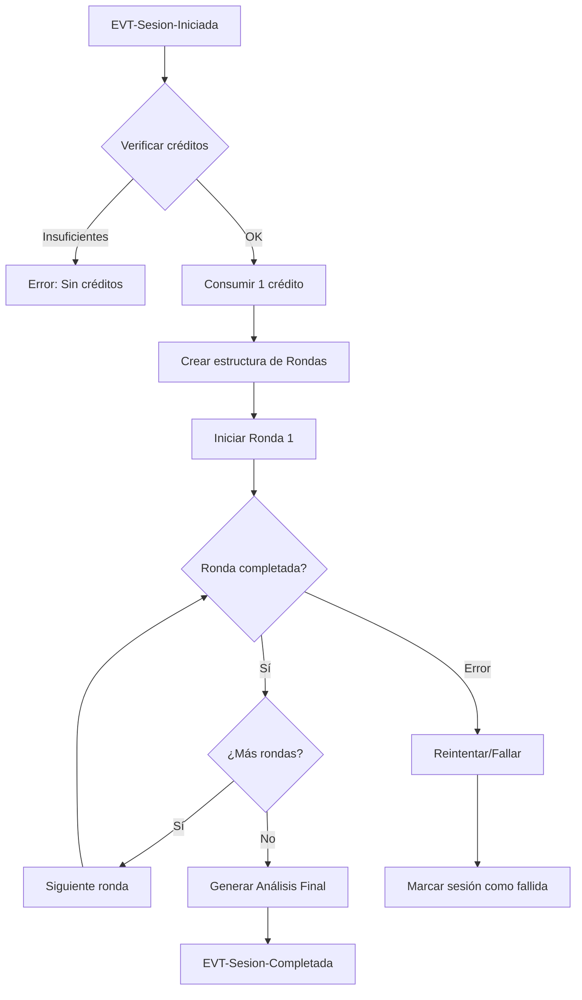

# Capa 03: Capacidades

## Las Operaciones del Sistema: ¿Qué Puede Hacer?

---

## Introducción

La capa de Capacidades responde a la pregunta: **¿Qué puede hacer el sistema?**

Aquí definimos las **operaciones posibles** sobre el dominio, de forma abstracta. No decimos *cómo* un usuario ejecuta estas operaciones (eso es Interacción), ni *cómo* se implementan técnicamente (eso es Infraestructura). Solo describimos *qué* operaciones existen.

```
┌─────────────────────────────────────────────────────────────────────────────┐
│                                                                              │
│   01-Problem    →   02-Domain   →   03-Capabilities   →   04-Interaction    │
│                                                                              │
│   "¿Por qué        "¿Qué            "¿QUÉ PUEDE          "¿Cómo lo          │
│    existe?"        existe?"          HACER?"               usan?"            │
│                                                                              │
│   ──────────────────────────────────────────────────────────────────────────│
│                                                                              │
│   Motivación       Conceptual       FUNCIONAL            Experiencial        │
│   Contexto         (entidades)      OPERACIONES          (personas)          │
│   Objetivos        (reglas)         PROCESOS                                 │
│                                                                              │
└─────────────────────────────────────────────────────────────────────────────┘
```

---

## La Filosofía: CQRS Light

KDD adopta el patrón **CQRS (Command Query Responsibility Segregation)** de forma ligera:

```
┌─────────────────────────────────────────────────────────────────────────────┐
│                                                                              │
│   CQRS: Separar operaciones de ESCRITURA y LECTURA                          │
│                                                                              │
│   ┌─────────────────────────────────────────────────────────────────────┐   │
│   │                                                                     │   │
│   │   COMMANDS (Escritura)          QUERIES (Lectura)                   │   │
│   │   ────────────────────          ─────────────────                   │   │
│   │                                                                     │   │
│   │   - Modifican estado            - Solo leen estado                  │   │
│   │   - Validan reglas              - No validan (datos ya válidos)     │   │
│   │   - Emiten eventos              - No emiten eventos                 │   │
│   │   - Pueden fallar               - Siempre exitosas (o vacías)       │   │
│   │   - Retornan poco/nada          - Retornan datos estructurados      │   │
│   │                                                                     │   │
│   │   Ejemplo:                      Ejemplo:                            │   │
│   │   CMD-CreateChallenge           QRY-ListChallenges                  │   │
│   │   CMD-InitiateSession           QRY-GetCreditBalance                │   │
│   │                                                                     │   │
│   └─────────────────────────────────────────────────────────────────────┘   │
│                                                                              │
└─────────────────────────────────────────────────────────────────────────────┘
```

### Por Qué Separar Commands y Queries

1. **Claridad mental**: Sabes exactamente qué operaciones modifican datos
2. **Optimización**: Queries pueden usar réplicas de lectura, caches
3. **Testing**: Commands se testean con rigor, Queries más ligero
4. **Escalabilidad**: Puedes escalar lectura y escritura independientemente

---

## Los Artefactos de la Capa de Capacidades

### 1. Commands (Comandos)

Operaciones que **modifican el estado** del sistema.

#### Características de un Command

- **Intención clara**: Nombre en imperativo (CreateChallenge, not ChallengeCreation)
- **Input validado**: Schema de entrada con tipos y restricciones
- **Precondiciones**: Estado requerido antes de ejecutar
- **Postcondiciones**: Estado garantizado después
- **Eventos**: Lo que emite al completarse
- **Errores**: Casos de fallo documentados

#### Estructura de un Command

```markdown
---
id: CMD-001
title: Create Challenge
type: command
status: approved
---

# CMD-001: CreateChallenge

## Propósito
Crea un nuevo [[Reto]] en estado `borrador` para el [[Usuario]] actual.

## Input
| Parámetro | Tipo | Requerido | Validación |
|-----------|------|-----------|------------|
| titulo | string | Sí | 1-100 caracteres |
| descripcion | string | Sí | 1-10000 caracteres |
| contexto | string | No | Máx 5000 caracteres |
| userId | UUID | Sí | Usuario autenticado |

## Precondiciones
- Usuario está autenticado
- Usuario tiene estado `activo`

## Postcondiciones
- Existe un nuevo [[Reto]] con:
  - ID único generado
  - Estado = `borrador`
  - creadorId = userId del input
  - createdAt = timestamp actual
- Evento [[EVT-Reto-Creado]] emitido

## Reglas Validadas
- [[BR-RETO-002]]: Título 1-100 caracteres
- [[BR-RETO-005]]: Descripción requerida

## Eventos Generados
- [[EVT-Reto-Creado]] (siempre, en éxito)

## Errores Posibles
| Código | Condición | Mensaje |
|--------|-----------|---------|
| RETO-001 | Título vacío | "El título es requerido" |
| RETO-002 | Título > 100 chars | "El título no puede exceder 100 caracteres" |
| RETO-003 | Descripción vacía | "La descripción es requerida" |
| AUTH-001 | No autenticado | "Debes iniciar sesión" |

## Output
```typescript
interface CreateChallengeOutput {
  retoId: string      // UUID del reto creado
  estado: 'borrador'  // Estado inicial
  createdAt: string   // ISO 8601
}
```

## Implementation Notes
```typescript
// Ubicación: apps/api/src/application/use-cases/create-challenge.use-case.ts
// Schema Zod para validación de input
// Usar RetoRepository para persistir
// Emitir evento via EventEmitter
```
```

#### Naming Conventions para Commands

```
┌─────────────────────────────────────────────────────────────────────────────┐
│                                                                              │
│   PATRÓN: CMD-{NNN}-{Verbo}{Sustantivo}                                     │
│                                                                              │
│   Verbos comunes:                                                            │
│   - Create    → Crear algo nuevo                                             │
│   - Update    → Modificar existente                                          │
│   - Delete    → Eliminar                                                     │
│   - Initiate  → Comenzar un proceso                                          │
│   - Complete  → Finalizar un proceso                                         │
│   - Cancel    → Abortar un proceso                                           │
│   - Generate  → Crear via IA/algoritmo                                       │
│   - Purchase  → Transacción de compra                                        │
│   - Consume   → Gastar un recurso                                            │
│   - Refund    → Devolver un recurso                                          │
│                                                                              │
│   Ejemplos:                                                                  │
│   - CMD-001-CreateChallenge                                                  │
│   - CMD-009-InitiateSession                                                  │
│   - CMD-013-GenerateAnalysis                                                 │
│   - CMD-014-PurchaseCredits                                                  │
│                                                                              │
└─────────────────────────────────────────────────────────────────────────────┘
```

---

### 2. Queries (Consultas)

Operaciones que **leen estado** sin modificarlo.

#### Características de una Query

- **Solo lectura**: Nunca modifica datos
- **Idempotente**: Llamar N veces da el mismo resultado
- **Sin efectos secundarios**: No emite eventos ni notificaciones
- **Puede retornar vacío**: Resultado vacío es válido, no error

#### Estructura de una Query

```markdown
---
id: QRY-002
title: List Challenges
type: query
status: approved
---

# QRY-002: ListChallenges

## Propósito
Obtiene la lista de [[Reto|Retos]] del [[Usuario]] actual,
con filtros y paginación.

## Input
| Parámetro | Tipo | Requerido | Default | Descripción |
|-----------|------|-----------|---------|-------------|
| userId | UUID | Sí | - | Usuario autenticado |
| estado | RetoEstado | No | todos | Filtrar por estado |
| search | string | No | - | Buscar en título/descripción |
| limit | number | No | 20 | Máx resultados (1-100) |
| offset | number | No | 0 | Para paginación |
| orderBy | string | No | 'updatedAt' | Campo de ordenación |
| order | 'asc'│'desc' | No | 'desc' | Dirección |

## Output
```typescript
interface ListChallengesOutput {
  items: RetoSummary[]
  total: number
  limit: number
  offset: number
  hasMore: boolean
}

interface RetoSummary {
  retoId: string
  titulo: string
  estado: RetoEstado
  personasCount: number
  sesionesCount: number
  createdAt: string
  updatedAt: string
}
```

## Precondiciones
- Usuario está autenticado

## Comportamiento
- Solo retorna Retos donde `creadorId = userId`
- Ordenados por `orderBy` en dirección `order`
- Si `search` está presente, busca en título y descripción
- Si `estado` está presente, filtra por ese estado

## Casos Especiales
| Caso | Resultado |
|------|-----------|
| Usuario sin retos | `{ items: [], total: 0, hasMore: false }` |
| Filtro sin matches | `{ items: [], total: 0, hasMore: false }` |
| offset > total | `{ items: [], total: N, hasMore: false }` |

## Performance
- Índices recomendados: `(creadorId, updatedAt)`, `(creadorId, estado)`
- Caché: 30 segundos, invalidar en EVT-Reto-*
```

#### Naming Conventions para Queries

```
┌─────────────────────────────────────────────────────────────────────────────┐
│                                                                              │
│   PATRÓN: QRY-{NNN}-{Verbo}{Sustantivo}                                     │
│                                                                              │
│   Verbos comunes:                                                            │
│   - Get       → Obtener uno por ID                                           │
│   - List      → Obtener colección con filtros                                │
│   - Search    → Búsqueda full-text                                           │
│   - Count     → Solo cantidad                                                │
│   - Exists    → Boolean de existencia                                        │
│                                                                              │
│   Ejemplos:                                                                  │
│   - QRY-001-GetChallenge                                                     │
│   - QRY-002-ListChallenges                                                   │
│   - QRY-006-GetCreditBalance                                                 │
│   - QRY-008-ListContributions                                                │
│                                                                              │
└─────────────────────────────────────────────────────────────────────────────┘
```

---

### 3. Processes (Procesos de Negocio)

**Flujos que orquestan** múltiples Commands y reaccionan a Eventos.

#### Características de un Proceso

- **Orquestador**: Coordina múltiples operaciones
- **Reactivo**: Se dispara por eventos o triggers temporales
- **Con estado**: Puede tener pasos y checkpoints
- **Compensable**: Define qué hacer si algo falla

#### Estructura de un Proceso

```markdown
---
id: PROC-001
title: Start Session
type: process
status: approved
---

# PROC-001: StartSession

## Descripción
Proceso que inicia una [[Sesión]] de análisis completa,
creando la estructura de [[Ronda|Rondas]] y ejecutándolas secuencialmente.

## Disparador
- [[CMD-009-InitiateSession]] exitoso

## Diagrama de Flujo



## Pasos del Proceso

### 1. Verificar Créditos
- Invocar: [[QRY-006-GetCreditBalance]]
- Precondición: balance >= 1
- Si falla: Abortar con error CREDIT-001

### 2. Consumir Crédito
- Invocar: [[CMD-015-ConsumeCredit]]
- Registrar transacción vinculada a sesionId
- Si falla: Abortar (no hay compensación aún)

### 3. Crear Estructura
- Para cada sombrero en la secuencia elegida:
  - Crear [[Ronda]] con estado `pendiente`
- Total: 6 Rondas

### 4. Ejecutar Rondas (loop)
- Para cada Ronda en orden:
  - Invocar: [[CMD-011-ExecuteRound]]
  - Esperar contribuciones de todas las Personas
  - Marcar Ronda como `completada`
  - Emitir: [[EVT-Ronda-Completada]]

### 5. Generar Análisis
- Invocar: [[CMD-013-GenerateAnalysis]]
- Input: Todas las contribuciones de la sesión
- Output: [[Análisis Final]] estructurado

### 6. Completar Sesión
- Actualizar estado a `completada`
- Emitir: [[EVT-Sesion-Completada]]

## Compensación (Rollback)

| Paso fallido | Compensación |
|--------------|--------------|
| Consumir crédito | N/A (primer paso con efecto) |
| Ejecutar ronda | [[CMD-016-RefundCredit]], marcar sesión como `fallida` |
| Generar análisis | Reintentar 3 veces, luego refund |

## Eventos del Proceso
- Escucha: [[EVT-Sesion-Iniciada]]
- Emite: [[EVT-Ronda-Completada]] (x6), [[EVT-Sesion-Completada]]

## Timeout
- Ronda individual: 2 minutos
- Proceso completo: 15 minutos
- Al timeout: Compensación + [[EVT-Sesion-Timeout]]

## Métricas
- Duración promedio del proceso
- Tasa de éxito/fallo por paso
- Tiempo promedio por ronda
```

---

## El Principio de Dependencia

La capa de Capacidades:
- **CONOCE**: Entidades, Value Objects, Reglas, Eventos (02-Domain)
- **NO CONOCE**: Vistas, Use Cases, Componentes UI (04-Interaction)

```
┌─────────────────────────────────────────────────────────────────────────────┐
│                                                                              │
│   03-CAPABILITIES                                                            │
│                                                                              │
│   [[CMD-001-CreateChallenge]]                                                │
│     │                                                                        │
│     ├── conoce → [[Reto]]           (entidad)                               │
│     ├── conoce → [[BR-RETO-002]]    (regla)                                 │
│     ├── conoce → [[EVT-Reto-Creado]] (evento)                               │
│     │                                                                        │
│     └── NO conoce → [[UI-RetoEditor]]  ❌                                   │
│         NO conoce → [[UC-001-Crear-Reto]]  ❌                               │
│                                                                              │
│   ¿Por qué?                                                                  │
│   - El Command puede ser invocado desde UI, API, CLI, tests...              │
│   - Si conociera la UI, estaría acoplado a una forma específica de uso      │
│   - La UI conoce al Command, no al revés                                    │
│                                                                              │
└─────────────────────────────────────────────────────────────────────────────┘
```

---

## Mapeo a Código

### Commands → Use Cases

```typescript
// apps/api/src/application/use-cases/create-challenge.use-case.ts

export const createChallengeSchema = z.object({
  titulo: z.string().min(1).max(100),
  descripcion: z.string().min(1).max(10000),
  contexto: z.string().max(5000).optional(),
})

export class CreateChallengeUseCase {
  constructor(
    private readonly retoRepository: RetoRepository,
    private readonly eventEmitter: EventEmitter,
  ) {}

  async execute(input: CreateChallengeInput): Promise<CreateChallengeOutput> {
    // Validar input (BR-RETO-002, BR-RETO-005)
    const validated = createChallengeSchema.parse(input)

    // Crear entidad de dominio
    const reto = Reto.create({
      titulo: validated.titulo,
      descripcion: validated.descripcion,
      contexto: validated.contexto,
      creadorId: input.userId,
    })

    // Persistir
    await this.retoRepository.save(reto)

    // Emitir evento
    await this.eventEmitter.emit(new RetoCreado(reto))

    return {
      retoId: reto.id,
      estado: reto.estado,
      createdAt: reto.createdAt.toISOString(),
    }
  }
}
```

### Queries → Query Services

```typescript
// apps/api/src/application/queries/list-challenges.query.ts

export class ListChallengesQuery {
  constructor(private readonly retoRepository: RetoRepository) {}

  async execute(input: ListChallengesInput): Promise<ListChallengesOutput> {
    const { items, total } = await this.retoRepository.findByUser(
      input.userId,
      {
        estado: input.estado,
        search: input.search,
        limit: input.limit,
        offset: input.offset,
        orderBy: input.orderBy,
        order: input.order,
      }
    )

    return {
      items: items.map(this.toSummary),
      total,
      limit: input.limit,
      offset: input.offset,
      hasMore: input.offset + items.length < total,
    }
  }
}
```

---

## Estructura de Carpetas

```
/specs/03-capabilities/
├── /commands/
│   ├── CMD-001-CreateChallenge.md
│   ├── CMD-002-UpdateChallenge.md
│   ├── CMD-003-DeleteChallenge.md
│   ├── CMD-004-DuplicateChallenge.md
│   ├── CMD-005-CreatePersona.md
│   ├── CMD-006-UpdatePersona.md
│   ├── CMD-007-DeletePersona.md
│   ├── CMD-008-GeneratePersonasWithAI.md
│   ├── CMD-009-InitiateSession.md
│   ├── CMD-010-CancelSession.md
│   ├── CMD-011-ExecuteRound.md
│   ├── CMD-012-RetryFailedContributions.md
│   ├── CMD-013-GenerateAnalysis.md
│   ├── CMD-014-PurchaseCredits.md
│   ├── CMD-015-ConsumeCredit.md
│   ├── CMD-016-RefundCredit.md
│   ├── CMD-017-UpdateUserProfile.md
│   └── CMD-018-DeleteAccount.md
│
├── /queries/
│   ├── QRY-001-GetChallenge.md
│   ├── QRY-002-ListChallenges.md
│   ├── QRY-003-GetSession.md
│   ├── QRY-004-ListSessions.md
│   ├── QRY-005-GetAnalysis.md
│   ├── QRY-006-GetCreditBalance.md
│   ├── QRY-007-GetUserProfile.md
│   └── QRY-008-ListContributions.md
│
└── /processes/
    ├── PROC-001-StartSession.md
    └── PROC-002-MonthlyBilling.md
```

---

## Checklist: Especificando Capacidades

### Para Commands
- [ ] Nombre en imperativo (Create, Update, Delete)
- [ ] Input con tipos y validaciones
- [ ] Precondiciones claras
- [ ] Postcondiciones garantizadas
- [ ] Reglas de dominio que valida
- [ ] Eventos que emite
- [ ] Errores posibles con códigos
- [ ] Output estructurado

### Para Queries
- [ ] Nombre describe qué retorna (Get, List)
- [ ] Input con filtros y paginación
- [ ] Output con tipos exactos
- [ ] Casos especiales (vacío, no encontrado)
- [ ] Consideraciones de performance

### Para Processes
- [ ] Trigger que lo inicia
- [ ] Diagrama de flujo
- [ ] Pasos con Commands/Queries involucrados
- [ ] Estrategia de compensación
- [ ] Timeouts definidos
- [ ] Eventos que escucha y emite

---

## Anti-patrones a Evitar

### 1. Command que Conoce la UI

```yaml
# ❌ INCORRECTO
# CMD-001-CreateChallenge.md
## Usado por:
- UI-RetoEditor  # El command no debe saber esto

# ✅ CORRECTO
# CMD-001-CreateChallenge.md
# (Sin sección "Usado por")
```

### 2. Query que Modifica Estado

```typescript
// ❌ INCORRECTO
class GetChallengeQuery {
  async execute(id: string) {
    const reto = await this.repo.findById(id)
    reto.viewCount++  // ¡Modificando en una query!
    await this.repo.save(reto)
    return reto
  }
}

// ✅ CORRECTO
class GetChallengeQuery {
  async execute(id: string) {
    return await this.repo.findById(id)  // Solo lectura
  }
}

// Tracking de vistas es un Command separado
class TrackChallengeViewCommand { ... }
```

### 3. Lógica de Negocio en el Controller

```typescript
// ❌ INCORRECTO: Regla en el controller/route
app.post('/retos', async ({ body }) => {
  if (body.titulo.length > 100) {  // ¡Regla aquí!
    throw new Error('Título muy largo')
  }
  await db.insert(retos).values(body)
})

// ✅ CORRECTO: Controller delega al Command
app.post('/retos', async ({ body, user }) => {
  return await createChallengeUseCase.execute({
    ...body,
    userId: user.id,
  })
})
```

### 4. Command sin Eventos

```yaml
# ❌ INCORRECTO
# CMD-CreateChallenge.md
## Eventos
(ninguno)

# ✅ CORRECTO
# CMD-CreateChallenge.md
## Eventos Generados
- [[EVT-Reto-Creado]]
```

---

## Resumen

La capa de Capacidades en KDD:

1. **Define operaciones**: Qué puede hacer el sistema
2. **Separa lectura/escritura**: Commands vs Queries
3. **Es agnóstica de UI**: No sabe quién la invoca
4. **Conoce el dominio**: Usa entidades, valida reglas, emite eventos
5. **Orquesta procesos**: Flujos complejos de múltiples pasos
6. **Es testeable**: Input → Output bien definido

> **"Un sistema bien diseñado tiene Commands claros. Si no puedes nombrar la operación, probablemente no la entiendes."**

---

## Artefactos Relacionados

- [[command.template]] - Template para commands
- [[query.template]] - Template para queries
- [[process.template]] - Template para procesos
- [[02-domain]] - La capa anterior: Dominio
- [[04-interaction]] - La capa siguiente: Interacción
- [[Introducción a KDD]] - Visión general de KDD

---

*Última actualización: 2024-12-14*
