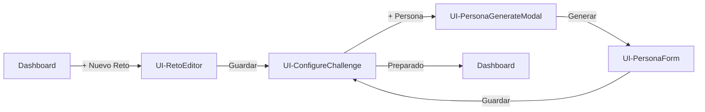

# Capa 04: Interacción

## La Capa donde el Usuario Entra en Escena

---

## Introducción

La capa de Interacción responde a la pregunta fundamental: **¿Cómo usa alguien el sistema?**

En las capas anteriores hablamos de problemas de negocio (01-Problem), entidades y reglas del dominio (02-Domain), y operaciones que el sistema puede ejecutar (03-Capabilities). Todo eso ocurre en un plano abstracto, sin mencionar a personas concretas ni pantallas.

La capa 04-Interaction es donde **el usuario humano entra en escena**. Aquí describimos:

- Quién usa el sistema (actores)
- Qué quieren lograr (objetivos)
- Cómo lo logran (flujos, pantallas, interacciones)

```
┌─────────────────────────────────────────────────────────────────────────────┐
│                                                                              │
│   01-Problem    →   02-Domain   →   03-Capabilities   →   04-Interaction    │
│                                                                              │
│   "¿Por qué        "¿Qué            "¿Qué puede          "¿CÓMO LO          │
│    existe?"        existe?"          hacer?"               USAN?"            │
│                                                                              │
│   ──────────────────────────────────────────────────────────────────────────│
│                                                                              │
│   Sin compromiso   Conceptual       Funcional            EXPERIENCIAL       │
│   tecnológico      (entidades)      (operaciones)        (personas)         │
│                                                                              │
└─────────────────────────────────────────────────────────────────────────────┘
```

---

## La Filosofía Central

### El Usuario como Consumidor de Capacidades

El diseño de esta capa parte de un principio clave:

> **Las interfaces de usuario son "clientes" de las capacidades del sistema, no su definición.**

Esto significa que una Vista (UI) **no define** lo que el sistema hace; una Vista **consume** lo que el sistema ya sabe hacer.

```
❌ Incorrecto: "El sistema puede crear retos porque hay un formulario"
✅ Correcto:   "Hay un formulario porque el sistema puede crear retos"
```

Esta distinción es crucial porque:

1. **Desacopla la lógica de la presentación**: El mismo Command puede ser invocado desde una web, una CLI, una API, o un test automatizado.

2. **Permite evolución independiente**: Puedes rediseñar completamente la UI sin tocar la lógica de negocio.

3. **Facilita el testing**: Los Commands se pueden probar aislados de la UI.

### La UI como "Cara" del Sistema

Las interfaces de usuario tienen tres responsabilidades fundamentales:

```
┌─────────────────────────────────────────────────────────────────────────────┐
│                                                                              │
│   1. PRESENTAR DATOS                                                         │
│      Obtener información via Queries y mostrarla al usuario                  │
│      Query → Datos → Renderizado visual                                      │
│                                                                              │
│   2. CAPTURAR INTENCIONES                                                    │
│      Traducir acciones del usuario en Commands                               │
│      Click/Input → Validación → Command                                      │
│                                                                              │
│   3. DAR FEEDBACK                                                            │
│      Comunicar el resultado de las operaciones                               │
│      Loading → Success/Error → Actualización visual                          │
│                                                                              │
└─────────────────────────────────────────────────────────────────────────────┘
```

La UI **no debe contener lógica de negocio**. Si te encuentras escribiendo reglas de validación complejas o cálculos en un componente, probablemente esa lógica pertenece a un Command o a un Domain Service.

---

## Los Artefactos de la Capa de Interacción

### 1. Use Cases (Casos de Uso)

Los Use Cases son **narrativas completas** de cómo un actor logra un objetivo usando el sistema. Son agnósticos de la tecnología de UI.

#### Qué Captura un Use Case

```yaml
Actor: Quién inicia la interacción
Objetivo: Qué quiere lograr
Precondiciones: Estado requerido antes de empezar
Flujo Principal: Secuencia de pasos del camino feliz
Flujos Alternativos: Variaciones válidas del flujo
Flujos de Excepción: Manejo de errores
Postcondiciones: Estado garantizado al finalizar
Commands Invocados: Qué operaciones dispara
```

#### Ejemplo de Use Case

```markdown
# UC-001: Crear Reto

## Contexto
| Elemento | Descripción |
|----------|-------------|
| Actor | Usuario autenticado |
| Objetivo | Crear un nuevo Reto para analizar |
| Precondición | Usuario ha iniciado sesión |
| Postcondición | Existe un Reto en estado 'borrador' |

## Flujo Principal
1. El Usuario selecciona "Nuevo Reto" desde el dashboard
2. El Sistema muestra el formulario de creación
3. El Usuario ingresa título y descripción
4. El Usuario hace clic en "Crear"
5. El Sistema valida los datos
6. El Sistema crea el Reto
7. El Sistema redirige a configuración de personas

## Flujo Alternativo: Asistencia IA
En el paso 2, el Usuario puede elegir "Crear con IA":
1. El Sistema muestra modal de asistencia
2. El Usuario describe su idea en lenguaje natural
3. El Sistema genera estructura sugerida
4. Continúa en paso 3 del flujo principal

## Commands Invocados
- [[CMD-001-CreateChallenge]]
```

#### Por Qué el Use Case es Agnóstico de UI

El mismo Use Case podría implementarse como:
- Una aplicación web (lo que tenemos)
- Una aplicación móvil
- Una CLI para power users
- Un chatbot conversacional
- Una API pública

El Use Case describe el **qué**, no el **cómo se ve**.

---

### 2. Views (Vistas)

Las Views son **especificaciones de la interfaz visual** que implementan los Use Cases. Hay dos tipos:

| Tipo | Tag | Propósito | Tiene ruta |
|------|-----|-----------|------------|
| **View** | `ui/view` | Página completa | Sí (`/retos/:id/editar`) |
| **Component** | `ui/component` | Pieza reutilizable | No |

#### Estructura de una View

```yaml
---
tags:
  - ui/view
links:
  entities:
    - "[[Reto]]"                    # Entidades que muestra
  use-cases:
    - "[[UC-001-Crear-Reto]]"       # Caso de uso que implementa
  commands:
    - "[[CMD-001-CreateChallenge]]" # Operaciones de escritura
  queries:
    - "[[QRY-001-GetChallenge]]"    # Operaciones de lectura
---
```

#### Secciones de una Especificación de View

1. **Layout**: Estructura visual con wireframes ASCII
2. **Estados**: Loading, Empty, Error, Success
3. **Datos Requeridos**: Qué entidades y campos necesita
4. **Interacciones**: Qué puede hacer el usuario
5. **Responsive**: Comportamiento en diferentes breakpoints
6. **Accesibilidad**: Consideraciones a11y

#### Ejemplo de Layout

```ascii
┌──────────────────────────────────────────────────────────────────────────────┐
│  HEADER                                                                       │
│  ← Volver    [Título del Reto]                    [Guardar] [Siguiente →]    │
├────────────────┬─────────────────────────────────────────────┬───────────────┤
│                │                                             │               │
│  NAV STEPPER   │            EDITOR MARKDOWN                  │  TABLE OF     │
│  (200px)       │            (flexible)                       │  CONTENTS     │
│                │                                             │  (220px)      │
│  ○ Objetivos   │  # Objetivos del Reto                       │               │
│  ○ Contexto    │                                             │  • Objetivos  │
│  ● Hipótesis   │  Describir aquí los objetivos               │  • Contexto   │
│                │  principales...                             │  • Hipótesis  │
│                │                                             │               │
├────────────────┴─────────────────────────────────────────────┴───────────────┤
│  FOOTER                                                                       │
│  [Potenciar con IA]           Último guardado: hace 2 min      [Vista previa]│
└──────────────────────────────────────────────────────────────────────────────┘
```

---

### 3. Components (Componentes)

Los Components son **piezas reutilizables** de UI que se componen para formar Views.

#### Características de un Component

- **Reutilizable**: Se usa en múltiples vistas
- **Sin lógica de negocio**: Solo presentación y comportamiento UI
- **Props-driven**: Su comportamiento se controla via props
- **Testeable**: Se puede probar aislado en Storybook

#### Ejemplo de Component

```markdown
# PersonaCard

## Props
| Prop | Tipo | Requerido | Descripción |
|------|------|-----------|-------------|
| `persona` | `PersonaSintetica` | sí | Datos a mostrar |
| `onEdit` | `(id: string) => void` | no | Callback edición |
| `onDelete` | `(id: string) => void` | no | Callback eliminación |
| `isEditable` | `boolean` | no | Muestra botones de acción |

## Estructura
```ascii
┌─────────────────────────────────────────────┐
│  🎭 María García                        [⋮] │
│  ─────────────────────────────────────────  │
│  Directora Financiera                       │
│  15 años de experiencia                     │
│                                             │
│  "Escéptica pero abierta a la innovación"   │
└─────────────────────────────────────────────┘
```

## Commands Invocados (via callbacks)
- [[CMD-006-UpdatePersona]] (via onEdit)
- [[CMD-007-DeletePersona]] (via onDelete)
```

---

### 4. Flows (Flujos)

Los Flows documentan **secuencias de navegación** entre Views para completar un objetivo.

```markdown
# Flow: Crear y Configurar Reto

## Secuencia de Pantallas



## Estados del Flujo
| Paso | Vista | Estado del Reto |
|------|-------|-----------------|
| 1 | Dashboard | - |
| 2 | RetoEditor | borrador |
| 3 | ConfigureChallenge | borrador |
| 4-5 | PersonaForm | borrador |
| 6 | Dashboard | preparado |
```

---

## El Principio de Dependencia Unidireccional

Este es el corazón de cómo KDD estructura las relaciones entre capas:

```
┌─────────────────────────────────────────────────────────────────────────────┐
│                                                                              │
│   REGLA FUNDAMENTAL:                                                         │
│                                                                              │
│   Cada capa CONOCE Y DEPENDE de las capas anteriores.                       │
│   Cada capa NO CONOCE a las capas posteriores.                              │
│                                                                              │
│   04-Interaction → conoce → 03-Capabilities                                  │
│   03-Capabilities → NO conoce → 04-Interaction                               │
│                                                                              │
└─────────────────────────────────────────────────────────────────────────────┘
```

### Por Qué Esta Regla

```
┌─────────────────────────────────────────────────────────────────────────────┐
│                                                                              │
│   El mismo CMD-001-CreateChallenge puede ser invocado desde:                │
│                                                                              │
│   ┌─────────────────┐                                                        │
│   │  UI-RetoEditor  │ ────┐                                                  │
│   └─────────────────┘     │                                                  │
│                           │                                                  │
│   ┌─────────────────┐     │      ┌─────────────────────┐                    │
│   │  API REST       │ ────┼────► │ CMD-001             │                    │
│   └─────────────────┘     │      │ CreateChallenge     │                    │
│                           │      │                     │                    │
│   ┌─────────────────┐     │      │ (no sabe quién      │                    │
│   │  CLI Admin      │ ────┤      │  lo invoca)         │                    │
│   └─────────────────┘     │      └─────────────────────┘                    │
│                           │                                                  │
│   ┌─────────────────┐     │                                                  │
│   │  Test E2E       │ ────┘                                                  │
│   └─────────────────┘                                                        │
│                                                                              │
│   Si el Command "supiera" quién lo usa, estaría acoplado a la UI.           │
│   Eso violaría la separación de concerns.                                   │
│                                                                              │
└─────────────────────────────────────────────────────────────────────────────┘
```

### Implicaciones Prácticas

**En las especificaciones:**

```yaml
# ✅ CORRECTO: La View conoce al Command
# UI-RetoEditor.md
links:
  commands:
    - "[[CMD-001-CreateChallenge]]"

# ❌ INCORRECTO: El Command conoce a la View
# CMD-001-CreateChallenge.md
links:
  views:  # NO DEBE EXISTIR
    - "[[UI-RetoEditor]]"
```

**En el código:**

```typescript
// ✅ CORRECTO: El componente importa el command
import { createChallenge } from '@/commands/create-challenge'

function RetoEditor() {
  const handleSave = () => createChallenge(data)
}

// ❌ INCORRECTO: El command importa el componente
// (Esto nunca debería pasar)
import { RetoEditor } from '@/components/reto-editor'
```

---

## Interacciones: El Puente entre UI y Commands

La sección más crítica de una especificación de UI es **Interacciones**. Aquí documentamos exactamente qué pasa cuando el usuario hace algo.

### Estructura de una Interacción

```markdown
### Click en "Guardar"

- **Trigger**: Click en botón `[Guardar]`
- **Precondición**: Formulario válido (título no vacío)
- **Resultado**:
  - Ejecuta [[CMD-001-CreateChallenge]]
  - Actualiza estado local
  - Navega a configuración de personas
- **Feedback**:
  - Durante: Spinner + botón deshabilitado
  - Éxito: Toast "Reto creado correctamente"
  - Error: Toast con mensaje del error
- **Emite**: `EVT-Reto-Creado`
- **Navega a**: [[UI-ConfigureChallenge]]
```

### Campos Disponibles

| Campo | Descripción | Ejemplo |
|-------|-------------|---------|
| **Trigger** | Qué acción del usuario dispara esto | Click, Hover, Submit |
| **Precondición** | Condiciones que deben cumplirse | Formulario válido |
| **Resultado** | Qué ocurre como consecuencia | Ejecuta Command, actualiza estado |
| **Feedback** | Feedback visual al usuario | Spinner, Toast, Animación |
| **Emite** | Evento de dominio emitido | EVT-Reto-Creado |
| **Abre** | Modal/drawer que se abre | UI-PersonaGenerateModal |
| **Navega a** | Vista destino | UI-ConfigureChallenge |
| **Datos** | Datos pasados al destino | `{ retoId, mode: 'edit' }` |

### Diferencia entre "Abre" y "Navega a"

```
┌─────────────────────────────────────────────────────────────────────────────┐
│                                                                              │
│   ABRE: Modal, drawer, popover (overlay sobre la vista actual)              │
│   ─────                                                                      │
│   - La vista actual permanece debajo                                         │
│   - El usuario puede cerrar y volver                                         │
│   - No cambia la URL                                                         │
│                                                                              │
│   NAVEGA A: Cambio de ruta/página (reemplaza la vista actual)               │
│   ─────────                                                                  │
│   - La vista actual se desmonta                                              │
│   - Cambia la URL del navegador                                              │
│   - El usuario usa "atrás" para volver                                       │
│                                                                              │
└─────────────────────────────────────────────────────────────────────────────┘
```

---

## Estados de una Vista

Toda vista debe especificar sus posibles estados:

### 1. Loading

Mientras se cargan los datos iniciales.

```ascii
┌──────────────────────────────────────┐
│  ← Volver    ████████████            │
├──────────────────────────────────────┤
│                                      │
│      ┌────────────────────┐          │
│      │   ▓▓▓▓▓▓▓▓▓▓▓▓▓   │          │
│      │   ▓▓▓▓▓▓▓▓▓▓▓▓▓   │          │
│      │   ▓▓▓▓▓▓▓▓▓▓▓▓▓   │          │
│      └────────────────────┘          │
│          (Skeleton)                  │
└──────────────────────────────────────┘
```

### 2. Empty

Cuando no hay datos que mostrar.

```ascii
┌──────────────────────────────────────┐
│                                      │
│         📋                           │
│                                      │
│    No tienes retos todavía           │
│                                      │
│    Crea tu primer reto para          │
│    empezar a analizar ideas          │
│                                      │
│       [+ Crear mi primer reto]       │
│                                      │
└──────────────────────────────────────┘
```

### 3. Error

Cuando algo falla.

```ascii
┌──────────────────────────────────────┐
│                                      │
│         ⚠️                           │
│                                      │
│    No pudimos cargar los datos       │
│                                      │
│    Error: Connection timeout         │
│                                      │
│       [Reintentar]  [Volver]         │
│                                      │
└──────────────────────────────────────┘
```

### 4. Success/Default

El estado normal con datos.

---

## El Flujo Completo: De Dominio a Pantalla

Este diagrama muestra cómo fluye la información desde el dominio hasta la interfaz:

```
┌─────────────────────────────────────────────────────────────────────────────┐
│                                                                              │
│   02-DOMAIN                                                                  │
│   ────────                                                                   │
│   [[Reto]]                                                                   │
│     - id: UUID                                                               │
│     - titulo: string (1-100 chars)                                           │
│     - descripcion: string                                                    │
│     - estado: borrador | preparado | en_analisis | terminado                │
│                                                                              │
│   [[BR-RETO-002]]: "Un Reto debe tener título de 1-100 caracteres"          │
│                                                                              │
│        ↓ define estructura y reglas                                          │
│                                                                              │
│   03-CAPABILITIES                                                            │
│   ───────────────                                                            │
│   [[CMD-001-CreateChallenge]]                                                │
│     - Input: { titulo, descripcion }                                         │
│     - Validates: BR-RETO-002                                                 │
│     - Output: Reto con estado 'borrador'                                     │
│     - Emits: EVT-Reto-Creado                                                 │
│                                                                              │
│   [[QRY-001-GetChallenge]]                                                   │
│     - Input: { retoId }                                                      │
│     - Output: Reto completo con personas                                     │
│                                                                              │
│        ↓ expone operaciones                                                  │
│                                                                              │
│   04-INTERACTION                                                             │
│   ──────────────                                                             │
│   [[UC-001-Crear-Reto]]                                                      │
│     - Actor: Usuario                                                         │
│     - Objetivo: Crear nuevo reto                                             │
│     - Invoca: CMD-001-CreateChallenge                                        │
│                                                                              │
│   [[UI-RetoEditor]]                                                          │
│     - Implements: UC-001                                                     │
│     - Uses: QRY-001 (para cargar), CMD-001 (para guardar)                   │
│     - Layout: Header + Editor + Sidebar                                      │
│     - States: loading, editing, saving, error                                │
│                                                                              │
│        ↓ verificado por                                                      │
│                                                                              │
│   05-VERIFICATION                                                            │
│   ───────────────                                                            │
│   crear-reto.feature                                                         │
│     - Scenario: Crear reto con título válido                                 │
│     - Scenario: Error con título vacío                                       │
│     - Tags: @regla:BR-RETO-002                                               │
│                                                                              │
└─────────────────────────────────────────────────────────────────────────────┘
```

---

## Conexión con Storybook

Las especificaciones de UI en KDD están diseñadas para generar automáticamente stories de Storybook:

```yaml
# En el front-matter de una View
storybook:
  category: "Views"
  auto-generate: true
```

Cada **estado** documentado se convierte en una story:

| Estado en Spec | Story Generada |
|----------------|----------------|
| Loading | `RetoEditor.stories.tsx` → `Loading` |
| Empty | `RetoEditor.stories.tsx` → `Empty` |
| Error | `RetoEditor.stories.tsx` → `Error` |
| Default | `RetoEditor.stories.tsx` → `Default` |

Ver [[specs-to-storybook]] para más detalles del proceso de generación.

---

## Checklist: Especificando una Nueva Vista

Cuando crees una nueva especificación de View, asegúrate de incluir:

- [ ] **Front-matter** con links a entities, use-cases, commands, queries
- [ ] **Contexto de navegación**: ruta, desde dónde llega, a dónde puede ir
- [ ] **Layout** con wireframe ASCII
- [ ] **Responsive**: comportamiento en desktop, tablet, mobile
- [ ] **Estados**: loading, empty, error, success
- [ ] **Datos requeridos**: entidades y campos necesarios
- [ ] **Interacciones**: cada acción del usuario documentada
- [ ] **Validaciones**: reglas de cada campo
- [ ] **Accesibilidad**: focus, keyboard nav, ARIA
- [ ] **Storybook config**: categoría y auto-generate

---

## Anti-patrones a Evitar

### 1. Lógica de Negocio en la UI

```typescript
// ❌ INCORRECTO: Regla de negocio en el componente
function RetoEditor() {
  const canSave = reto.personas.length >= 3 && reto.personas.length <= 6
  // Esta regla debería estar en BR-PERSONA-001
}

// ✅ CORRECTO: La UI solo presenta el resultado
function RetoEditor() {
  const { canInitiateSession } = useRetoValidation(reto)
  // La validación viene del dominio
}
```

### 2. View que Define Commands

```yaml
# ❌ INCORRECTO: La UI "inventa" operaciones
# UI-RetoEditor.md
## Operaciones que este componente habilita:
- Crear reto
- Duplicar reto
- Archivar reto

# ✅ CORRECTO: La UI consume Commands existentes
# UI-RetoEditor.md
links:
  commands:
    - "[[CMD-001-CreateChallenge]]"  # Ya definido en 03-Capabilities
    - "[[CMD-004-DuplicateChallenge]]"
```

### 3. Command que Conoce la UI

```yaml
# ❌ INCORRECTO: El Command sabe quién lo usa
# CMD-001-CreateChallenge.md
## Usado por:
- UI-RetoEditor
- UI-NewChallenge

# ✅ CORRECTO: El Command es agnóstico
# CMD-001-CreateChallenge.md
# (Sin sección "Usado por")
```

### 4. Especificar Solo el Happy Path

```markdown
# ❌ INCORRECTO: Solo el caso feliz
## Interacciones
- Click en Guardar → Reto creado

# ✅ CORRECTO: Todos los casos
## Interacciones
### Click en Guardar (éxito)
- Resultado: Reto creado
- Feedback: Toast de éxito

### Click en Guardar (error de validación)
- Resultado: Formulario muestra errores
- Feedback: Campos inválidos resaltados

### Click en Guardar (error de servidor)
- Resultado: Modal de error
- Feedback: Opción de reintentar
```

---

## Resumen

La capa de Interacción en KDD:

1. **Es experiencial**: Aquí hablamos de personas, no de abstracciones
2. **Depende hacia atrás**: Conoce Commands/Queries de la capa 03
3. **No es conocida por capas anteriores**: Los Commands no saben quién los usa
4. **Es derivable**: Si tienes Commands bien especificados, la UI es "solo presentación"
5. **Es verificable**: Los tests BDD ejercitan la UI contra los Commands
6. **Genera Storybook**: Las especificaciones alimentan la documentación visual

> **"La mejor UI es invisible: presenta las capacidades del sistema de forma natural, sin inventar comportamiento propio."**

---

## Artefactos Relacionados

- [[ui-component.template]] - Template para componentes
- [[ui-view.template]] - Template para vistas
- [[ui-flow.template]] - Template para flujos
- [[specs-to-storybook]] - Proceso de generación de Storybook
- [[03-capabilities]] - La capa de capacidades (Commands/Queries)
- [[05-verification]] - La capa de verificación (Tests BDD)

---

*Última actualización: 2024-12-14*
