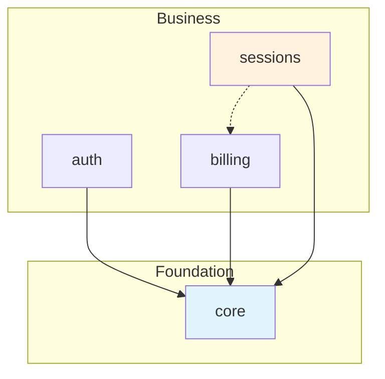

# KDD Multi-Dominio

> Extensión de la metodología KDD para soportar múltiples bounded contexts en aplicaciones grandes.

## Principio Central

> **"Dominio primero, capa segundo"**

En lugar de organizar por capa y luego buscar el dominio, invertimos la jerarquía para que cada dominio sea autónomo pero interconectable.

---

## Cuándo Usar Multi-Dominio

| Usar Multi-Dominio | Usar KDD Monolítico |
|--------------------|---------------------|
| Múltiples bounded contexts | Un solo bounded context |
| Equipos trabajando en paralelo | Equipo pequeño |
| 50+ artefactos de especificación | Menos de 50 artefactos |
| Dependencias explícitas entre áreas | Todo está relacionado |

---

## Estructura de Carpetas

```
specs/
├── _shared/                          # Elementos transversales (raíz)
│   ├── policies/                     # XP-* Políticas cross-domain
│   ├── glossary.md                   # Términos globales
│   ├── domain-map.md                 # Mapa de dominios y dependencias
│   └── _index.json                   # Índice de elementos compartidos
│
├── domains/                          # Contenedor de todos los dominios
│   │
│   ├── core/                         # Dominio Core (fundacional)
│   │   ├── _manifest.yaml            # Metadatos del dominio
│   │   ├── 00-requirements/
│   │   ├── 01-domain/
│   │   ├── 02-behavior/
│   │   ├── 03-experience/
│   │   ├── 04-verification/
│   │   ├── 05-architecture/
│   │   └── _index.json               # Índice local del dominio
│   │
│   ├── auth/                         # Dominio Autenticación
│   │   ├── _manifest.yaml
│   │   └── ... (capas KDD)
│   │
│   ├── billing/                      # Dominio Facturación
│   │   └── ...
│   │
│   └── sessions/                     # Dominio Sesiones
│       └── ...
│
└── _index.json                       # Índice global (agregado)
```

### Ventajas de `domains/` como contenedor

1. **Explícito**: Queda claro que es una organización por dominios
2. **Limpio**: `_shared/` y `domains/` al mismo nivel, sin mezclar convenciones
3. **Escalable**: Fácil añadir nuevos dominios dentro del contenedor
4. **Tooling friendly**: Globs como `domains/*/01-domain/**` funcionan intuitivamente

---

## Manifest de Dominio

Cada dominio debe tener un archivo `_manifest.yaml` que declara sus metadatos y dependencias.

### Ubicación

`specs/domains/{domain-name}/_manifest.yaml`

### Ejemplo Básico

```yaml
domain:
  id: sessions
  name: "Sesiones Six Hats"
  description: "Gestión de sesiones de pensamiento estructurado"
  status: active
```

### Ejemplo Completo

```yaml
domain:
  id: sessions
  name: "Sesiones Six Hats"
  description: |
    Gestiona el ciclo completo de sesiones de pensamiento
    estructurado con personas sintéticas.
  status: active
  team: "@team-core"
  version: "1.0.0"
  tags:
    - core-business
    - six-hats
    - ai-powered

dependencies:
  - domain: core
    type: required
    reason: "Usuarios y Retos son conceptos fundacionales"
    imports:
      entities: [Usuario, Reto]
      events: [EVT-Reto-Creado]

  - domain: billing
    type: optional
    reason: "Las sesiones pueden funcionar sin créditos en modo demo"
    imports:
      events: [EVT-Credito-Consumido]

exports:
  entities:
    - Sesion
    - Ronda
    - Idea
    - PersonaSintetica
  events:
    - EVT-Sesion-Iniciada
    - EVT-Sesion-Completada
  commands:
    - CMD-IniciarSesion

context-map:
  upstream: [core, billing, ai]
  downstream: [analytics]

boundaries:
  anti-corruption:
    - external: "billing::Credito"
      internal: CreditoDisponible
      notes: "Solo nos interesa el balance, no los detalles de transacción"
```

### Campos del Manifest

#### Sección `domain` (requerida)

| Campo | Tipo | Requerido | Descripción |
|-------|------|-----------|-------------|
| `id` | string | Sí | Identificador único (kebab-case, debe coincidir con carpeta) |
| `name` | string | Sí | Nombre legible para humanos |
| `description` | string | Sí | Propósito y alcance del dominio |
| `status` | enum | Sí | `active`, `deprecated`, `experimental`, `frozen` |
| `team` | string | No | Equipo responsable (`@team-name`) |
| `version` | string | No | Versión semántica |
| `tags` | array | No | Tags de categorización |

#### Sección `dependencies` (opcional)

Lista de dominios de los que este depende.

| Campo | Tipo | Requerido | Descripción |
|-------|------|-----------|-------------|
| `domain` | string | Sí | ID del dominio del que se depende |
| `type` | enum | Sí | `required`, `optional`, `event-only` |
| `reason` | string | No | Justificación de la dependencia |
| `imports.entities` | array | No | Entidades que se referencian |
| `imports.events` | array | No | Eventos que se escuchan |
| `imports.commands` | array | No | Comandos que se invocan |
| `imports.queries` | array | No | Queries que se consultan |
| `imports.value-objects` | array | No | Value Objects que se usan |

#### Sección `exports` (opcional)

Artefactos que este dominio expone a otros.

| Campo | Tipo | Descripción |
|-------|------|-------------|
| `entities` | array | Entidades públicas |
| `events` | array | Eventos consumibles por otros |
| `commands` | array | Comandos invocables por otros |
| `queries` | array | Queries disponibles para otros |
| `value-objects` | array | Value Objects reutilizables |

#### Sección `context-map` (opcional)

Posición en el mapa de contextos DDD.

| Campo | Tipo | Descripción |
|-------|------|-------------|
| `upstream` | array | Dominios de los que consume |
| `downstream` | array | Dominios que consumen de este |
| `relationships` | array | Tipo de relación con cada dominio |

Patrones de relación válidos:
- `conformist` - Nos adaptamos a su modelo
- `anti-corruption-layer` - Traducimos su modelo
- `shared-kernel` - Modelo compartido
- `customer-supplier` - Relación cliente-proveedor
- `open-host-service` - Servicio genérico expuesto
- `published-language` - Lenguaje publicado

#### Sección `boundaries` (opcional)

Define traducciones Anti-Corruption Layer.

```yaml
boundaries:
  anti-corruption:
    - external: "billing::Credito"
      internal: CreditoDisponible
      adapter: CreditoAdapter
      notes: "Solo nos interesa el balance"
```

---

## Referencias Cross-Domain

### Sintaxis de Wiki-Links

Las wiki-links ahora soportan notación de dominio con `::` como separador:

```markdown
# Referencia en el mismo dominio
[[Sesion]]                    # Busca en dominio actual, luego en core

# Referencia explícita a otro dominio
[[core::Usuario]]             # Usuario en dominio core
[[billing::Credito]]          # Credito en dominio billing
[[_shared::XP-AUDIT-001]]     # Política compartida
```

### Reglas de Resolución

1. `[[Entity]]` → Busca primero en el dominio actual, luego en `core`
2. `[[domain::Entity]]` → Busca explícitamente en el dominio especificado
3. `[[_shared::Policy]]` → Busca en la carpeta `_shared/`

### Por qué `::`

- Evita confusión con paths de archivo (que usan `/`)
- Familiar de otros lenguajes (C++, Rust namespaces)
- Fácil de parsear sin ambigüedad

---

## Carpeta `_shared/`

Elementos que aplican a TODOS los dominios:

```
_shared/
├── policies/
│   ├── XP-LOGGING-001.md         # Política de logging
│   ├── XP-AUDIT-001.md           # Auditoría
│   └── XP-SECURITY-001.md        # Seguridad
├── glossary.md                    # Términos universales
├── domain-map.md                  # Visualización de dependencias
└── nfr/                          # Non-functional requirements globales
    └── NFR-001-Performance.md
```

### Domain Map

El archivo `_shared/domain-map.md` visualiza las dependencias entre dominios:

```markdown
# Mapa de Dominios

## Diagrama de Dependencias



## Matriz de Dependencias

| Dominio | Depende de | Exporta a |
|---------|------------|-----------|
| core | - | auth, billing, sessions |
| auth | core | sessions |
| billing | core | sessions |
| sessions | core, billing | - |
```

---

## Reglas de Dependencia

### Principios

1. **Core es fundacional**: `domains/core` no puede depender de ningún otro dominio
2. **Dependencias explícitas**: Toda dependencia debe estar en `_manifest.yaml`
3. **Sin ciclos**: A → B → A está prohibido
4. **Anti-corruption layer**: Traducciones explícitas para conceptos externos

### Niveles de Dominio

```
┌─────────────────────────────────────────────────────────┐
│  LEAF DOMAINS (no tienen dependientes)                  │
│  sessions, reporting, analytics                         │
├─────────────────────────────────────────────────────────┤
│  MIDDLE DOMAINS (dependencias bidireccionales)          │
│  auth, billing, notifications                           │
├─────────────────────────────────────────────────────────┤
│  CORE DOMAIN (fundacional)                              │
│  core                                                   │
└─────────────────────────────────────────────────────────┘
```

### Tipos de Dependencia

| Tipo | Significado | Validación |
|------|-------------|------------|
| `required` | Dominio no funciona sin esta dependencia | Error si falta |
| `optional` | Funcionalidad degradada sin dependencia | Warning si falta |
| `event-only` | Solo escucha eventos, sin acoplamiento | Info |

---

## Sistema de Índices

### Índice Local (`domains/{domain}/_index.json`)

Cada dominio tiene un índice local generado automáticamente:

```json
{
  "domain": "sessions",
  "generated": "2025-01-20T10:00:00Z",
  "artifacts": {
    "entities": [
      { "id": "Sesion", "path": "01-domain/entities/Sesion.md" },
      { "id": "Ronda", "path": "01-domain/entities/Ronda.md" }
    ],
    "events": [...],
    "commands": [...]
  },
  "dependencies": {
    "core": ["Usuario", "Reto"],
    "billing": ["EVT-Credito-Consumido"]
  },
  "exports": ["Sesion", "Ronda", "Idea"]
}
```

### Índice Global (`specs/_index.json`)

Agregación de todos los índices locales:

```json
{
  "generated": "2025-01-20T10:00:00Z",
  "domains": {
    "core": { "artifacts": 25, "status": "active" },
    "auth": { "artifacts": 15, "status": "active" },
    "sessions": { "artifacts": 45, "status": "active" }
  },
  "totalArtifacts": 85,
  "crossReferences": {
    "sessions → core": 12,
    "sessions → billing": 3
  },
  "search": {
    "Usuario": { "domain": "core", "type": "entity" },
    "Sesion": { "domain": "sessions", "type": "entity" }
  }
}
```

---

## Validación Multi-Dominio

### Comandos CLI

```bash
# Validar dominio específico
bun run validate:specs --domain sessions

# Validar todos los dominios
bun run validate:specs --all-domains

# Validar dependencias entre dominios
bun run validate:specs --check-dependencies

# Generar índice de dominio
bun run generate:index --domain sessions

# Visualizar dependencias
bun run specs:domain-map
```

### Validaciones Adicionales

1. **Dependencias declaradas**: Todo `[[domain::X]]` debe estar en `_manifest.yaml`
2. **Ciclos detectados**: Error si A depende de B que depende de A
3. **Exports consistentes**: Lo declarado en exports debe existir
4. **Imports usados**: Warning si se declara import no usado
5. **Core sin dependencias**: Error si `core` depende de otros dominios

---

## Migración desde KDD Monolítico

### Estrategia Incremental

```bash
# Fase 1: Crear estructura base
specs/
├── _shared/              # Mover políticas XP-*
├── domains/
│   ├── core/             # Mover entidades fundacionales
│   └── legacy/           # Todo lo demás temporalmente

# Fase 2: Extraer dominios uno por uno
domains/auth/    ← Extraer de legacy
domains/billing/ ← Extraer de legacy

# Fase 3: Eliminar domains/legacy cuando esté vacío
```

### Comando de Migración

```bash
# Analizar monolito y sugerir dominios
bun run specs:analyze-domains

# Mover artefactos a nuevo dominio
bun run specs:extract-domain --domain sessions --entities Sesion,Ronda,Idea

# Actualizar referencias automáticamente
bun run specs:update-refs --from "[[Sesion]]" --to "[[sessions::Sesion]]"
```

---

## Detección Automática

El validador detecta automáticamente el modo de operación:

1. Si existe `specs/domains/`, activa modo multi-dominio
2. Si no existe, usa modo monolítico tradicional
3. La migración es gradual y sin breaking changes

### Coexistencia

Durante la migración, puede existir una estructura híbrida:

```
specs/
├── 01-domain/            # Artefactos legacy (monolítico)
├── 02-behavior/
├── _shared/              # Nuevo: elementos compartidos
└── domains/              # Nuevo: dominios extraídos
    └── auth/
```

---

## Ejemplo Completo: Six Hats App

### Dominios Identificados

| Dominio | Responsabilidad | Entidades Principales |
|---------|-----------------|----------------------|
| `core` | Fundacional | Reto, Usuario |
| `auth` | Autenticación | Credencial, Sesión de Usuario |
| `billing` | Créditos y pagos | Credito, Transaccion, Plan |
| `sessions` | Sesiones Six Hats | Sesion, Ronda, Idea, PersonaSintetica |
| `ai` | Integración IA | Prompt, Respuesta, Modelo |
| `analytics` | Métricas y reportes | Metrica, Reporte, Dashboard |

### Manifest de `sessions`

```yaml
domain:
  id: sessions
  name: "Sesiones de Pensamiento"
  description: |
    Dominio principal de Six Hats. Gestiona el ciclo completo
    de sesiones de pensamiento estructurado con personas sintéticas.
  team: "@team-core"
  status: active

dependencies:
  - domain: core
    type: required
    reason: "Usuarios y Retos son conceptos fundacionales"
    imports:
      entities: [Usuario, Reto]
      events: [EVT-Reto-Creado, EVT-Reto-Configurado]

  - domain: billing
    type: required
    reason: "Las sesiones consumen créditos"
    imports:
      entities: [CreditoDisponible]
      events: [EVT-Credito-Consumido]

  - domain: ai
    type: required
    reason: "Personas sintéticas requieren generación IA"
    imports:
      commands: [CMD-GenerarRespuesta]
      entities: [ModeloIA]

exports:
  entities:
    - Sesion
    - Ronda
    - Idea
    - PersonaSintetica
    - AnalisisFinal
  events:
    - EVT-Sesion-Iniciada
    - EVT-Sesion-Completada
    - EVT-Ronda-Completada
    - EVT-Idea-Generada
    - EVT-Analisis-Generado
  commands:
    - CMD-IniciarSesion
    - CMD-AvanzarRonda
    - CMD-GenerarIdea
    - CMD-GenerarAnalisis
  queries:
    - QRY-ObtenerSesion
    - QRY-ListarIdeasPorSombrero

context-map:
  upstream: [core, billing, ai]
  downstream: [analytics]

boundaries:
  anti-corruption:
    - external: "billing::Credito"
      internal: CreditoDisponible
      notes: "Solo nos interesa el balance, no los detalles de transacción"
    - external: "ai::ModeloIA"
      internal: ConfiguracionIA
      notes: "Abstraemos el modelo específico usado"
```

---

## Beneficios

1. **Autonomía de equipos**: Cada equipo trabaja en su dominio sin conflictos
2. **Navegación clara**: Saber dónde buscar algo es inmediato
3. **Validación rápida**: Solo validar el dominio modificado
4. **Dependencias explícitas**: El domain-map muestra la arquitectura
5. **Escalabilidad**: Añadir dominios no afecta los existentes
6. **Onboarding fácil**: Nuevo dev solo estudia su dominio + core

---

## Referencias

- [KDD Model Reference](/kdd/kdd.md)
- [Convenciones de Escritura](/kdd/docs/convenciones-escritura.md)
- [Validación de Especificaciones](/kdd/docs/validacion-especificaciones.md)
