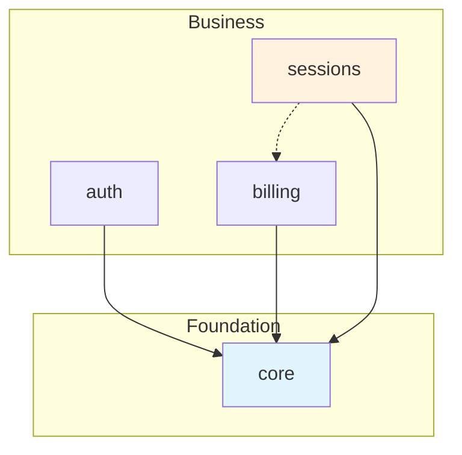

# KDD Multi-Domain

> Extension of the KDD methodology to support multiple bounded contexts in large applications.

## Core Principle

> **"Domain first, layer second"**

Instead of organizing by layer and then searching for the domain, we invert the hierarchy so that each domain is autonomous but interconnectable.

---

## When to Use Multi-Domain

| Use Multi-Domain | Use Monolithic KDD |
|------------------|---------------------|
| Multiple bounded contexts | A single bounded context |
| Teams working in parallel | Small team |
| 50+ specification artifacts | Fewer than 50 artifacts |
| Explicit dependencies between areas | Everything is related |

---

## Folder Structure

```
specs/
├── _shared/                          # Cross-cutting elements (root)
│   ├── policies/                     # XP-* Cross-domain policies
│   ├── glossary.md                   # Global terms
│   ├── domain-map.md                 # Domain map and dependencies
│   └── _index.json                   # Shared elements index
│
├── domains/                          # Container for all domains
│   │
│   ├── core/                         # Core domain (foundational)
│   │   ├── _manifest.yaml            # Domain metadata
│   │   ├── 00-requirements/
│   │   ├── 01-domain/
│   │   ├── 02-behavior/
│   │   ├── 03-experience/
│   │   ├── 04-verification/
│   │   ├── 05-architecture/
│   │   └── _index.json               # Local domain index
│   │
│   ├── auth/                         # Authentication domain
│   │   ├── _manifest.yaml
│   │   └── ... (KDD layers)
│   │
│   ├── billing/                      # Billing domain
│   │   └── ...
│   │
│   └── sessions/                     # Sessions domain
│       └── ...
│
└── _index.json                       # Global index (aggregate)
```

### Advantages of `domains/` as a Container

1. **Explicit**: It is clear that this is a domain-based organization
2. **Clean**: `_shared/` and `domains/` at the same level, without mixing conventions
3. **Scalable**: Easy to add new domains inside the container
4. **Tooling friendly**: Globs like `domains/*/01-domain/**` work intuitively

---

## Domain Manifest

Each domain must have a `_manifest.yaml` file that declares its metadata and dependencies.

### Location

`specs/domains/{domain-name}/_manifest.yaml`

### Basic Example

```yaml
domain:
  id: sessions
  name: "Store Sessions"
  description: "Management of structured thinking sessions"
  status: active
```

### Complete Example

```yaml
domain:
  id: sessions
  name: "Store Sessions"
  description: |
    Manages the complete lifecycle of structured thinking
    sessions with synthetic products.
  status: active
  team: "@team-core"
  version: "1.0.0"
  tags:
    - core-business
    - store
    - ai-powered

dependencies:
  - domain: core
    type: required
    reason: "Customers and Orders are foundational concepts"
    imports:
      entities: [Customer, Order]
      events: [EVT-Order-Placed]

  - domain: billing
    type: optional
    reason: "Sessions can work without credits in demo mode"
    imports:
      events: [EVT-Credit-Consumed]

exports:
  entities:
    - Cart
    - CartItem
    - Idea
    - Product
  events:
    - EVT-Cart-Initiated
    - EVT-Cart-Completed
  commands:
    - CMD-InitiateCart

context-map:
  upstream: [core, billing, ai]
  downstream: [analytics]

boundaries:
  anti-corruption:
    - external: "billing::Credit"
      internal: AvailableCredit
      notes: "We only care about the balance, not the transaction details"
```

### Manifest Fields

#### `domain` Section (required)

| Field | Type | Required | Description |
|-------|------|----------|-------------|
| `id` | string | Yes | Unique identifier (kebab-case, must match folder) |
| `name` | string | Yes | Human-readable name |
| `description` | string | Yes | Purpose and scope of the domain |
| `status` | enum | Yes | `active`, `deprecated`, `experimental`, `frozen` |
| `team` | string | No | Responsible team (`@team-name`) |
| `version` | string | No | Semantic version |
| `tags` | array | No | Categorization tags |

#### `dependencies` Section (optional)

List of domains this one depends on.

| Field | Type | Required | Description |
|-------|------|----------|-------------|
| `domain` | string | Yes | ID of the domain depended upon |
| `type` | enum | Yes | `required`, `optional`, `event-only` |
| `reason` | string | No | Justification for the dependency |
| `imports.entities` | array | No | Entities that are referenced |
| `imports.events` | array | No | Events that are listened to |
| `imports.commands` | array | No | Commands that are invoked |
| `imports.queries` | array | No | Queries that are consulted |
| `imports.value-objects` | array | No | Value Objects that are used |

#### `exports` Section (optional)

Artifacts that this domain exposes to others.

| Field | Type | Description |
|-------|------|-------------|
| `entities` | array | Public entities |
| `events` | array | Events consumable by others |
| `commands` | array | Commands invocable by others |
| `queries` | array | Queries available to others |
| `value-objects` | array | Reusable Value Objects |

#### `context-map` Section (optional)

Position in the DDD context map.

| Field | Type | Description |
|-------|------|-------------|
| `upstream` | array | Domains it consumes from |
| `downstream` | array | Domains that consume from this |
| `relationships` | array | Relationship type with each domain |

Valid relationship patterns:
- `conformist` - We adapt to their model
- `anti-corruption-layer` - We translate their model
- `shared-kernel` - Shared model
- `customer-supplier` - Customer-supplier relationship
- `open-host-service` - Generic exposed service
- `published-language` - Published language

#### `boundaries` Section (optional)

Defines Anti-Corruption Layer translations.

```yaml
boundaries:
  anti-corruption:
    - external: "billing::Credit"
      internal: AvailableCredit
      adapter: CreditAdapter
      notes: "We only care about the balance"
```

---

## Cross-Domain References

### Wiki-Link Syntax

Wiki-links now support domain notation with `::` as separator:

```markdown
# Reference in the same domain
[[Cart]]                          # Searches in current domain, then in core

# Explicit reference to another domain
[[core::Customer]]                # Customer in core domain
[[billing::Credit]]               # Credit in billing domain
[[_shared::XP-003-AuditTrail]]   # Shared policy
```

### Resolution Rules

1. `[[Entity]]` → Searches first in the current domain, then in `core`
2. `[[domain::Entity]]` → Searches explicitly in the specified domain
3. `[[_shared::Policy]]` → Searches in the `_shared/` folder

### Why `::`

- Avoids confusion with file paths (which use `/`)
- Familiar from other languages (C++, Rust namespaces)
- Easy to parse without ambiguity

---

## `_shared/` Folder

Elements that apply to ALL domains:

```
_shared/
├── policies/
│   ├── XP-004-RequestLogging.md  # Logging policy
│   ├── XP-003-AuditTrail.md     # Audit
│   └── XP-005-SecurityPolicy.md # Security
├── glossary.md                    # Universal terms
├── domain-map.md                  # Dependency visualization
└── nfr/                          # Global non-functional requirements
    └── NFR-001-Performance.md
```

### Domain Map

The `_shared/domain-map.md` file visualizes the dependencies between domains:

```markdown
# Domain Map

## Dependency Diagram



## Dependency Matrix

| Domain | Depends On | Exports To |
|--------|-----------|------------|
| core | - | auth, billing, sessions |
| auth | core | sessions |
| billing | core | sessions |
| sessions | core, billing | - |
```

---

## Dependency Rules

### Principles

1. **Core is foundational**: `domains/core` cannot depend on any other domain
2. **Explicit dependencies**: Every dependency must be in `_manifest.yaml`
3. **No cycles**: A → B → A is forbidden
4. **Anti-corruption layer**: Explicit translations for external concepts

### Domain Levels

```
┌─────────────────────────────────────────────────────────┐
│  LEAF DOMAINS (have no dependents)                       │
│  sessions, reporting, analytics                          │
├─────────────────────────────────────────────────────────┤
│  MIDDLE DOMAINS (bidirectional dependencies)             │
│  auth, billing, notifications                            │
├─────────────────────────────────────────────────────────┤
│  CORE DOMAIN (foundational)                              │
│  core                                                    │
└─────────────────────────────────────────────────────────┘
```

### Dependency Types

| Type | Meaning | Validation |
|------|---------|------------|
| `required` | Domain does not work without this dependency | Error if missing |
| `optional` | Degraded functionality without dependency | Warning if missing |
| `event-only` | Only listens to events, no coupling | Info |

---

## Index System

### Local Index (`domains/{domain}/_index.json`)

Each domain has an automatically generated local index:

```json
{
  "domain": "sessions",
  "generated": "2025-01-20T10:00:00Z",
  "artifacts": {
    "entities": [
      { "id": "Cart", "path": "01-domain/entities/Cart.md" },
      { "id": "CartItem", "path": "01-domain/entities/CartItem.md" }
    ],
    "events": [...],
    "commands": [...]
  },
  "dependencies": {
    "core": ["Customer", "Order"],
    "billing": ["EVT-Credit-Consumed"]
  },
  "exports": ["Cart", "CartItem", "Idea"]
}
```

### Global Index (`specs/_index.json`)

Aggregation of all local indexes:

```json
{
  "generated": "2025-01-20T10:00:00Z",
  "domains": {
    "core": { "artifacts": 25, "status": "active" },
    "auth": { "artifacts": 15, "status": "active" },
    "sessions": { "artifacts": 45, "status": "active" }
  },
  "totalArtifacts": 85,
  "crossReferences": {
    "sessions → core": 12,
    "sessions → billing": 3
  },
  "search": {
    "Customer": { "domain": "core", "type": "entity" },
    "Cart": { "domain": "sessions", "type": "entity" }
  }
}
```

---

## Multi-Domain Validation

### CLI Commands

```bash
# Validate specific domain
bun run validate:specs --domain sessions

# Validate all domains
bun run validate:specs --all-domains

# Validate dependencies between domains
bun run validate:specs --check-dependencies

# Generate domain index
bun run generate:index --domain sessions

# Visualize dependencies
bun run specs:domain-map
```

### Additional Validations

1. **Declared dependencies**: Every `[[domain::X]]` must be in `_manifest.yaml`
2. **Cycles detected**: Error if A depends on B which depends on A
3. **Consistent exports**: What is declared in exports must exist
4. **Used imports**: Warning if a declared import is unused
5. **Core without dependencies**: Error if `core` depends on other domains

---

## Migration from Monolithic KDD

### Incremental Strategy

```bash
# Phase 1: Create base structure
specs/
├── _shared/              # Move XP-* policies
├── domains/
│   ├── core/             # Move foundational entities
│   └── legacy/           # Everything else temporarily

# Phase 2: Extract domains one by one
domains/auth/    ← Extract from legacy
domains/billing/ ← Extract from legacy

# Phase 3: Remove domains/legacy when empty
```

### Migration Command

```bash
# Analyze monolith and suggest domains
bun run specs:analyze-domains

# Move artifacts to new domain
bun run specs:extract-domain --domain sessions --entities Cart,CartItem,Idea

# Update references automatically
bun run specs:update-refs --from "[[Cart]]" --to "[[sessions::Cart]]"
```

---

## Automatic Detection

The validator automatically detects the operating mode:

1. If `specs/domains/` exists, it activates multi-domain mode
2. If it does not exist, it uses traditional monolithic mode
3. Migration is gradual and without breaking changes

### Coexistence

During migration, a hybrid structure can exist:

```
specs/
├── 01-domain/            # Legacy artifacts (monolithic)
├── 02-behavior/
├── _shared/              # New: shared elements
└── domains/              # New: extracted domains
    └── auth/
```

---

## Complete Example: Store App

### Identified Domains

| Domain | Responsibility | Main Entities |
|--------|---------------|---------------|
| `core` | Foundational | Order, Customer |
| `auth` | Authentication | Credential, User Session |
| `billing` | Credits and payments | Credit, Transaction, Plan |
| `sessions` | Store Sessions | Cart, CartItem, Idea, Product |
| `ai` | AI Integration | Prompt, Response, Model |
| `analytics` | Metrics and reports | Metric, Report, Dashboard |

### `sessions` Manifest

```yaml
domain:
  id: sessions
  name: "Thinking Sessions"
  description: |
    Main Store domain. Manages the complete lifecycle
    of structured thinking sessions with products.
  team: "@team-core"
  status: active

dependencies:
  - domain: core
    type: required
    reason: "Customers and Orders are foundational concepts"
    imports:
      entities: [Customer, Order]
      events: [EVT-Order-Placed, EVT-Order-Configured]

  - domain: billing
    type: required
    reason: "Sessions consume credits"
    imports:
      entities: [AvailableCredit]
      events: [EVT-Credit-Consumed]

  - domain: ai
    type: required
    reason: "Products require AI generation"
    imports:
      commands: [CMD-GenerateResponse]
      entities: [AIModel]

exports:
  entities:
    - Cart
    - CartItem
    - Idea
    - Product
    - FinalAnalysis
  events:
    - EVT-Cart-Initiated
    - EVT-Cart-Completed
    - EVT-CartItem-Completed
    - EVT-Idea-Generated
    - EVT-Analysis-Generated
  commands:
    - CMD-InitiateCart
    - CMD-AdvanceCartItem
    - CMD-GenerateIdea
    - CMD-GenerateAnalysis
  queries:
    - QRY-GetCart
    - QRY-ListItemsByCategory

context-map:
  upstream: [core, billing, ai]
  downstream: [analytics]

boundaries:
  anti-corruption:
    - external: "billing::Credit"
      internal: AvailableCredit
      notes: "We only care about the balance, not the transaction details"
    - external: "ai::AIModel"
      internal: AIConfiguration
      notes: "We abstract the specific model used"
```

---

## Benefits

1. **Team autonomy**: Each team works in its own domain without conflicts
2. **Clear navigation**: Knowing where to find something is immediate
3. **Fast validation**: Only validate the modified domain
4. **Explicit dependencies**: The domain-map shows the architecture
5. **Scalability**: Adding domains does not affect existing ones
6. **Easy onboarding**: New dev only studies their domain + core

---

## References

- [KDD Model Reference](/kdd/kdd.md)
- [Writing Conventions](/kdd/docs/writing-conventions.md)
- [Specification Validation](/kdd/docs/specification-validation.md)
