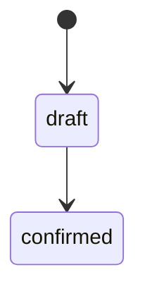

# KDD Writing Conventions

> Style guide for writing specifications in the KDD (Knowledge-Driven Development) system.

## 1. Domain Entity Capitalization

### Main Rule

**Domain entities (Aggregates, Entities, Value Objects) are ALWAYS written with the first letter capitalized**, even in the middle of a sentence.

```markdown
# Correct
The Customer creates an Order and configures the Products.
Each Cart contains multiple CartItems.
The Admin controls the process.

# Incorrect
The customer creates an order and configures the products.
Each cart contains multiple cart items.
The admin controls the process.
```

### Rationale

1. **Intentionality**: Indicates that the term is a defined domain concept, not a casual word
2. **Readability**: Visually highlights important concepts when reading
3. **Consistency**: Facilitates search and automatic linking
4. **Ubiquitous Language**: Reinforces the shared domain language (DDD)

### Exceptions

- **Plurals**: Keep capitalization → "the Orders", "the Carts"
- **With articles**: The article is lowercase → "the Order", "a Cart"
- **Code/variables**: In code use camelCase → `order`, `cart`, `product`

---

## 2. Wiki-Links

### Format

```markdown
[[Entity Name]]                 # Simple link
[[Entity|alternative text]]     # Link with alias
```

### When to Link

| Situation | Action | Example |
|-----------|--------|---------|
| First mention in section | Link | `The [[Customer]] can...` |
| Subsequent mentions | Optional | `The Customer also...` |
| In titles/headers | DO NOT link | `## Customer Flow` |
| In code | DO NOT link | `` `customer.create()` `` |
| In tables | Do link | `\| [[Order]] \| Draft \|` |

### Aliases for Plurals and Variations

```markdown
[[Cart|carts]]                   # Plural
[[Product|item]]                 # Contextual synonym
[[OrderItem|line item]]          # Alternative name
```

---

## 3. Identifiers

### Patterns by Type

| Type | Pattern | Example |
|------|---------|---------|
| Use Case | `UC-NNN` | UC-001, UC-012 |
| Requirement | `REQ-NNN` | REQ-001, REQ-015 |
| Individual Requirement | `REQ-NNN.M` | REQ-001.1, REQ-001.2 |
| Event | `EVT-Entity-Action` | EVT-Order-Placed |
| Business Rule | `BR-ENTITY-NNN` | BR-CART-001, BR-ORDER-001 |
| Process | `PRC-NNN` | PRC-001 |
| ADR | `ADR-NNNN` | ADR-0001 |
| NFR | `NFR-NNN` | NFR-001 |

### In Text

Identifiers are always uppercase and can be linked:

```markdown
# Correct
This requirement derives from [[UC-001-PlaceOrder]].
Rule [[BR-CART-001]] applies.

# Incorrect
This requirement derives from uc-001.
Rule br-cart-001 applies.
```

---

## 4. Sentence Structure

### Active vs Passive Voice

Prefer active voice for clarity:

```markdown
# Preferred (active)
The System creates a new Cart.
The Customer configures the Products.

# Avoid (passive)
A new Cart is created by the System.
The Products are configured by the Customer.
```

### Clear Subjects

Always specify who performs the action:

```markdown
# Correct
The System SHALL reject the request.
The Customer MUST confirm the action.

# Incorrect
The request is rejected.
The action must be confirmed.
```

---

## 5. EARS Patterns for Requirements

### Keywords

EARS keywords are written in **UPPERCASE**:

- `WHEN` - Triggering event
- `IF` - Condition (unwanted behavior)
- `WHILE` - Continuous state
- `WHERE` - Optional feature
- `SHALL` - System obligation
- `SHALL NOT` - Prohibition

```markdown
WHEN the Customer submits the form,
the System SHALL create a new Order
  AND SHALL emit EVT-Order-Placed.
```

---

## 6. Code Blocks

### Specify Language

Always indicate the language for syntax highlighting:

````markdown
```typescript
const order = await placeOrder(input)
```

```gherkin
Given a logged-in Customer
When the Customer places an Order
Then the Order status should be "draft"
```


````

### Entities in Code

In code blocks, use language conventions (camelCase/snake_case), not domain capitalization:

```typescript
// In code: camelCase
const product = await createProduct(input)
const activeCart = await getActiveCart(customerId)

// In documentation: Capitalized
// The Product is added to the active Cart
```

---

## 7. Tables

### Clear Headers

```markdown
| Field | Type | Required | Description |
|-------|------|----------|-------------|
| title | string | Yes | Title of the [[Order]] |
| status | enum | Yes | Current status |
```

### Alignment

- Text: Left (default)
- Numbers: Right
- States/Enums: Center

---

## 8. YAML Frontmatter

### Field Order

```yaml
---
id: UC-001                    # Identifier first
kind: use-case                # Document type
status: draft                 # Status
actor: Customer               # Type-specific fields
tags:                         # Metadata at the end
  - core
  - order
---
```

### Values

- Strings without quotes (unless they contain special characters)
- Arrays in list format with dashes
- Booleans in lowercase: `true`, `false`

---

## 9. Review Checklist

Before committing a specification, verify:

- [ ] Domain entities capitalized
- [ ] First mention of each entity linked
- [ ] Identifiers in correct format (UC-NNN, REQ-NNN, etc.)
- [ ] Frontmatter complete per template
- [ ] Required sections present
- [ ] Code blocks with language specified
- [ ] No broken links (run `bun run validate:specs`)

---

## References

- [Specification Validation](./validacion-especificaciones.md)
- [KDD Templates](/kdd_templates/_schema.md)
- [Domain-Driven Design - Ubiquitous Language](https://martinfowler.com/bliki/UbiquitousLanguage.html)
