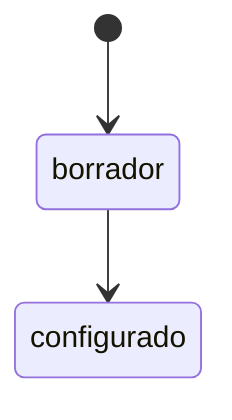

# Convenciones de Escritura KDD

> Guía de estilo para escribir especificaciones en el sistema KDD (Knowledge-Driven Development).

## 1. Capitalización de Entidades de Dominio

### Regla Principal

**Las entidades de dominio (Aggregates, Entities, Value Objects) SIEMPRE se escriben con la primera letra en mayúscula**, incluso en medio de una oración.

```markdown
# Correcto
El Usuario crea un Reto y configura las Personas Sintéticas.
Cada Sesión contiene múltiples Rondas.
El Sombrero Azul controla el proceso.

# Incorrecto
El usuario crea un reto y configura las personas sintéticas.
Cada sesión contiene múltiples rondas.
El sombrero azul controla el proceso.
```

### Justificación

1. **Intencionalidad**: Indica que el término es un concepto de dominio definido, no una palabra casual
2. **Legibilidad**: Destaca visualmente los conceptos importantes al leer
3. **Consistencia**: Facilita la búsqueda y el enlazado automático
4. **Ubiquitous Language**: Refuerza el lenguaje compartido del dominio (DDD)

### Excepciones

- **Plurales**: Mantienen la mayúscula → "los Retos", "las Sesiones"
- **Con artículos**: El artículo va en minúscula → "el Reto", "una Sesión"
- **Código/variables**: En código se usa camelCase → `reto`, `sesion`, `personaSintetica`

---

## 2. Wiki-Links

### Formato

```markdown
[[Nombre de Entidad]]           # Link simple
[[Entidad|texto alternativo]]   # Link con alias
```

### Cuándo Enlazar

| Situación | Acción | Ejemplo |
|-----------|--------|---------|
| Primera mención en sección | Enlazar | `El [[Usuario]] puede...` |
| Menciones posteriores | Opcional | `El Usuario también...` |
| En títulos/headers | NO enlazar | `## Flujo del Usuario` |
| En código | NO enlazar | `` `usuario.create()` `` |
| En tablas | Sí enlazar | `\| [[Reto]] \| Borrador \|` |

### Alias para Plurales y Variaciones

```markdown
[[Sesión|sesiones]]              # Plural
[[Persona Sintética|participante]]  # Sinónimo contextual
[[Método Seis Sombreros|Six Thinking Hats]]  # Traducción
```

---

## 3. Identificadores

### Patrones por Tipo

| Tipo | Patrón | Ejemplo |
|------|--------|---------|
| Use Case | `UC-NNN` | UC-001, UC-012 |
| Requirement | `REQ-NNN` | REQ-001, REQ-015 |
| Requirement individual | `REQ-NNN.M` | REQ-001.1, REQ-001.2 |
| Event | `EVT-Entidad-Accion` | EVT-Reto-Creado |
| Business Rule | `BR-ENTIDAD-NNN` | BR-RONDA-003, BR-SESION-001 |
| Process | `PRC-NNN` | PRC-001 |
| ADR | `ADR-NNNN` | ADR-0001 |
| NFR | `NFR-NNN` | NFR-001 |

### En Texto

Los identificadores siempre van en mayúsculas y pueden enlazarse:

```markdown
# Correcto
Este requisito deriva de [[UC-001-Crear-Reto]].
Aplica la regla [[BR-RONDA-003]].

# Incorrecto
Este requisito deriva de uc-001.
Aplica la regla br-ronda-003.
```

---

## 4. Estructura de Oraciones

### Voz Activa vs Pasiva

Preferir voz activa para claridad:

```markdown
# Preferido (activa)
El Sistema crea una nueva Sesión.
El Usuario configura las Personas Sintéticas.

# Evitar (pasiva)
Una nueva Sesión es creada por el Sistema.
Las Personas Sintéticas son configuradas por el Usuario.
```

### Sujetos Claros

Siempre especificar quién realiza la acción:

```markdown
# Correcto
El Sistema SHALL rechazar la solicitud.
El Usuario DEBE confirmar la acción.

# Incorrecto
Se rechaza la solicitud.
La acción debe confirmarse.
```

---

## 5. Patrones EARS para Requisitos

### Keywords

Las palabras clave EARS van en **MAYÚSCULAS**:

- `WHEN` - Evento disparador
- `IF` - Condición (comportamiento no deseado)
- `WHILE` - Estado continuo
- `WHERE` - Característica opcional
- `SHALL` - Obligación del sistema
- `SHALL NOT` - Prohibición

```markdown
WHEN the Usuario submits the form,
the Sistema SHALL create a new Reto
  AND SHALL emit EVT-Reto-Creado.
```

---

## 6. Bloques de Código

### Especificar Lenguaje

Siempre indicar el lenguaje para syntax highlighting:

````markdown
```typescript
const reto = await createReto(input)
```

```gherkin
Given a logged-in Usuario
When the Usuario creates a Reto
Then the Reto status should be "borrador"
```


````

### Entidades en Código

En bloques de código, usar convenciones del lenguaje (camelCase/snake_case), no capitalización de dominio:

```typescript
// En código: camelCase
const personaSintetica = await createPersona(input)
const sesionActiva = await getSesionActiva(retoId)

// En documentación: Capitalizado
// La Persona Sintética participa en la Sesión activa
```

---

## 7. Tablas

### Headers Claros

```markdown
| Campo | Tipo | Requerido | Descripción |
|-------|------|-----------|-------------|
| titulo | string | Sí | Título del [[Reto]] |
| estado | enum | Sí | Estado actual |
```

### Alineación

- Texto: Izquierda (default)
- Números: Derecha
- Estados/Enums: Centro

---

## 8. Frontmatter YAML

### Orden de Campos

```yaml
---
id: UC-001                    # Identificador primero
kind: use-case                # Tipo de documento
status: draft                 # Estado
actor: Usuario                # Campos específicos del tipo
tags:                         # Metadatos al final
  - core
  - reto
---
```

### Valores

- Strings sin comillas (excepto si contienen caracteres especiales)
- Arrays en formato lista con guiones
- Booleanos en minúscula: `true`, `false`

---

## 9. Checklist de Revisión

Antes de commitear una especificación, verificar:

- [ ] Entidades de dominio capitalizadas
- [ ] Primera mención de cada entidad enlazada
- [ ] Identificadores en formato correcto (UC-NNN, REQ-NNN, etc.)
- [ ] Frontmatter completo según plantilla
- [ ] Secciones requeridas presentes
- [ ] Bloques de código con lenguaje especificado
- [ ] Sin enlaces rotos (ejecutar `bun run validate:specs`)

---

## Referencias

- [Validación de Especificaciones](./validacion-especificaciones.md)
- [Plantillas KDD](/kdd_templates/_schema.md)
- [Domain-Driven Design - Ubiquitous Language](https://martinfowler.com/bliki/UbiquitousLanguage.html)
