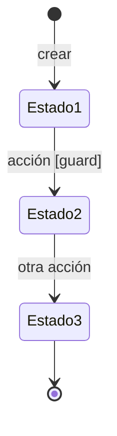

# Guía de Documentación Knowledge-Driven Development (KDD)

> **Propósito**: Que los miembros del equipo de Producto (desarrolladores, producto, diseño, QA e ingeniería) documenten de forma uniforme para que las especificaciones sean la **fuente de verdad** para Agentes y Humanos.


## 1) Introducción a KDD

* **Qué es**: tratar la documentación como código: artefactos pequeños (Markdown/YAML), versionados en Git, con *linters*, *reviews* y CI/CD.
* **Por qué**: reduce ambigüedad, acelera *onboarding*, permite automatizar generación/verificación de software y habilita RAG para asistentes.
* **Principios clave**
  1. **SSoT**: especificación > código (el código es una caché regenerable).
  2. **Especificación ejecutable**: ejemplos y contratos se convierten en pruebas y *checks*.
  3. **Granularidad y enlaces**: ficheros atómicos con front‑matter y conexiones entre ellos para reforzar la unidad del grafo de conocimiento.
  4. **RAG‑first**: los agentes consultan la documentación indexada, no el repo de código.
  5. **Gobernanza ligera**: estados, coberturas y revisiones automatizadas.

## 2) Conceptos principales (glosario operativo)

* **PRD (Product Requirement Document)**: narrativa de problema/alcance/éxito por *epic*. Enlaza a artefactos técnicos (UC, reglas, NFRs). No es un “todo en uno”.
* **Historia de usuario (HU)**: ítem breve de backlog (“Como … quiero … para …”) con criterios; puede referenciar un CU.
* **Caso de uso (CU)**: contrato de interacción actor↔sistema; flujo principal y alternativas; más estable que la HU.
* **Ontología**: entidades, value objects y eventos del dominio, con atributos, invariantes y ciclo de vida (máquina de estados).
* **Reglas de negocio**: decisiones; tabulares/DMN, ejecutables.
* **Procesos**: orquestación de pasos (BPMN‑lite/Mermaid) y responsables.
* **Interfaces**: OpenAPI (sync), AsyncAPI (eventos); contratos generadores de *stubs/clients*.
* **Datos**: JSON Schema/DDL declarativo, políticas de privacidad/retención.
* **SBE (Specification by Example)**: escenarios I/O y Gherkin ejecutables.
* **NFRs**: requisitos no funcionales (rendimiento, disponibilidad, seguridad…), con SLIs/SLOs.
* **ADRs**: decisiones arquitectónicas con contexto y consecuencias.
* **Contrato agéntico**: capacidades y guardarraíles de agentes sobre la especificación.


## 3) Estructura del Repositorio de Especificaciones

```
/specs
├── vision/                     # Visión del producto
│   ├── charter.md              # Carta del proyecto
│   └── prd/                    # PRDs por epic
│
├── domain/                     # Modelo de dominio (núcleo)
│   ├── entities/               # Entidades y value objects
│   │   └── <Entidad>.md        # Incluye ciclo de vida en Mermaid
│   ├── events/                 # Eventos de dominio (EVT-*.md)
│   └── rules/                  # Reglas de negocio (RUL-*.md)
│
├── behavior/                   # Comportamiento del sistema
│   ├── use-cases/              # UC-*.md (Cockburn-lite)
│   ├── processes/              # PRC-*.md (flujos multi-entidad, Mermaid)
│   ├── requirements/           # REQ-*.md (requisitos funcionales)
│   └── stories/                # US-*.md (historias de usuario)
│
├── interfaces/                 # Contratos de integración
│   ├── api/                    # OpenAPI specs
│   ├── async/                  # AsyncAPI specs
│   └── ui/                     # Contratos de UI
│
├── examples/                   # Especificación por ejemplo (SBE)
│   ├── gherkin/                # *.feature
│   ├── scenarios/              # SCN-*.json (I/O "golden")
│   └── fixtures/               # Datos de prueba
│
├── quality/                    # Requisitos no funcionales
│   ├── nfrs.md
│   └── observability.md
│
├── architecture/               # Decisiones técnicas
│   ├── adr/                    # ADR-*.md
│   └── diagrams/               # C4, deployment, etc.
│
└── governance/                 # Gobernanza del repositorio
    ├── contributing.md
    └── coverage.yaml
```

### Notas sobre la estructura

- **`domain/`**: Contiene el modelo de dominio puro. Las entidades incluyen su ciclo de vida como diagrama Mermaid embebido (no en archivos separados).
- **`behavior/`**: Describe cómo se comporta el sistema. Los procesos (`PRC-*`) orquestan flujos que involucran múltiples entidades.
- **`interfaces/`**: Contratos técnicos para integración (API, eventos, UI).
- Los **diagramas de estado** van dentro de cada entidad en `domain/entities/`, no como archivos YAML separados.


**Quién hace qué (por defecto)**

* **Producto**: `/0-vision`, PRDs, HU, CUs (borrador), métricas de éxito.
* **Diseño**: `/3-interfaces/ui` (contratos), *wireflows*.
* **Ingeniería**: OpenAPI/AsyncAPI, máquinas de estado, mapeos de datos.
* **QA**: SBE, cobertura, *doc‑tests*.
* **Seguridad/Legal**: políticas de datos, riesgos, compliance.
* **Product‑writer (humano/agente)**: curado de prosa, consistencia de estilo, glosario.

---

## 4) Convenciones transversales (front‑matter y trazabilidad)

**Front‑matter mínimo** para todos los MD:

```yaml
---
kind: use_case        # prd|story|entity|rule|use_case|process|state_machine|event|api|nfr|adr|scenario
status: draft|proposed|approved|deprecated
aliases: ["Pago de pedido"]
tags: [checkout, pagos]
domain: comercio
---
```

**Reglas de nombre**: `RUL-`, `UC-`, `PRC-`, `SM-`, `EVT-`, `PRD-`, `API-`, `SCN-`, `ADR-`.

**Cobertura exigible** (`/governance/traceability/coverage.yaml`):

```yaml
use_case:
  requires:
    scenarios: ">=3"
    varieties: [happy, edge, error]
rule:
  requires:
    scenarios: ">=1"
prd:
  requires: [>=1 use_case, >=1 nfr, >=1 metric]
entity:
  requires: [state_machine, >=1 use_case]
api:
  requires: [contract_tests]
```

---

## 5) Plantillas (copiar/pegar)

### 5.1 PRD (por epic)

```markdown
---
id: PRD-<Nombre>@v1
kind: prd
status: proposed
owner: producto-core
stakeholders: [ventas, soporte]
related: [UC-<…>@vN, NFR-<…>@vN, API-<…>@vN]
success_metrics:
  - "Conversión +3pp"
  - "P95 < 600ms en /pay"
release_criteria:
  - "SBE en verde"
  - "Errores < 0.5% durante canary 48h"
---
# <Nombre del PRD>
## Problema / oportunidad
…
## Usuarios y jobs-to-be-done
…
## Alcance / No alcance
…
## Requisitos funcionales enlazados
- UC: UC-…
- Reglas: RUL-…
## NFRs y compliance
- NFR-…
## Métricas de éxito y telemetría
- SLI/SLO con nombre de métrica
## Dependencias
- API-…, EVT-…
## Criterios de aceptación / Go-Live
- Escenarios SCN-…
```

### 5.2 Historia de usuario (HU)

```markdown
---
id: STORY-1234
kind: story
status: proposed
related: [UC-Checkout@v3]
---
**Como** comprador **quiero** pagar con tarjeta **para** completar mi compra.

**Criterios de aceptación**
- Dado un carrito válido…
- Cuando elijo tarjeta…
- Entonces veo confirmación…
```

### 5.3 Caso de uso (Cockburn‑lite)

```markdown
---
id: UC-<Nombre>@vN
kind: use_case
status: proposed

---
# <Verbo + Sustantivo>

## Actor Principal
1. ...
## Preconditions
1. ...
## Minimal Guarantees
[ … ]
## Success_guarantees: [ … ]
## Invokes Rules: 
[RUL-…]

## Produces Events:
[EVT-…]

## Related Stories
[STORY-…]

## Flujo principal
1. …

## Extensiones / alternativas
2a. …
## Postcondiciones
- Éxito: …
- Falla: …
```

### 5.4 Entidad

- El ciclo de vida se expresa como diagrama `stateDiagram-v2` de Mermaid **dentro del archivo de la entidad**
- Los atributos que relacionan entidades usan el nombre de la entidad como tipo (ej: `creador` tiene tipo `[[Usuario]]`)
- Opcionalmente, se puede incluir un bloque YAML ejecutable colapsado con `<details>` para generación de código/tests

```markdown
---
aliases: [<alias1>, <alias2>]
tags: [entity]
---
# <Nombre>

## Descripción
…

## Atributos

| Atributo | Tipo | Descripción |
|----------|------|-------------|
| `id` | uuid | Identificador único |
| `estado` | enum | Estado del ciclo de vida |
| `created_at` | timestamp | Fecha de creación |

## Relaciones

| Relación | Cardinalidad | Entidad | Descripción |
|----------|--------------|---------|-------------|
| `pertenece a` | N:1 | [[OtraEntidad]] | … |

## Ciclo de Vida



| Estado | Descripción | Condiciones de entrada |
|--------|-------------|------------------------|
| **Estado1** | Descripción del estado | Condición para entrar |
| **Estado2** | … | … |

<details>
<summary>Especificación ejecutable (YAML)</summary>

```yaml
id: SM-<Entidad>@v1
kind: state_machine
entity: <Entidad>

states:
  - id: estado1
    initial: true
  - id: estado2
  - id: estado3
    final: true

transitions:
  - from: estado1
    to: estado2
    event: EVENTO_OCURRIDO
    guard: "condición"
    produces: EVT-Algo-Pasó
```

</details>

## Invariantes

- Regla que siempre debe cumplirse
- …

## Eventos

- **Emite**: [[EVT-Entidad-Creada]], [[EVT-Entidad-Actualizada]]
- **Consume**: [[EVT-Otro-Evento]]
```

> **Nota**: El bloque YAML colapsado es opcional. Es útil cuando se quiere generar código (XState, tests) desde la especificación.

### 5.5 Regla de negocio (tabla + YAML ejecutable)

````markdown
---
id: RUL-<Nombre>@vN
kind: rule
status: approved
---
# <Nombre de la regla>
| condición | resultado |
|---|---|
| … | … |

```yaml
executable:
  inputs: [ … ]
  output: <campo>
  cases:
    - when: <condición>
      then: <resultado>
````

````

### 5.6 Proceso (BPMN‑lite/Mermaid)
```markdown
---
id: PRC-<Nombre>@vN
kind: process
---
```mermaid
flowchart TD
  A[Inicio] --> B{Decisión}
  B -- sí --> C[Tarea]
  B -- no --> D[Alternativa]
  C --> E[Fin]
````

````

### 5.7 API (OpenAPI extracto)

```yaml
openapi: 3.1.0
info: { title: Orders API, version: 1.0.0 }
paths:
  /orders:
    post:
      operationId: createOrder
      requestBody:
        content:
          application/json:
            schema: { $ref: '#/components/schemas/Order' }
      responses:
        '201': { description: Created }
components:
  schemas:
    Order:
      type: object
      properties:
        orderId: { type: string, format: uuid }
```

### 5.8 Eventos (AsyncAPI extracto)

```yaml
asyncapi: 3.0.0
info: { title: Commerce Events, version: 1.0.0 }
channels:
  order/placed:
    messages:
      OrderPlaced:
        payload:
          type: object
          properties:
            orderId: { type: string }
```

### 5.9 Datos (JSON Schema)

```json
{
  "$schema": "https://json-schema.org/draft/2020-12/schema",
  "$id": "https://acme.com/schemas/order.json",
  "type": "object",
  "properties": {
    "orderId": { "type": "string", "format": "uuid" }
  },
  "required": ["orderId"]
}
```

### 5.10 NFRs (plantilla)

```markdown
---
id: NFR-Perf@v1
kind: nfr
status: proposed
---
# Rendimiento
- **Objetivo**: P95 < 600ms en /pay
- **SLI**: http_request_duration_seconds{route="/pay",quantile="0.95"}
- **SLO**: 28/30 días cumpliendo
- **Estrategias**: caché, backpressure
```

### 5.11 ADR (decisión arquitectónica)

```markdown
---
id: ADR-0001
kind: adr
status: approved
---
# Elegimos Kafka para eventos de dominio
## Contexto
…
## Decisión
…
## Consecuencias
Positivas: …  
Negativas: …
```

### 5.12 SBE — Escenario ejecutable (I/O)

```json
{
  "id": "SCN-<Tema>-001@v1",
  "validates": ["UC-…", "RUL-…"],
  "tags": ["happy-path"],
  "context": "Explica la intención del caso",
  "input": { … },
  "expected": { … },
  "seed": 1729,
  "status": "approved"
}
```

### 5.13 SBE — Gherkin

```gherkin
Feature: <Tema>
  Scenario: <Nombre>
    Given …
    When …
    Then …
```

---

## 6) Flujo de trabajo de producto (de idea a aprobado)

1. **Descubrimiento** → PRD `proposed` + 2–3 ejemplos *inline* (ilustrativos).
2. **Modelado** → Entidades/Reglas/CU `proposed` con IDs y enlaces.
3. **Ejemplificación** → SBE en `/examples` (I/O y/o Gherkin), cobertura ≥ objetivo.
4. **Contratos** → OpenAPI/AsyncAPI esqueleto enlazado desde CUs.
5. **NFRs & Observabilidad** → SLIs/SLOs definidos; métricas con nombres concretos.
6. **Revisión** → PR de especificación (linters + doc‑tests en CI).
7. **Aprobación** → `approved` + publicación del índice RAG.

**Definiciones de listo/terminado**

* **DoR** de incrementos: PRD con alcance + ≥1 CU + ≥1 NFR + ejemplos ilustrativos + contratos esqueleto.
* **DoD**: SBE en verde, cobertura cumplida, contratos validados, *site* de docs actualizado.

---

## 7) Calidad, CI/CD y agentes

* **Spec CI**: linters (Markdown, enlaces), validador de front‑matter, lint OpenAPI/AsyncAPI, ejecución SBE, build de sitio e índice RAG.
* **Spec CD**: *stubs* de contratos, *contract tests* contra entornos, *drift* detector.
* **Agentes**: definidos en `/9-agentic-contract/agentic-contract.yaml` con guardarraíles: deben pasar `doc_tests`, `contract_tests` y `lint_all`.

---

## 8) Buenas prácticas de autoría

* Un archivo = un concepto. Títulos H1 únicos.
* Evita ambigüedades (unidades, rangos, zonas horarias, monedas).
* Usa lenguaje imperativo; evita UI/tecnología en CUs.
* Incluye **postcondiciones medibles** y **anti‑ejemplos** cuando acoten el dominio.
* Linka los conceptos entre archivos/notas al estilo Wiki/OBSIDIAN
* Versiona escenarios y reglas de forma desacoplada; depreca, no sobrescribas.
* Utilizamos un concepto similar a la arquitectura hexagonal, de forma que los documentos (conceptos) de capas mayores (por ejemplo, )

---

## 9) FAQ mínima

* **¿HU o CU?** HU para priorizar y conversar; CU como contrato estable. Enlaza ambos.
* **¿Ejemplos dentro o fuera del CU?** Ejecutables fuera (SBE), ilustrativos dentro (breves) con enlaces.
* **¿Un PRD por proyecto?** Mejor **por epic**; compacto y enlazado.

---

## 10) Anexos

* **`/spec/_meta/frontmatter.schema.json`**: esquema de front‑matter.
* **`/8-governance/traceability/coverage.yaml`**: reglas de cobertura (editable por equipo).
* **Guía Cockburn‑lite**: niveles, formatos y ejemplos.
