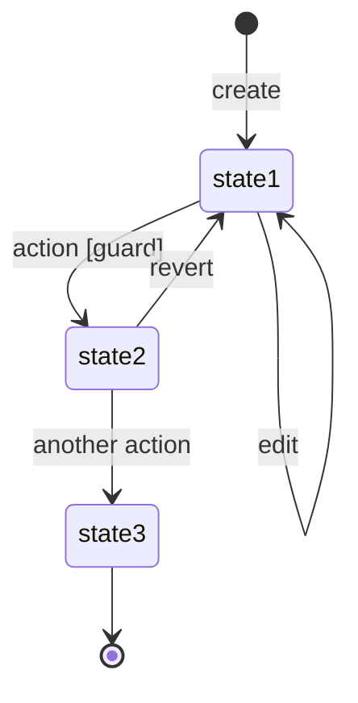

# Entity Name <!-- title-is-name -->

<!--
  VARIANTES POR KIND:

  kind: entity  → Entidad de dominio estándar (Reto, Sesión, Plan)
  kind: role    → Rol/actor que interactúa con el sistema (Propietario, Usuario, Moderador)
  kind: system  → Sistema externo en MAYÚSCULAS (ORACLE, SAP, STRIPE)

  Para sistemas externos:
  - El nombre del archivo y título SIEMPRE en MAYÚSCULAS: ORACLE.md, SAP.md
  - En texto se referencia igual: [[ORACLE]], [[SAP]]
-->

## Description <!-- required -->

Clear description of what this entity represents in the domain. Include:
- Main purpose and role in the system
- Relationships with other entities (mentioned naturally in the text, not in a separate table)
- Distinctive characteristics

Relationships are expressed naturally: "Each X belongs to a [[User]]", "An X contains multiple [[OtherEntity|OtherEntities]]". The indexer will infer them automatically.

### Examples <!-- optional -->

Concrete examples that help understand the entity in a real context.

## Attributes <!-- required -->

| Attribute | Type | Description |
|-----------|------|-------------|
| `id` | uuid | Unique identifier |
| `name` | string | Descriptive name |
| `status` | enum | Lifecycle status (see [[#States]]) |
| `reference_id` | uuid | Related [[OtherEntity]] |
| `created_at` | timestamp | Creation date |
| `updated_at` | timestamp | Last modification date |

## States <!-- optional, required-if: has lifecycle -->

| State | ID | Description |
|-------|----|-------------|
| **State1** | `state1` | Initial state of the entity |
| **State2** | `state2` | Intermediate state after action X |
| **State3** | `state3` | Final state, immutable |

### Transitions <!-- optional -->

- **State1 → State2**: Condition or event that triggers the transition
- **State2 → State3**: Another transition with its context

## Lifecycle <!-- optional -->

<!-- expects: mermaid:stateDiagram-v2 -->

## Invariants <!-- optional -->

| ID | Constraint |
|----|------------|
| INV-ENTITY-001 | Natural language description of the constraint |
| INV-ENTITY-002 | Another constraint that must always hold |
| INV-ENTITY-003 | Business rule associated with the entity |
