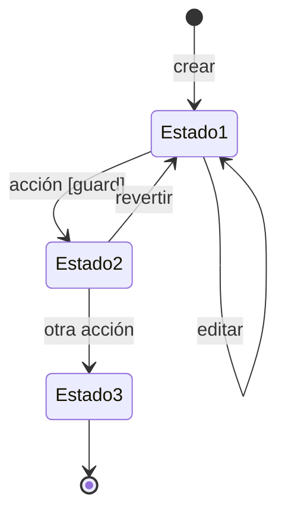

# Nombre de la Entidad <!-- title-is-name -->

## Descripción <!-- required -->

Descripción clara de qué representa esta entidad en el dominio. Incluye:
- Propósito principal
- Rol en el sistema
- Características distintivas

## Atributos <!-- required -->

| Atributo | Code | Tipo | Descripción |
|----------|------|------|-------------|
| `id` | `id` | uuid | Identificador único |
| `nombre` | `name` | string | Nombre descriptivo |
| `estado` | `status` | enum | Estado del ciclo de vida (ver abajo) |
| `referencia_id` | `referenceId` | [[OtraEntidad]] | Relación con otra entidad |
| `created_at` | `createdAt` | timestamp | Fecha de creación |
| `updated_at` | `updatedAt` | timestamp | Fecha de última modificación |

> **Nota**: La columna `Code` es opcional. Indica el nombre del atributo en código (camelCase).

## Relaciones <!-- optional -->

| Relación | Code | Cardinalidad | Entidad | Descripción |
|----------|------|--------------|---------|-------------|
| `tiene` | `items` | 1:N | [[EntidadHija]] | Descripción de la relación |
| `pertenece a` | `parent` | N:1 | [[EntidadPadre]] | Descripción de la relación |
| `asociado con` | `related` | N:M | [[OtraEntidad]] | Descripción de la relación |

> **Nota**: Esta sección puede ser opcional ya que podría reforzar contenido comentado anteriormente, ya que la relación entre entidades puede inferirse a través de la descripción o a través de los atributos.


## Ciclo de Vida <!-- optional -->

<!-- expects: mermaid:stateDiagram-v2 -->


### Estados<!-- -->

| Estado      | Descripción                       | Condiciones de entrada      |
| ----------- | --------------------------------- | --------------------------- |
| **Estado1** | Descripción del estado inicial    | Condición para entrar       |
| **Estado2** | Descripción del estado intermedio | Condición para transicionar |
| **Estado3** | Estado final                      | Condición de finalización   |

<details>
<summary>Especificación ejecutable (YAML)</summary>

<!-- expects: yaml -->
```yaml
id: SM-NombreEntidad@v1
kind: state_machine
entity: NombreEntidad

states:
  - id: estado1
    initial: true
    description: Estado inicial
  - id: estado2
    description: Estado intermedio
  - id: estado3
    final: true
    description: Estado final

transitions:
  - id: crear
    from: null
    to: estado1
    event: ENTIDAD_CREATED
    produces: EVT-Entidad-Creada

  - id: transicionar
    from: estado1
    to: estado2
    event: ACCION_REALIZADA
    guard: "condición booleana"
    produces: EVT-Entidad-Transicionada

invariants:
  - "atributo_requerido !== null"
  - "estado === 'final' implies inmutable"
```

</details>

## Invariantes <!-- optional alias: Constraints -->

- Regla que siempre debe cumplirse para esta entidad
- Otra restricción de integridad
- Regla de negocio asociada

## Eventos <!-- optional -->

- **Emite**: [[EVT-Entidad-Creada]], [[EVT-Entidad-Actualizada]]
- **Consume**: [[EVT-Otro-Evento]] (si aplica)

