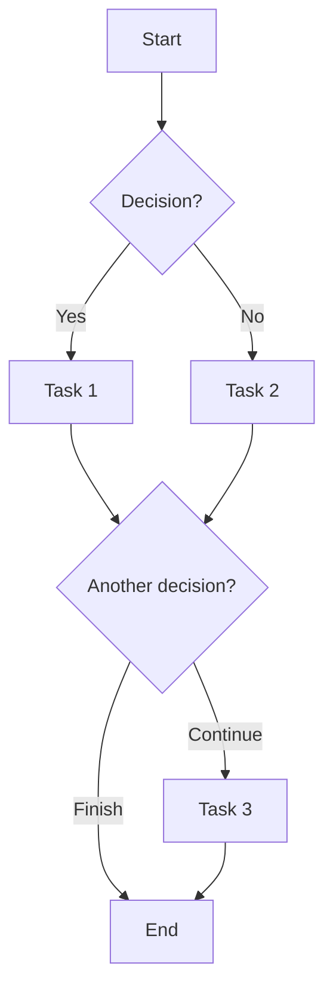

# PRC-NNN: Process Name <!-- required pattern: ^(PRC|PROC)-\d{3}: -->

## Description <!-- optional -->

Process description:
- Process objective
- Actors involved
- Expected outcome

## Diagram <!-- required -->

<!-- expects: mermaid:flowchart -->

## Participants <!-- optional alias: Actors|Roles -->

| Role | Responsibility |
|------|----------------|
| [[User]] | Initiates the process |
| System | Executes automatic tasks |
| [[OtherActor]] | Approves/validates |

## Steps <!-- optional -->

| # | Step | Actor | Input | Output | Rules |
|---|------|-------|-------|--------|-------|
| 1 | Description | User | Initial data | Result | [[BR-XXX-001]] |
| 2 | Next step | System | Previous result | New state | - |
| 3 | Decision | User | Current state | Chosen option | [[BR-XXX-002]] |

## Related Use Cases <!-- optional -->

- [[UC-NNN-Name]] - Step 1
- [[UC-MMM-Name]] - Steps 2-3

## Events Emitted <!-- optional -->

| Step | Event |
|------|-------|
| On start | [[EVT-Process-Started]] |
| On step 2 | [[EVT-Task-Completed]] |
| On finish | [[EVT-Process-Completed]] |

## Integration Points <!-- optional -->

- **External services**: APIs that are invoked
- **Notifications**: Emails, push, etc.
- **Persistence**: What is saved and when
