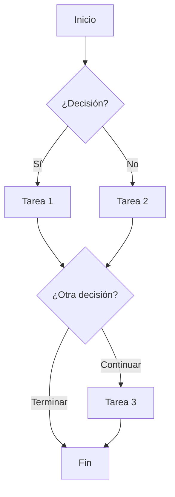

# PRC-NNN: Nombre del Proceso <!-- required pattern: ^(PRC|PROC)-\d{3}: -->

## Descripción <!-- optional -->

Descripción del proceso:
- Objetivo del proceso
- Actores involucrados
- Resultado esperado

## Diagrama <!-- required alias: "Diagrama de Proceso" -->

<!-- expects: mermaid:flowchart -->

## Participantes <!-- optional alias: Actors|Roles -->

| Rol | Responsabilidad |
|-----|-----------------|
| [[Usuario]] | Inicia el proceso |
| Sistema | Ejecuta tareas automáticas |
| [[OtroActor]] | Aprueba/valida |

## Pasos <!-- optional alias: Steps -->

| # | Paso | Actor | Entrada | Salida | Reglas |
|---|------|-------|---------|--------|--------|
| 1 | Descripción | Usuario | Datos iniciales | Resultado | [[BR-XXX-001]] |
| 2 | Siguiente paso | Sistema | Resultado anterior | Nuevo estado | - |
| 3 | Decisión | Usuario | Estado actual | Opción elegida | [[BR-XXX-002]] |

## Casos de Uso Involucrados <!-- optional -->

- [[UC-NNN-Nombre]] - Paso 1
- [[UC-MMM-Nombre]] - Pasos 2-3

## Eventos Emitidos <!-- optional -->

| Paso | Evento |
|------|--------|
| Al iniciar | [[EVT-Proceso-Iniciado]] |
| En paso 2 | [[EVT-Tarea-Completada]] |
| Al finalizar | [[EVT-Proceso-Completado]] |

## Puntos de Integración <!-- optional -->

- **Servicios externos**: APIs que se invocan
- **Notificaciones**: Emails, push, etc.
- **Persistencia**: Qué se guarda y cuándo
