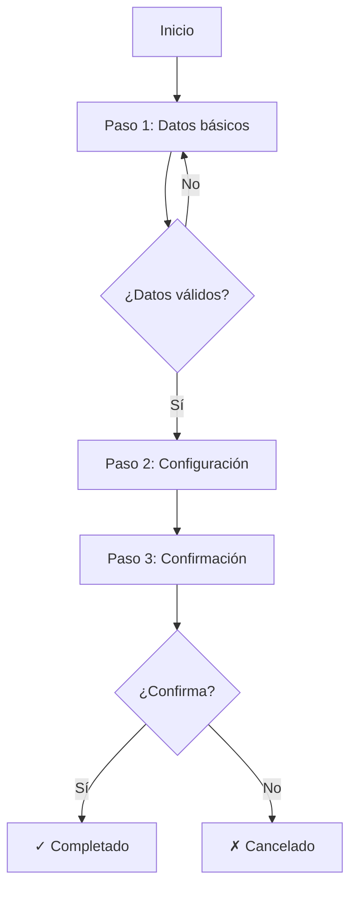

# Flow: {{FlowName}}

## Propósito

<!-- 1-3 líneas: qué logra el usuario al completar este flujo -->

## Actor y Contexto

- **Actor**: [[Usuario]] / [[Admin]] / etc.
- **Precondición**: Estado requerido antes de iniciar
- **Resultado exitoso**: Qué cambia en el sistema al completar

## Diagrama



## Pasos

### 1. {{Nombre del paso}}

- **Vista**: [[VIEW-PasoUno]]
- **Usuario hace**: Completa formulario con datos X, Y, Z
- **Sistema responde**: Valida datos, habilita continuar
- **Siguiente**: Paso 2 / Fin si cancela

### 2. {{Nombre del paso}}

- **Vista**: [[VIEW-PasoDos]]
- **Usuario hace**: Configura opciones A, B, C
- **Sistema responde**: Previsualiza resultado
- **Siguiente**: Paso 3 / Volver a Paso 1

### 3. Confirmación

- **Vista**: [[VIEW-Confirmacion]] o modal
- **Usuario hace**: Revisa resumen y confirma
- **Sistema responde**: Ejecuta [[CMD-Create]], emite [[EVT-Creado]]
- **Siguiente**: Estado terminal

## Wireframe del Flujo

<!-- Opcional: un wireframe que muestre la progresión -->

```
┌─────────────────────────────────────────────────────────────┐
│  ● Datos ─────── ○ Configuración ─────── ○ Confirmación     │
├─────────────────────────────────────────────────────────────┤
│                                                             │
│                    [Contenido del paso]                     │
│                                                             │
├─────────────────────────────────────────────────────────────┤
│  [Cancelar]                      [← Anterior]  [Siguiente →]│
└─────────────────────────────────────────────────────────────┘
```

## Puntos de Decisión

<!-- Solo si hay bifurcaciones significativas -->

| Condición | Camino A | Camino B |
|-----------|----------|----------|
| Usuario nuevo | Mostrar onboarding | Saltar a paso 2 |
| Tiene datos previos | Pre-rellenar formulario | Formulario vacío |

## Estados Terminales

### Éxito

- **Condición**: Usuario completó todos los pasos
- **Efecto**: Entidad creada/modificada
- **Navegación**: → [[VIEW-Detalle]] o [[VIEW-Lista]]
- **Feedback**: Toast "Operación completada"

### Cancelado

- **Condición**: Usuario cancela en cualquier paso
- **Efecto**: Sin cambios (o borrador guardado si aplica)
- **Navegación**: → Vista de origen
- **Feedback**: Confirmación si hay datos sin guardar

### Error

- **Condición**: Fallo del sistema durante el flujo
- **Efecto**: Mantener estado actual, permitir retry
- **Feedback**: Mensaje de error con opción de reintentar

## Persistencia

<!-- Cómo se maneja el estado entre pasos -->

| Estrategia | Uso |
|------------|-----|
| Estado local (React) | Navegación entre pasos |
| localStorage | Recuperar si se cierra accidentalmente |
| Backend (borrador) | Flujos largos que requieren persistencia |

## Conexiones

- **Implementa**: [[UC-001]]
- **Vistas involucradas**: [[VIEW-Paso1]], [[VIEW-Paso2]], [[VIEW-Confirmacion]]
- **Comandos**: [[CMD-Create]]
- **Eventos**: [[EVT-Entidad-Creada]]
