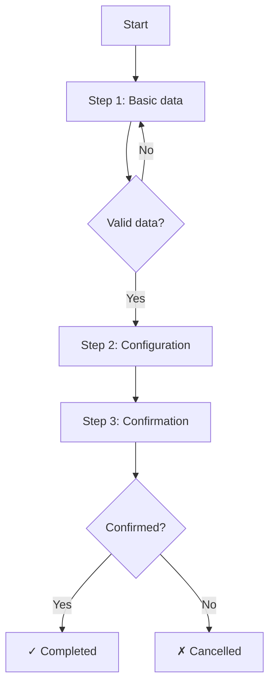

# Flow: {{FlowName}}

## Purpose

<!-- 1-3 lines: what the user achieves by completing this flow -->

## Actor and Context

- **Actor**: [[Customer]] / [[Admin]] / etc.
- **Precondition**: Required state before starting
- **Successful outcome**: What changes in the system upon completion

## Diagram



## Steps

### 1. {{Step name}}

- **View**: [[VIEW-StepOne]]
- **User does**: Fills in form with data X, Y, Z
- **System responds**: Validates data, enables continue
- **Next**: Step 2 / End if cancelled

### 2. {{Step name}}

- **View**: [[VIEW-StepTwo]]
- **User does**: Configures options A, B, C
- **System responds**: Previews result
- **Next**: Step 3 / Back to Step 1

### 3. Confirmation

- **View**: [[VIEW-Confirmation]] or modal
- **User does**: Reviews summary and confirms
- **System responds**: Executes [[CMD-Create]], emits [[EVT-Created]]
- **Next**: Terminal state

## Flow Wireframe

<!-- Optional: a wireframe showing the progression -->

```
┌─────────────────────────────────────────────────────────────┐
│  ● Data ─────── ○ Configuration ─────── ○ Confirmation       │
├─────────────────────────────────────────────────────────────┤
│                                                             │
│                      [Step content]                         │
│                                                             │
├─────────────────────────────────────────────────────────────┤
│  [Cancel]                          [← Previous]  [Next →]   │
└─────────────────────────────────────────────────────────────┘
```

## Decision Points

<!-- Only if there are significant branches -->

| Condition | Path A | Path B |
|-----------|--------|--------|
| New user | Show onboarding | Skip to step 2 |
| Has previous data | Pre-fill form | Empty form |

## Terminal States

### Success

- **Condition**: User completed all steps
- **Effect**: Entity created/modified
- **Navigation**: → [[VIEW-Detail]] or [[VIEW-List]]
- **Feedback**: Toast "Operation completed"

### Cancelled

- **Condition**: User cancels at any step
- **Effect**: No changes (or draft saved if applicable)
- **Navigation**: → Origin view
- **Feedback**: Confirmation if there is unsaved data

### Error

- **Condition**: System failure during the flow
- **Effect**: Maintain current state, allow retry
- **Feedback**: Error message with retry option

## Persistence

<!-- How state is managed between steps -->

| Strategy | Use |
|----------|-----|
| Local state (React) | Navigation between steps |
| localStorage | Recover if accidentally closed |
| Backend (draft) | Long flows requiring persistence |
