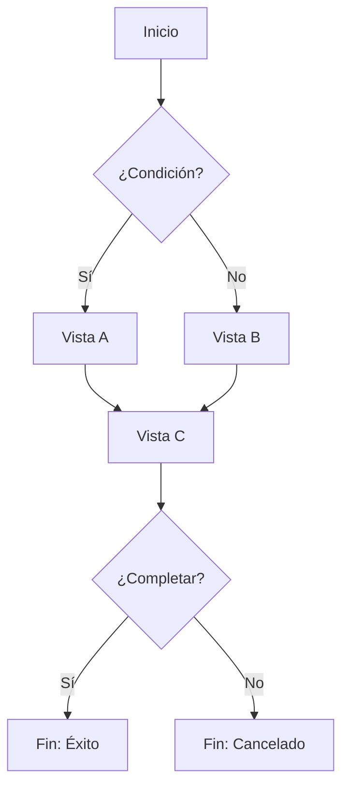

---
tags:
  - ui/flow
status: draft
version: "1.0"
links:
  entities: []
  use-cases: []
  views: []
storybook:
  category: "Flows"
  auto-generate: true
---

# Flujo: {{nombre-del-flujo}}

## Descripción

<!--
Describe el proceso completo que este flujo representa.
¿Qué objetivo del usuario se cumple al completar este flujo?
-->

## Actor Principal

- **Usuario**: Tipo de usuario que ejecuta este flujo
- **Precondiciones**: Estado requerido antes de iniciar

## Diagrama de Flujo



## Pasos del Flujo

### Paso 1: {{Nombre del Paso}}

| Atributo | Valor |
|----------|-------|
| **Vista** | [[Vista-Relacionada]] |
| **Acción del Usuario** | Descripción de lo que hace |
| **Sistema Responde** | Qué ocurre tras la acción |
| **Siguiente Paso** | Paso 2 / Fin |

#### Wireframe del Paso

```ascii
┌──────────────────────────────────────┐
│        Paso 1: Nombre                │
├──────────────────────────────────────┤
│                                      │
│   Contenido del paso                 │
│                                      │
│   [Cancelar]        [Continuar →]    │
└──────────────────────────────────────┘
```

---

### Paso 2: {{Nombre del Paso}}

| Atributo | Valor |
|----------|-------|
| **Vista** | [[Vista-Relacionada]] |
| **Acción del Usuario** | Descripción de lo que hace |
| **Sistema Responde** | Qué ocurre tras la acción |
| **Siguiente Paso** | Paso 3 / Fin |

#### Wireframe del Paso

```ascii
┌──────────────────────────────────────┐
│        Paso 2: Nombre                │
├──────────────────────────────────────┤
│                                      │
│   Contenido del paso                 │
│                                      │
│   [← Volver]        [Continuar →]    │
└──────────────────────────────────────┘
```

---

### Paso 3: {{Nombre del Paso}}

| Atributo | Valor |
|----------|-------|
| **Vista** | [[Vista-Relacionada]] |
| **Acción del Usuario** | Descripción de lo que hace |
| **Sistema Responde** | Qué ocurre tras la acción |
| **Siguiente Paso** | Fin |

#### Wireframe del Paso

```ascii
┌──────────────────────────────────────┐
│        Paso 3: Confirmación          │
├──────────────────────────────────────┤
│                                      │
│   Resumen de lo configurado          │
│                                      │
│   [← Volver]        [Finalizar ✓]    │
└──────────────────────────────────────┘
```

## Puntos de Decisión

### Decisión 1: {{Nombre}}

```ascii
        ┌─────────────────┐
        │  ¿Condición?    │
        └────────┬────────┘
                 │
        ┌────────┴────────┐
        ▼                 ▼
   [Opción A]        [Opción B]
```

- **Si cumple**: Descripción del camino A
- **Si no cumple**: Descripción del camino B

## Estados Terminales

### Éxito

| Atributo | Valor |
|----------|-------|
| **Condición** | El usuario completó todos los pasos |
| **Estado Final** | Entidad creada/modificada |
| **Redirección** | A dónde va el usuario después |
| **Feedback** | Toast/mensaje de confirmación |

```ascii
┌──────────────────────────────────────┐
│          ✓ ¡Completado!              │
├──────────────────────────────────────┤
│                                      │
│   Tu [entidad] ha sido creado        │
│   correctamente.                     │
│                                      │
│          [Ver detalle]               │
│          [Crear otro]                │
└──────────────────────────────────────┘
```

### Cancelado

| Atributo | Valor |
|----------|-------|
| **Condición** | El usuario canceló en cualquier paso |
| **Estado Final** | Sin cambios / Borrador guardado |
| **Redirección** | A dónde vuelve el usuario |
| **Feedback** | Confirmación antes de perder cambios |

### Error

| Atributo | Valor |
|----------|-------|
| **Condición** | Error del sistema durante el flujo |
| **Comportamiento** | Reintentar / Guardar borrador |
| **Feedback** | Mensaje de error con opciones |

## Persistencia Durante el Flujo

<!--
¿Cómo se mantiene el estado entre pasos?
¿Qué pasa si el usuario cierra el navegador?
-->

| Estrategia | Descripción |
|------------|-------------|
| **Estado Local** | React state para navegación entre pasos |
| **LocalStorage** | Guardar borrador cada N segundos |
| **Backend** | Guardar como "borrador" en BD |

## Eventos de Dominio

<!--
Lista los eventos que se disparan durante el flujo.
-->

| Paso | Evento | Payload |
|------|--------|---------|
| Paso 1 completo | `ENTIDAD_INICIADA` | `{ id, userId }` |
| Paso 3 completo | `ENTIDAD_CREADA` | `{ id, ...data }` |
| Cancelado | `FLUJO_CANCELADO` | `{ step, userId }` |

## Métricas y Analytics

<!--
¿Qué métricas se deben trackear en este flujo?
-->

| Evento | Cuándo | Datos |
|--------|--------|-------|
| `flow_started` | Al iniciar | `flowName`, `userId` |
| `step_completed` | Al avanzar paso | `step`, `duration` |
| `flow_completed` | Al finalizar | `totalDuration`, `success` |
| `flow_abandoned` | Al cancelar | `lastStep`, `duration` |

## Casos de Uso Implementados

<!--
Lista los casos de uso que este flujo implementa completa o parcialmente.
-->

- [[UC-001-Crear-Reto]]: Pasos 1-2
- [[UC-002-Configurar-Personas-Sinteticas]]: Paso 3

## Vistas Involucradas

<!--
Lista ordenada de las vistas que componen este flujo.
-->

1. [[Vista-Paso1]]
2. [[Vista-Paso2]]
3. [[Vista-Paso3]]

## Imagen de Referencia

<!--
Si tienes un diagrama o diseño del flujo completo.
![[figma-flujo-completo.png]]
-->

## Notas de Implementación

<!--
Consideraciones técnicas:
- ¿Usar wizard multi-step o páginas separadas?
- ¿Cómo manejar navegación hacia atrás?
- ¿Validación en cada paso o al final?
-->

## Historial de Cambios

| Versión | Fecha | Cambios |
|---------|-------|---------|
| 1.0 | YYYY-MM-DD | Versión inicial |
